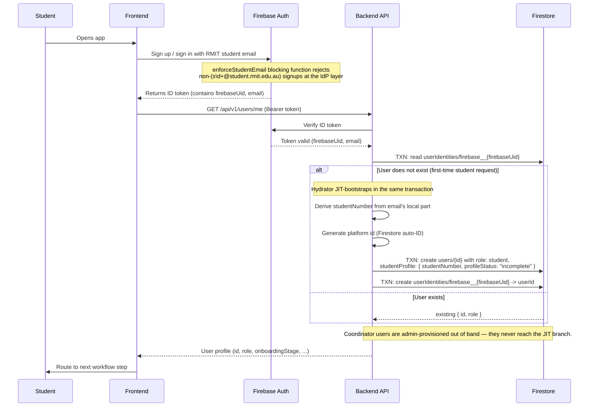
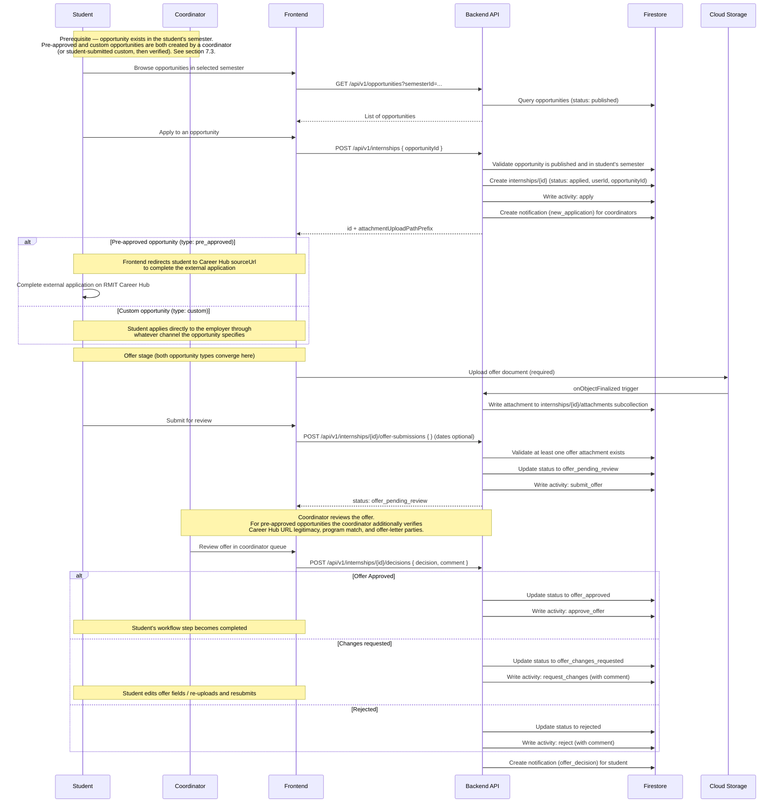
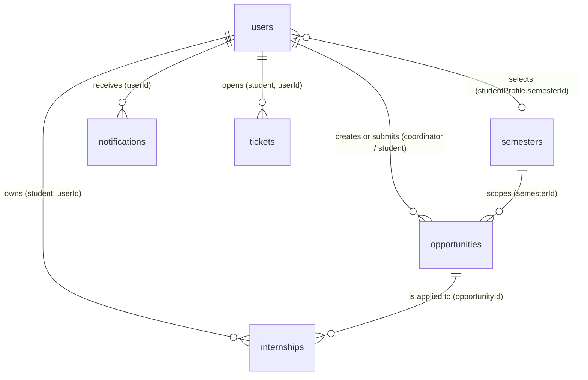

# Internship Platform Workflow and API Specification

Version: Draft 5  
Status: Working design document  
Primary stack: Firebase, Firestore, Cloud Storage, Cloud Functions v2

## 1. Overview

This document defines the platform workflow, API contract, and data model for the internship platform. The platform supports the student journey from sign-in through profile completion, semester enrolment, opportunity browsing and application, and job offer approval.

The document is intentionally product and API focused. It does not describe code-level folder structure or implementation detail. Its purpose is to provide:

- a clear API contract
- a Firestore data model
- the login and user-provisioning touchpoint with the backend
- diagrams that explain system behavior

## 2. Scope

In scope:

- student profile and confirmed academic information (manually entered by the student)
- semester enrolment as the gateway to opportunity browsing and applications
- coordinator-created opportunities (pre-approved via RMIT Career Hub links, or custom opportunities)
- student-submitted custom opportunities with coordinator verification
- student applications to opportunities, with offer upload and coordinator review
- coordinator review workflows with activity timeline
- semester management inside the app
- optional AI-assisted review suggestions (stateless, no data persisted)
- AI FAQ support for common internship questions
- support ticketing system (students submit questions/issues to coordinators)
- notifications and status tracking
- login handoff from Firebase Auth into the platform user model

Out of scope for this version:

- low-level source code design
- CI/CD and deployment pipelines
- advanced chatbot prompt engineering and knowledge-base authoring
- AI-assisted ticket deflection (suggesting answers before a student submits a ticket)
- institutional SSO federation (Entra ID / Azure AD / SAML / OIDC against RMIT's identity provider) — students authenticate directly with Firebase Auth
- per-coordinator work-item assignment and access scoping (all coordinators see all opportunities and internships in this version)
- personalised opportunity matching and semantic job search

## 3. Architecture Overview

The platform uses Firebase for identity and backend services, Firestore for operational records, Cloud Storage for uploaded files, and Cloud Functions v2 for APIs and business rules.

### Architecture Summary

1. Students and coordinators use separate frontend views over the same platform workflow.
2. The backend stores platform records in Firestore and documents in Cloud Storage.
3. Coordinators create and manage semester-scoped opportunities. Students enrol in a semester, browse its opportunities, and apply.
4. Students who find an opportunity externally can submit it as a custom opportunity for coordinator verification. Once verified, the opportunity is published and visible to all students in that semester.
5. Applications progress through offer upload and coordinator review. Coordinators approve or reject applications through backend APIs.
6. An AI FAQ service answers common internship questions using approved knowledge sources.
7. Students can submit support tickets to coordinators for questions or issues not answered by the AI FAQ.
8. Notifications are generated when important workflow states change and are delivered both in-app and by email.
9. Authentication is only the entry point into the platform workflow.

### AI Features

The app includes two AI-assisted features:

1. `AI pre-approval suggestions`
   A stateless API that returns review suggestions (concerns, missing details, recommended decision) for an internship application. It does not persist any data to Firestore — the response is consumed by the frontend as guidance only.

2. `AI FAQ`
   Used to answer common internship questions from students based on approved policy and process information. It is an assistance feature and should not override official coordinator decisions.

## 4. Actors

| Actor              | Description                             | Main Responsibilities                                                                                                              |
| ------------------ | --------------------------------------- | ---------------------------------------------------------------------------------------------------------------------------------- |
| Student            | Internship student using the web app    | Complete profile, enrol in semester, browse and apply to opportunities, upload documents, submit tickets, track progress           |
| Course Coordinator | Staff user managing internship workflow | Create and manage opportunities, verify student-submitted opportunities, review applications, manage semesters, respond to tickets |
| Identity Service   | Authentication provider (Firebase Auth) | Authenticate users before platform access                                                                                          |
| AI FAQ Service     | AI-assisted knowledge support           | Answer common internship questions from approved source material                                                                   |

The Backend API (Cloud Functions v2) is the system under specification in this document, not an external actor — it validates requests from the above actors, applies workflow rules, persists to Firestore, and triggers notifications.

## 5. Core Workflow

The expected end-to-end workflow is:

1. Student enters the platform and lands on the next required workflow step.
2. Student completes profile details, enters the required academic information manually (program, GPA, units, study load, etc.), and saves the profile. Once all required fields are present, `profileStatus` transitions to `complete` and the student can proceed to the next step.
3. Student selects an active semester from the app. Backend validates that the student's profile is complete and the semester's enrolment window is open. On success, the student is enrolled in that semester and can browse its opportunities.
4. Student browses opportunities belonging to their selected semester. Two types of opportunities exist:
   - **Pre-approved opportunities:** created by a coordinator with a link to RMIT Career Hub. When a student clicks "Apply," they are redirected to Career Hub to complete the external application. The platform tracks that the student has applied.
   - **Custom opportunities:** created by a coordinator directly, or submitted by a student who found a role externally. Student-submitted custom opportunities require coordinator verification before they become visible to all students in the semester.
5. Self-sourced opportunity submission path: a student finds an opportunity externally (LinkedIn, Seek, Indeed, a company careers page, etc.) and submits it to the platform with the position details. A coordinator reviews and verifies the submission. If approved, the opportunity is published and visible to all students in that semester. The coordinator can see how many students have applied to each opportunity.
6. Student applies to an opportunity. For both pre-approved and custom opportunities, the student proceeds to upload a job offer document once they have secured an offer.
7. Student uploads the job offer document and submits for coordinator review. For pre-approved opportunities the coordinator additionally verifies that the Career Hub URL is legitimate, the position matches the student's program, and the offer letter names the correct student and employer.
8. Coordinator reviews the job offer and approves, rejects, or requests changes. All actions are recorded in the activity timeline.
9. Students may use the AI FAQ feature to ask common process or policy questions, or submit support tickets to coordinators for issues that require human attention.
10. Notifications are sent on major workflow events through both in-app records and email delivery.

## 6. Login and User Provisioning Flow

Authentication is only the entry point into the platform. It should not dominate the document, but the handoff into the platform user model must be defined clearly.

### Authentication Rules

- Verify the Firebase ID token in every backend request.
- Hydrate the platform user from `userIdentities/firebase__{uid}` → `users/{id}` on every request (no JWT custom claims, no client handshake).
- On a brand-new student-shape email the hydrator JIT-creates the `users/{id}` aggregate in the same transaction as the lookup — there is no dedicated bootstrap endpoint.
- Restrict student sign-up to RMIT student emails (`s\d+@student.rmit.edu.au`) at the IdP layer via the `enforceStudentEmail` GCIP `beforeUserCreated` blocking function.
- Enforce a project-level password policy at the IdP layer (min length 8, requires uppercase + lowercase + numeric + non-alphanumeric, `enforcementState: ENFORCE`). Configured by `backend/scripts/configure-password-policy.ts` because the Terraform `google_identity_platform_config` resource does not surface `password_policy_config`; `beforeUserCreated` cannot enforce it either since the blocking-function event payload does not include the raw password.

### Flow

1. User signs in on the frontend with Firebase Auth (email/password, RMIT student email enforced by the blocking function).
2. Firebase Auth returns an ID token for the signed-in user.
3. Frontend calls any authenticated backend endpoint with the bearer token (typically `GET /api/v1/users/me`).
4. Backend's auth middleware verifies the token, then runs the platform-user hydrator:
   - looks up `userIdentities/firebase__{uid}` → `users/{id}` in a transaction
   - on first request from a new student, the hydrator derives `studentNumber` from the IdP-attested email's local part (`s1234567@student.rmit.edu.au` → `s1234567`), generates a platform `id`, and creates `users/{id}` (with `role: student`, `onboardingStage: profile_pending`, an initial `studentProfile` with `profileStatus: incomplete`) plus the `userIdentities/firebase__{uid}` sentinel atomically
5. The handler runs against the hydrated `actor.platformUser`.
6. Frontend uses the response (onboarding state, current workflow step) to decide the next screen.

### Notes

- The frontend signs in with Firebase Auth first, then calls backend APIs with the Firebase ID token. There is no `POST /auth/sync` step — the IdP token is the only thing the frontend ever sends.
- The backend uses the verified token to identify the caller and load (or JIT-create) the platform user and workflow state.
- The `studentNumber` is derived server-side from the IdP-attested RMIT student email; clients never send it. It is immutable thereafter (returns `400 immutable_field` on PATCH attempts to change it).
- Federation with RMIT's institutional identity provider (Entra ID / SSO) is **not in scope** for this platform. Students authenticate directly with Firebase Auth using their RMIT student email.

### Role Provisioning

- **Platform user id vs Firebase Auth UID.** The `users` collection uses Firestore auto-generated document IDs as the app-user primary key (exposed to clients as `id`). Auth-provider identifiers live in `userIdentities/{provider}__{providerUserId}` mapping documents and are not stored on `users`. URLs, foreign keys, and all domain data reference the platform `id`, never the Firebase UID. Foreign keys to users are named `userId` (e.g. `internships.userId`, `notifications.userId`) to make their reference nature obvious in the data model. This decouples the platform data model from the authentication provider.
- **Students** self-register through the normal sign-in flow. Any user JIT-created by the auth middleware is assigned `role: student` — this is the only role the public signup path produces. The hydrator generates a new platform `id` (Firestore auto-ID), creates `users/{id}` with `role: student`, creates `userIdentities/firebase__{firebaseUid}` pointing at that user, and embeds an initial `studentProfile` map with `studentNumber` derived from the IdP-attested email's local part (`s\d+@student.rmit.edu.au` → `s\d+`). All in one transaction.
- **Coordinators** are **never** created through the public sign-in flow. The `enforceStudentEmail` blocking function rejects non-student-shape emails at the IdP layer, so a coordinator's `coord_*@rmit.edu.au` address cannot self-serve sign up. Coordinator user records are provisioned by an administrator (or admin endpoint) using `adminAuth.createUser()` (which **bypasses** the blocking function) plus a transactional Firestore write that creates the `users/{id}` document with `role: coordinator` and the matching `userIdentities/firebase__{uid}` sentinel. By the time the middleware sees a coordinator request, both records already exist and the JIT branch is never entered. Coordinator user documents do not have a `studentProfile` field **and coordinators never own internships** — they only review them. Any attempt by a user with `role: coordinator` to create an internship returns `403`.
- **Mixed roles:** a single user record holds exactly one `role`. If a staff member also needs student access (rare), they use a separate Firebase Auth identity and receive a separate platform `id`.
- Role changes after account creation are an administrative action and are not exposed through the API in this version.

## 7. API Contract

### 7.0 Conventions

These conventions apply to every endpoint in this section. Per-endpoint specs below list only the parts that vary (path, auth, body, failure cases specific to the endpoint).

#### Base and transport

- **Base path:** `/api/v1`
- **Authentication:** Firebase ID token in `Authorization: Bearer <token>`
- **Content type:** request and response bodies are `application/json; charset=utf-8`. Clients should send `Accept: application/json`
- **Timestamps:** ISO 8601 with explicit UTC (`Z` suffix, e.g. `2026-04-05T03:14:12Z`) in API payloads; Firestore timestamps in storage. Clients must normalize to UTC before sending

#### Naming conventions

Three casing styles are used consistently across the API — each serving a distinct purpose:

| Context                              | Style        | Examples                                                                                      |
| ------------------------------------ | ------------ | --------------------------------------------------------------------------------------------- |
| URL path segments (multi-word)       | `kebab-case` | `/offer-submissions`, `/ai-reviews`, `/semester-selection`                                    |
| JSON fields and query params         | `camelCase`  | `studentProfile`, `semesterId`, `pageToken`, `nextPageToken`, `sort`                          |
| Enum / status / activity-type values | `snake_case` | `offer_pending_review`, `approve_offer`, `pre_approved`, `published`, `duplicate_application` |

Rationale: kebab-case URL paths are the web convention (everyone reads them that way); camelCase JSON matches JavaScript/TypeScript client ergonomics without a mapping layer; snake_case enum values are the Firestore convention and stay out of the way of code-generated client field names.

#### Authorization

The per-endpoint `Auth:` label is enforced against `users.role`. The auth middleware resolves the Firebase ID token's UID through `userIdentities/firebase__{uid}` → `users/{id}` on every request (no custom claims, no client handshake — see §6 Authentication). On a brand-new student-shape email the hydrator JIT-creates the platform record in the same transaction. `caller.id` is the platform user id used for downstream authorization and ownership checks. `Student` means `caller.role == 'student'`. `Coordinator` means `caller.role == 'coordinator'`. `Student owner` means `caller.role == 'student'` **and** the record's `userId` foreign key matches `caller.id`. `Notification owner` means the `notifications` record's `userId` field matches `caller.id`. `Ticket owner` means the `tickets` record's `userId` field matches `caller.id`. A mismatch returns `403`.

#### Success status codes

Per-endpoint specs below list only failure codes. Success codes follow this table:

| Code             | When                                                                                                                                             |
| ---------------- | ------------------------------------------------------------------------------------------------------------------------------------------------ |
| `200 OK`         | Successful `GET`, `PATCH`, `PUT`, or action `POST` that returns a body                                                                           |
| `201 Created`    | Successful `POST` that creates a new resource. Response includes the created resource body and a `Location` header pointing to its canonical URL |
| `204 No Content` | Successful mutation that returns no body (rare in this API — used only when explicitly noted per endpoint)                                       |

#### Error response shape

All non-2xx responses wrap the error under a top-level `error` object — matching the pattern used by [Stripe](https://docs.stripe.com/api/errors) and [Google Cloud](https://google.aip.dev/193). The wrapped shape keeps error-specific fields out of the top-level namespace (which is reserved for the resource body on success) and is forward-compatible for adding new error metadata.

```json
{
  "error": {
    "code": "conflict",
    "reason": "duplicate_application",
    "message": "You have already applied to this opportunity.",
    "fields": [
      {
        "field": "opportunityId",
        "code": "already_applied",
        "message": "Existing internship int_017 covers this opportunity"
      }
    ]
  }
}
```

- `error.code`: coarse machine-readable code corresponding to the HTTP status class. Stable across releases — always safe to match on
- `error.reason`: fine-grained sub-code identifying the specific failure. Use this in clients to switch on UX messages. Absent when the coarse `code` is enough (e.g. plain `401 unauthorized`)
- `error.message`: human-readable summary, safe to show to end users
- `error.fields`: present on `400` / `422` responses to identify which fields failed and why. Omitted otherwise

Coarse codes (`error.code`): `unauthorized`, `forbidden`, `not_found`, `method_not_allowed`, `conflict`, `precondition_failed`, `validation_failed`, `rate_limited`, `service_unavailable`.

Fine reasons (`error.reason`) used in this spec:

| HTTP code | `error.code`          | `error.reason` examples                                                                                                                                                                                                       |
| --------- | --------------------- | ----------------------------------------------------------------------------------------------------------------------------------------------------------------------------------------------------------------------------- |
| `409`     | `conflict`            | `duplicate_application`, `invalid_state_transition`, `enrolment_window_closed`, `semester_not_active`, `opportunity_not_published`, `opportunity_semester_mismatch`, `student_has_no_selected_semester`, `natural_key_exists` |
| `412`     | `precondition_failed` | `etag_mismatch`                                                                                                                                                                                                               |
| `422`     | `validation_failed`   | `profile_incomplete`, `offer_attachment_missing`, `url_not_on_allowlist`, `missing_required_field`, `comment_required_for_decision`                                                                                           |
| `403`     | `forbidden`           | `student_not_owner`, `coordinator_not_allowed`, `role_restricted_action`                                                                                                                                                      |
| `503`     | `service_unavailable` | `ai_provider_down`, `email_provider_down`                                                                                                                                                                                     |

The list is not exhaustive — implementations may introduce additional `reason` values as new failure modes emerge. The rule for adding a new reason: each distinct client-facing UX message warrants its own reason code. If two failures would render the same user-facing message, they share a reason.

#### Status code semantics

- `400 Bad Request` — request is **syntactically** malformed: invalid JSON, unknown query param, unknown enum value, attempt to write an immutable or unknown field
- `401 Unauthorized` — missing, expired, or invalid Firebase token
- `403 Forbidden` — authenticated but not permitted (wrong role or ownership mismatch)
- `404 Not Found` — resource does not exist, or caller has no visibility into it (used in preference to `403` when leaking existence would itself be a disclosure)
- `405 Method Not Allowed` — method is valid for the URL but not for the caller's role. Response includes an `Allow` header listing permitted methods
- `409 Conflict` — request conflicts with resource state (duplicate, wrong workflow status, preconditions not met by current state)
- `412 Precondition Failed` — `If-Match` header does not match the current resource version (see Concurrency)
- `422 Unprocessable Entity` — request is **semantically** invalid (required field missing, business rule violated, invalid combination of otherwise-valid fields)
- `429 Too Many Requests` — rate limit exceeded. Response includes a `Retry-After` header
- `503 Service Unavailable` — dependent service (AI provider, email provider) temporarily unavailable

Rule of thumb for `400` vs `422`: `400` means "I can't parse or recognize this request"; `422` means "I parsed it, but it violates a rule."

#### Actions as plural-noun sub-resources

This spec follows the **reify-as-noun** pattern shipped by [GitHub](https://docs.github.com/en/rest), [Twitter/X v2](https://developer.twitter.com/en/docs/twitter-api), and [Jira](https://developer.atlassian.com/cloud/jira/platform/rest/v3/api-group-issues/) for workflow apps:

- **Standard methods** act on resources: `GET /internships`, `POST /internships`, `PATCH /internships/{id}`, `GET /internships/{id}`.
- **Action methods** reify the action as a plural-noun sub-resource and `POST` to it:
  - `POST /internships/{id}/offer-submissions` — creates an offer-submission record
  - `POST /internships/{id}/decisions` — creates a decision record (matches Jira's `POST /issue/{id}/transitions`)
  - `POST /opportunities/{id}/verifications` — creates a verification record (student-submission review path)
  - `POST /opportunities/{id}/transitions` — creates a transition record (coordinator publish/archive)
  - `POST /semesters/{id}/transitions` — creates a transition record (semester activate/archive)
  - `POST /tickets/{id}/transitions` — creates a transition record (role-aware ticket lifecycle)
  - `POST /internships/{id}/comments` — creates a comment record
  - `POST /tickets/{id}/replies` — creates a reply record
  - `POST /internships/{id}/ai-reviews` — creates an (ephemeral) AI review suggestion
  - `PUT /notifications` with `{ "read": true }` — bulk "mark all as read", using GitHub's collection-level PUT pattern (idempotent state replacement). Paired with `PATCH /notifications/{id}` for single-item mark-read

Why this pattern (and not Stripe-style `/capture` verbs or Google-style `:verify` custom methods):

- The domain is workflow + audit records — every coordinator decision, student submission, comment, and verification produces an activity entry. That shape matches GitHub PRs, Twitter likes, and Jira transitions, where reify-as-noun is semantically honest.
- No Express routing friction (colon-in-path escaping is not needed).
- Standard OpenAPI tooling generates clean clients.
- `DELETE /internships/{id}/decisions/{decisionId}` would be a natural undo path if v2 ever adds one.

The action record's backing store is typically the resource's `activity` subcollection (for `decisions`, `comments`, `offer-submissions`, `transitions`), a field-level mutation on the parent (`verifications` set `verifiedByUserId` / `verifiedAt`), or nothing at all (`ai-reviews` is stateless). Transition actions additionally rewrite the parent's `status` field.

#### Pagination

All list endpoints use opaque cursor pagination per [Google AIP-158](https://google.aip.dev/158) (same family as Stripe's cursor pagination — clients never compute or construct tokens):

- Query params: `limit` (number, default `50`, max `200`), `pageToken` (opaque cursor from the previous response)
- Response: `{ "items": [...], "nextPageToken": "..." | null }` — single-resource endpoints return the bare object, list endpoints wrap the array so pagination metadata has somewhere to live
- `nextPageToken` is `null` when no more results exist
- Clients must treat `pageToken` as opaque and pass it back unmodified

Cursor pagination (not offset-based `?page=3&pageSize=50`) is chosen because:

- Firestore native pagination uses document-snapshot cursors; offset pagination is expensive and reads every skipped document
- Results stay consistent when records are inserted/deleted during paging (offset pagination shifts results)
- It matches what FAANG APIs ship (Google AIP-158 cursor, Stripe `starting_after`, GitHub `Link: rel="next"`)

Endpoints that add extra top-level fields (e.g. `unreadCount` on notifications) document them individually.

#### Sorting

List endpoints that support sorting accept a `sort` query param using JSON:API-style leading-minus syntax:

- `sort=createdAt` — ascending
- `sort=-createdAt` — descending (default for most endpoints, equivalent to "newest first")
- `sort=-lastSubmittedAt` — coordinator review queue with newest-submitted first; use `sort=lastSubmittedAt` for oldest-first FIFO draining

Each endpoint documents the allowed sort fields and the default in its `Query params` table. Unknown sort fields return `400`.

#### Filtering

- **Single value:** `?status=open`
- **Multi-value:** repeated param — `?status=open&status=in_progress`. Endpoints that accept multi-value filters document this explicitly. Comma-separated lists are **not** accepted
- **Unknown filter values:** return `400` with the offending field listed in `fields`

#### Concurrency (ETag / If-Match)

This spec follows [Google AIP-154](https://google.aip.dev/154) for optimistic concurrency: ETag is **optional** on every endpoint — clients that care about races opt in, clients that don't can ignore it entirely.

- Every `GET` on a mutable resource returns an `ETag` response header containing an opaque version token
- Every mutating request (`PATCH`, `PUT`, action `POST`s like `/decisions` and `/verifications`) **accepts** an optional `If-Match: <etag>` header
- If the client sends `If-Match` and the ETag has changed, the backend returns `412 Precondition Failed` and the client should re-fetch, merge, and retry
- If the client omits `If-Match`, the write proceeds (last-writer-wins)
- Endpoints where concurrency is specifically useful (e.g. the coordinator review queue, where two coordinators might pick up the same internship) are marked **Concurrency: supported** in their spec — this is an advisory to client authors, not a requirement

#### Idempotency

Not exposed in v1. Non-idempotent `POST` creates (`POST /internships`, `POST /tickets`, `POST /opportunities`, etc.) rely on domain-level uniqueness rules to prevent duplicates on client retry:

- `POST /internships` — rejects with `409` if the student already has an internship for the opportunity (duplicate-application rule)
- `POST /semesters` — rejects with `409` if a `(semesterCode, courseCode)` tuple already exists (natural-key uniqueness)
- JIT bootstrap (§7.1) — naturally idempotent; the `userIdentities/{provider}__{providerUserId}` sentinel created in the same transaction as the user record ensures one app user per Firebase identity

Endpoints without a domain-level dedup rule (`POST /tickets`, `POST /internships/{id}/comments`, `POST /tickets/{id}/replies`) may produce duplicate records on retry. This is accepted risk in v1. A future revision may add an `Idempotency-Key` header (Stripe-style) backed by a dedicated cache when write volume justifies it.

#### Deletion policy

This API is **soft-delete only in v1**. No endpoint accepts `DELETE`. Resources are retired through status transitions (`archived`, `closed`, `rejected`) so the workflow timeline and foreign keys remain intact. Future versions may expose administrative hard-delete; it is not part of this contract.

#### Caching

- `GET /api/v1/faq` responses may be cached by CDN and clients; the backend sets `Cache-Control: public, max-age=300` on successful responses
- `GET` responses for mutable resources set `Cache-Control: private, no-cache` and include an `ETag` (see Concurrency)
- List endpoints are not cached

#### Rate limiting

- AI endpoints (`POST /internships/{id}/ai-reviews`, `GET /faq`) are per-caller rate-limited. Exceeding the limit returns `429 Too Many Requests` with a `Retry-After` header
- Other endpoints rely on upstream (Cloud Run / CDN) rate limiting and do not document per-endpoint limits in v1

#### CORS

The backend allows cross-origin requests from the configured frontend origin(s) only. Allowed methods mirror the methods documented per endpoint; allowed request headers include `Authorization`, `Content-Type`, `If-Match`. Exposed response headers include `ETag`, `Location`, `Retry-After`.

#### OpenAPI

A machine-readable OpenAPI 3.1 document generated from this spec is the recommended artifact for client SDK generation and contract testing. Generation and publication are tracked as future work; this markdown is the normative source until that lands.

#### File upload pattern

File-backed records use a **backend-mediated, two-step intent + finalize** flow. The frontend never holds GCS credentials and never talks to Firebase Storage rules; the backend authorizes the upload, pre-writes the attachment subdoc in an `uploading` state, and an `OBJECT_FINALIZE` storage event flips the row to `finalized`.

Flow:

1. Frontend `POST`s to an upload-intents endpoint on the parent record (e.g. `/api/v1/internships/{id}/attachments/upload-intents`) with `fileName` and `contentType`.
2. Backend authorizes the actor against the parent record, mints an `att_*` id and a path of the form `<parent>/<id>/attachments/<attachmentId>-<sanitisedFileName>`, pre-writes the attachment subdoc with `uploadStatus: 'uploading'`, and returns a short-lived V4 signed `PUT` URL plus the attachment metadata.
3. Frontend `PUT`s the file bytes directly to the signed URL with the matching `Content-Type`. No Firebase Auth, no Storage rules.
4. GCS emits an `OBJECT_FINALIZE` Eventarc event. The `SyncAttachmentMetadataWorker` extracts `<attachmentId>` from the path prefix, loads the parent aggregate, calls `aggregate.finalizeAttachment(attachmentId, generation, finalizedAt)`, and persists — flipping `uploadStatus` to `'finalized'` and recording the `storageGeneration`.
5. Frontend `GET`s the parent record (or attachment) and treats `uploadStatus === 'finalized'` as upload-complete. The read path 404s attachments still in `uploading`.
6. Frontend `POST`s the submit endpoint (e.g. offer submission) once the file shows up as `finalized`. The submit handler requires at least one `finalized` attachment.

Rules:

- Opportunity attachments (position description documents) are optional.
- Job offer document is required on the internship before offer submission; the gate is `attachments.some((a) => a.isFinalized())`, not `length > 0`.
- The upload-intent endpoint is the only authorization point. There are no Firebase Storage rules on attachment paths — write access is gated entirely by the signed URL, which is only minted after the backend authorizes the actor against the parent record.
- The backend is the source of truth for saved attachment metadata. Frontend never sends attachment metadata on submit.
- The storage trigger is idempotent: `finalizeAttachment` is a no-op when the attachment is already `finalized`, so Pub/Sub redelivery is safe.
- The storage trigger verifies the path's owner prefix matches the attachment's parent before applying the transition (so a leaked signed URL pointed at a stale path cannot finalize another aggregate's row).
- Attachments are append-only: the storage trigger never deletes prior files. A student may upload multiple files before submitting; resubmission does not remove previously uploaded attachments. Cleanup of obsolete files (if needed) is a separate concern outside the upload trigger.
- If the PUT fails, the attachment subdoc stays in `uploading` and is invisible to reads; the record remains in its current state. The frontend may retry the intent + PUT.
- If submit fails, the frontend may retry submit without recreating the draft.
- A record in review remains editable until the coordinator makes a final decision.
- Editing a record under review updates the same internship and the coordinator reviews the latest version.

### 7.1 Authentication and JIT Bootstrap

There is **no** `POST /auth/sync` endpoint. Platform identity is hydrated at the api edge on every request from `userIdentities/firebase__{uid}` → `users/{id}`. On the first request from a brand-new student-shape email **whose IdP token carries `email_verified: true`**, the auth middleware's hydrator transactionally creates the `users/{id}` aggregate plus the `userIdentities` sentinel — no client handshake required. The frontend simply hits any authenticated endpoint (typically `GET /api/v1/users/me`) after sign-in and receives the freshly-bootstrapped record.

#### Email-verification gate

JIT bootstrap refuses to create a platform user record unless the IdP-attested `email_verified` claim is `true`. Without this gate an attacker who self-serve-signed up as `s9999999@student.rmit.edu.au` (a real student's email) would receive a usable token before the legitimate owner ever clicks the verification link, allowing them to squat the platform user record. Frontend self-serve sign-up flow:

1. `createUserWithEmailAndPassword(...)` — Firebase Auth creates the account; the `enforceStudentEmail` blocking function rejects non-RMIT-shape emails.
2. `sendEmailVerification(user)` — Firebase emails the verification link.
3. User clicks the link → Firebase flips `emailVerified: true` on the user record.
4. `auth.currentUser.getIdToken(true)` — force-refresh the ID token so it carries `email_verified: true`.
5. First call to any authenticated endpoint → JIT bootstrap fires → `users/{id}` created.

Until step 5, the caller is Firebase-authenticated but has no platform identity, and every authenticated route returns `403 no_platform_user`. We deliberately do **not** also use a `beforeUserSignedIn` blocking function: it would reject the implicit sign-in inside `createUserWithEmailAndPassword`, leaving the SDK with no `auth.currentUser` and the frontend unable to call `sendEmailVerification`. Verifier-side enforcement is sufficient — an unverified token reaches no application surface.

#### Side effects of first-request JIT bootstrap

- Generates a new platform `id` (Firestore auto-ID).
- Creates `users/{id}` with `role: student`, `status: active`, `onboardingStage: profile_pending`, `email` from the IdP-attested token, and an embedded `studentProfile: { studentNumber, profileStatus: "incomplete" }` where `studentNumber` is derived from the email's local part (`s\d+@student.rmit.edu.au` → `s\d+`).
- Creates `userIdentities/firebase__{token.uid}` with `userId: id`.
- All in a single Firestore transaction; concurrent first-requests from the same uid resolve to the same `users/{id}` record (the `userIdentities` sentinel is the uniqueness lock).

#### Constraints

- `studentNumber` is **immutable** thereafter: PATCH attempts to change it return `400 immutable_field`. A student who needs a correction must contact a coordinator (out-of-band process in v1).
- `firebaseUid` is intentionally **not** returned in any response — it is an authentication implementation detail that clients never need. Clients identify users by the platform `id`. `me` is accepted as an alias for the caller's own `id` in all user-addressed URLs (regardless of role).
- The student-email shape is enforced upstream by the `enforceStudentEmail` GCIP `beforeUserCreated` blocking function. Coordinators are admin-provisioned via `adminAuth.createUser({ emailVerified: true })` (which **bypasses** the blocking function) plus a transactional Firestore write — they never reach the JIT branch.

#### Fetching the caller's own record

Callers fetch their own record with `GET /api/v1/users/me` (see section 7.2). The response is polymorphic on the target user's `role`. On a brand-new student's first call this triggers the JIT bootstrap described above.

#### Workflow step vocabulary (reference)

The `currentWorkflowStep` field returned by `GET /users/{id}` and `GET /users/{id}/workflow` uses the **coarse** workflow vocabulary for frontend routing. Values: `profile`, `semester_selection`, `opportunity_browsing`, `offer_stage`, `completed`.

It is derived from the student's semester enrolment and internship records:

| Step                   | Condition                                                                                                 |
| ---------------------- | --------------------------------------------------------------------------------------------------------- |
| `profile`              | `profileStatus != complete`                                                                               |
| `semester_selection`   | Profile is complete but no semester selected (`studentProfile.semesterId` is null)                        |
| `opportunity_browsing` | Semester selected, and the student has no internships or no internships past the `applied` state          |
| `offer_stage`          | At least one internship in `offer_pending_review` or `offer_changes_requested`, and none `offer_approved` |
| `completed`            | At least one internship in `offer_approved`                                                               |

`rejected` internships are ignored by this step calculation — the step reflects the **furthest-along non-rejected** internship. If every internship a student created has been rejected, the step falls back to `opportunity_browsing` (the student can apply to another opportunity). The same student can have multiple internships in parallel, so when mixed states exist, the step reflects the furthest-along non-rejected one.

The **fine** vocabulary for display (not routing) is the derived workflow state in section 9.2 (e.g. `offer_in_review`, `offer_approved`). `GET /users/{id}/workflow` returns both vocabularies in its response.

### 7.2 Users

The `users` resource represents any platform user (student or coordinator). A student is simply a user with `role: student` and an embedded `studentProfile` nested map. A coordinator is a user with `role: coordinator` and no `studentProfile`. The path segment `{id}` is the platform-generated user identifier (Firestore auto-ID), and accepts either a concrete `id` or the alias `me`, which resolves to the caller's own id.

The sub-resources `/workflow` and `/semester-selection` are **student-specific** — they return `404` if the referenced user has `role: coordinator` (the sub-resource does not exist for coordinator users). The sub-resource `/activity` is available for all roles — it returns the caller's own activity feed across all internships and opportunities.

#### `GET /api/v1/users/{id}`

Purpose: Return a user. Polymorphic — the response shape depends on the target user's role. For students, returns the user document with its embedded `studentProfile` and `currentWorkflowStep`. For coordinators, returns identity fields only (no `studentProfile`, no workflow fields). Used by the frontend to hydrate the profile form when a student views their own record, by coordinators to view a student's full details during internship review, and by all users to fetch their own record via `GET /users/me`.

Auth: Student owner (`{id} == caller.id`) or Coordinator. Students may read only their own record. Coordinators may read any user (students for review; themselves via `me`).

Success response (student target):

```json
{
  "id": "usr_aBc123XyZ",
  "email": "s1234567@student.rmit.edu.au",
  "displayName": "Alex Chen",
  "role": "student",
  "status": "active",
  "onboardingStage": "profile_complete",
  "currentWorkflowStep": "opportunity_browsing",
  "studentProfile": {
    "studentNumber": "s1234567",
    "programCode": "BP096",
    "phone": "0400000000",
    "academicInfo": {
      "programName": "Bachelor of Software Engineering (Professional)",
      "programLevel": "undergraduate",
      "programStatus": "active_in_program",
      "majors": [],
      "minors": ["Data Science"],
      "unitsAttempted": 192,
      "creditUnitsEarned": 168,
      "gpa": 3.2,
      "currentStudyLoad": "full_time",
      "confirmedAt": "2026-04-05T03:14:12Z"
    },
    "profileStatus": "complete"
  }
}
```

Success response (coordinator target):

```json
{
  "id": "usr_DeF456UvW",
  "email": "coordinator@rmit.edu.au",
  "displayName": "Dr. Jane Smith",
  "role": "coordinator",
  "status": "active",
  "onboardingStage": "profile_complete"
}
```

Response headers:

- `ETag`: opaque version token. Clients may use it with `If-Match` on subsequent `PATCH /users/{id}` calls.

Notes:

- `firebaseUid` is not returned by this endpoint — it is an authentication implementation detail and clients never need it for any request.
- `studentProfile.academicInfo` is null (or the field is omitted) until the student has confirmed values via `PATCH /users/{id}` at least once.
- `currentWorkflowStep` is only present for students (it's a workflow-specific field and has no meaning for coordinators). See the workflow step table in section 7.1 for values and derivation rules.
- `onboardingStage` is always `profile_complete` for coordinators (they have no profile to complete — the field is carried on the user document for schema consistency).
- `GET /api/v1/users/me` is an alias that resolves `me` to the caller's own `id`. It is the canonical endpoint for the caller's record regardless of role; there is no separate `/me` or `/coordinators/me` endpoint.

Failure cases:

- `401` unauthorized
- `403` caller is a student and `{id} != caller.id`
- `404` no user exists with the referenced `id`

#### `PATCH /api/v1/users/{id}`

Purpose: Partially update a user. For students, updates the top-level `displayName` and/or fields on the embedded `studentProfile` nested map. `displayName` is **student-settable** because self-serve registration captures no name — the student supplies it during onboarding. The remaining top-level user fields are **never** writable through this endpoint: `email` and `role` sync from Firebase Auth / admin provisioning; `status` and `onboardingStage` are administrative fields set by the backend or by out-of-band admin actions.

Auth: Student owner only (`{id} == caller.id` and `caller.role == 'student'`). Coordinators have no writable fields on the user resource in v1; `PATCH /users/{id}` with `caller.role == 'coordinator'` returns `405 Method Not Allowed` (with `Allow: GET` header) regardless of body contents.

Concurrency: supported (optional `If-Match` header with the user's current `ETag`)

Request body (student caller):

| Field          | Type   | Required | Notes                                                                                                                                                                                                                                                                 |
| -------------- | ------ | -------- | --------------------------------------------------------------------------------------------------------------------------------------------------------------------------------------------------------------------------------------------------------------------- |
| displayName    | string | No       | The student-facing display name. Trimmed; 1–100 chars. Self-set during onboarding (registration captures no name). Send either this, `studentProfile`, or both; an empty body returns `422`.                                                                          |
| studentProfile | object | No       | The `studentProfile` nested map to merge onto the user document. Required sub-fields: `programCode`, `academicInfo` (see section 8.2A). Optional sub-fields: `phone`. `studentNumber` is immutable after first-set via JIT bootstrap (§7.1) — see failure cases below |

Student request body example:

```json
{
  "displayName": "Alex Chen",
  "studentProfile": {
    "studentNumber": "s1234567",
    "programCode": "BP096",
    "phone": "0400000000",
    "academicInfo": {
      "programName": "Bachelor of Software Engineering (Professional)",
      "programLevel": "undergraduate",
      "unitsAttempted": 192,
      "creditUnitsEarned": 168,
      "gpa": 3.2,
      "currentStudyLoad": "full_time"
    }
  }
}
```

Success response: the full updated user resource, same shape as `GET /users/{id}`.

Failure cases:

- `400` invalid field format, or request body attempts to write a non-writable field (`email`, `role`, `firebaseUid`, `status`, `onboardingStage`), or body attempts to change `studentProfile.studentNumber` to a value different from the one derived at JIT bootstrap
- `401` unauthorized
- `403` caller is a student and not the owner (`{id} != caller.id`) — students cannot update other students' records
- `405` caller has `role: coordinator` — coordinators have no writable fields in v1 (response includes `Allow: GET`)
- `412` client sent `If-Match` and it does not match the user's current `ETag` (only possible when the client opts in to concurrency checks)
- `422` caller is a student and one or more required `studentProfile` sub-fields are missing (`programCode`, or `academicInfo` with its required sub-fields: `programName`, `programLevel`, `unitsAttempted`, `creditUnitsEarned`, `gpa`, `currentStudyLoad`)
- `422` `empty_body` — the body carries neither `displayName` nor any `studentProfile` field

Notes:

- For students, writes the top-level `displayName` and/or the `studentProfile` nested map on `users/{id}`. The remaining identity fields on the user document (`email`, `role`) are not touched — those sync from Firebase Auth / admin provisioning. Auth-provider mappings live in `userIdentities`, not on the user document.
- `studentProfile.studentNumber` is derived server-side from the IdP-attested RMIT student email at JIT-bootstrap time (§7.1) and is immutable thereafter through this endpoint. Students who need to correct a student number must contact a coordinator; this is a product-level safeguard against impersonation and broken linkage to RMIT academic records. Re-sending the same value in a PATCH body is accepted as a no-op; sending a different value returns `400`.
- The backend sets `studentProfile.academicInfo.confirmedAt` to the server timestamp **only on the first write that transitions `profileStatus` from `incomplete` to `complete`**. Subsequent edits that keep `profileStatus: complete` leave `confirmedAt` unchanged — the field records the original act of confirmation, not the most recent edit.
- The backend sets `studentProfile.profileStatus` to `complete` when all required `studentProfile` fields and all required `academicInfo` fields are present; otherwise it remains `incomplete`. `profileStatus: complete` is the precondition for selecting a semester.
- `PATCH /api/v1/users/me` is an alias that resolves `me` to the caller's own id.

#### `GET /api/v1/users/{id}/workflow`

Purpose: Return the student's end-to-end internship workflow state. This sub-resource only exists for users with `role: student`.

Auth: Student owner (`{id} == caller.id`) or Coordinator. Coordinators can read any student's workflow state during internship review. `GET /api/v1/users/me/workflow` is an alias for the caller.

Success response:

```json
{
  "currentWorkflowStep": "opportunity_browsing",
  "internshipStatus": "browsing_opportunities",
  "semesterEnrolmentState": "enrolled"
}
```

Failure cases:

- `401` unauthorized
- `403` caller is a student and `{id} != caller.id`
- `404` no user exists with the referenced `id`, or the user has `role: coordinator` (workflow sub-resource does not exist for coordinator users)

Response fields:

| Field                  | Type   | Notes                                                                                                                     |
| ---------------------- | ------ | ------------------------------------------------------------------------------------------------------------------------- |
| currentWorkflowStep    | string | Coarse routing vocabulary (see the workflow step table at the end of section 7.1)                                         |
| internshipStatus       | string | Fine derived workflow state — one of the values in section 9.2                                                            |
| semesterEnrolmentState | string | Derived display state for the semester enrolment step. Not persisted. Values: `not_enrolled`, `enrolled`, `window_closed` |

Note: `semesterEnrolmentState` is a **derived** display state used by the frontend for UI rendering. The backend computes it at response time by checking whether the student has a `semesterId` set on their `studentProfile` and whether the referenced semester's enrolment window is still open.

#### `GET /api/v1/users/{id}/activity`

Purpose: Return activity entries authored by this user across all internships and opportunities. Uses a Firestore collection group query on the `activity` subcollection filtered by `authorUserId`. This gives coordinators a "my actions" feed (every review, comment, approval, rejection, and verification they've performed) and students a "my activity" feed (every comment and submission they've made) — without requiring a denormalized root collection.

Auth: Owner only (`{id} == caller.id`). A user can only view their own activity feed. `GET /api/v1/users/me/activity` is an alias for the caller.

Query params:

| Field     | Type   | Required | Notes                                                                                                                  |
| --------- | ------ | -------- | ---------------------------------------------------------------------------------------------------------------------- |
| limit     | number | No       | Page size, default `50`, max `200`                                                                                     |
| pageToken | string | No       | Opaque cursor from the previous response's `nextPageToken`. Omit on the first request                                  |
| sort      | string | No       | Sort order. Allowed field: `createdAt` (newest or oldest first). Prefix with `-` for descending. Default: `-createdAt` |

Success response:

```json
{
  "items": [
    {
      "id": "act_xYz789aBc",
      "internshipId": "int_001",
      "type": "approve_offer",
      "authorUserId": "usr_coord01",
      "authorRole": "coordinator",
      "text": "Offer looks good, approved.",
      "createdAt": "2026-04-05T10:30:00Z"
    },
    {
      "id": "act_dEf456gHi",
      "internshipId": "int_002",
      "type": "comment",
      "authorUserId": "usr_coord01",
      "authorRole": "coordinator",
      "text": "Please clarify the supervision structure.",
      "createdAt": "2026-04-05T09:15:00Z"
    }
  ],
  "nextPageToken": null
}
```

Notes:

- `internshipId` is derived from the activity document's parent path (`internships/{internshipId}/activity/{activityId}`) — it is not a stored field on the activity document itself.
- Results are ordered by `createdAt` descending (most recent first).
- This endpoint uses a Firestore **collection group query** on the `activity` subcollection, which requires a composite index on `authorUserId` + `createdAt` (see section 8.8).
- The response does not include internship metadata (student name, job title, status). If the frontend needs that context, it hydrates it by fetching the parent internship document separately.

Failure cases:

- `401` unauthorized
- `403` caller is not the referenced user (`{id} != caller.id`)
- `404` no user exists with the referenced `id`

### 7.3 Opportunities

An opportunity represents an internship position that students can apply to. Opportunities are scoped to a semester and come in two types: **pre-approved** (coordinator-created with a Career Hub link) and **custom** (coordinator-created directly, or student-submitted and verified by a coordinator). Once an opportunity is published, all students enrolled in that semester can see and apply to it.

#### `POST /api/v1/opportunities`

Purpose: Create an opportunity. Both coordinators and students can create opportunities, but the behavior differs by role.

Auth: Coordinator or Student

Role-based behavior:

- **Coordinator**: creates an opportunity with `status: draft`. The coordinator specifies the `semesterId`, `type`, and position details. Publishing is a separate `POST /opportunities/{id}/transitions` call — this ensures every publish event has a corresponding transition record in the activity log.
- **Student**: submits a custom opportunity they found externally. The opportunity is created with `status: pending_verification` and `type: custom`. The `semesterId` is taken from the student's currently selected semester. The student cannot create `pre_approved` opportunities.

Request body:

| Field           | Type   | Required    | Notes                                                                                                                                                                                                                                                                                     |
| --------------- | ------ | ----------- | ----------------------------------------------------------------------------------------------------------------------------------------------------------------------------------------------------------------------------------------------------------------------------------------- |
| semesterId      | string | Conditional | **Required** for coordinators. For students, automatically set from `studentProfile.semesterId`                                                                                                                                                                                           |
| type            | string | Conditional | `pre_approved` or `custom`. **Required** for coordinators. For students, always `custom` (ignored if sent)                                                                                                                                                                                |
| employerName    | string | Yes         | Name of employer                                                                                                                                                                                                                                                                          |
| jobTitle        | string | Yes         | Internship role title                                                                                                                                                                                                                                                                     |
| descriptionText | string | Yes         | Main position description content                                                                                                                                                                                                                                                         |
| workMode        | string | No          | `onsite`, `hybrid`, or `remote`                                                                                                                                                                                                                                                           |
| location        | string | No          | Work location                                                                                                                                                                                                                                                                             |
| sourceUrl       | string | Conditional | URL pointing to the job listing. **Required** when `type: pre_approved` — must match the RMIT Career Hub domain allowlist (`https://careerhub.rmit.edu.au/...`). **Optional** for `custom` — students may paste a LinkedIn, Seek, Indeed, or company careers URL as informational context |

`status` is not accepted in the request body. Coordinator-authored opportunities always start at `draft`; student-submitted opportunities always start at `pending_verification`. Use `POST /opportunities/{id}/transitions` (coordinator) or `POST /opportunities/{id}/verifications` (student review flow) to move forward.

Success response (`201 Created`) with `Location: /api/v1/opportunities/{id}`: the full created opportunity resource (same shape as `GET /opportunities/{id}`). An example subset:

```json
{
  "id": "opp_042",
  "semesterId": "sem_abc123xyz",
  "type": "pre_approved",
  "employerName": "Example Pty Ltd",
  "jobTitle": "Software Intern",
  "sourceUrl": "https://careerhub.rmit.edu.au/jobs/12345",
  "status": "draft",
  "createdByUserId": "usr_DeF456UvW",
  "attachmentUploadPathPrefix": "opportunities/opp_042/attachments/"
}
```

Failure cases:

- `400` invalid field format (e.g. unknown `type` value), or body attempts to write `status` (not accepted at creation)
- `401` unauthorized
- `403` student caller attempted to set `type: pre_approved`
- `409` student caller does not have a selected semester (`studentProfile.semesterId` is null)
- `409` referenced `semesterId` does not exist or has `status != active`
- `422` missing required fields (`employerName`, `jobTitle`, `descriptionText`)
- `422` `type: pre_approved` but `sourceUrl` is missing or does not match the Career Hub domain allowlist

Side effects:

- creates `opportunities/{id}` with the supplied fields
- if coordinator caller: sets `createdByUserId: caller.id`, `status: draft`
- if student caller: sets `submittedByUserId: caller.id`, `status: pending_verification`

Notes:

- **Domain allowlist validation is a weak trust signal** for pre-approved opportunities. It confirms the URL points to Career Hub but does not verify the listing exists or matches the submitted fields. The coordinator verifies the listing content during offer-stage review of individual applications.
- **Program match is not verified at opportunity creation.** Career Hub lists internships across all RMIT disciplines. Program-match verification is deferred to coordinator offer-stage review (see section 7.7).

#### `GET /api/v1/opportunities`

Purpose: Return opportunities the caller is allowed to see. Students see only `published` opportunities for their enrolled semester. Coordinators see all opportunities across all semesters.

Auth: Authenticated platform user (Student or Coordinator)

Authorization:

- **Student**: backend automatically filters to `opportunities.semesterId == caller.studentProfile.semesterId` AND `opportunities.status == published`. The student cannot widen the query.
- **Coordinator**: no automatic filters — sees all opportunities. Can filter by `semesterId`, `status`, `type`.

Query params:

| Field      | Type   | Required | Notes                                                                                                                     |
| ---------- | ------ | -------- | ------------------------------------------------------------------------------------------------------------------------- |
| semesterId | string | No       | Filter by semester. Students can only pass their own enrolled semester or omit (auto-filtered). Coordinators can pass any |
| status     | string | No       | Filter by status. Coordinator only — students always see `published` only                                                 |
| type       | string | No       | Filter by `pre_approved` or `custom`                                                                                      |
| limit      | number | No       | Page size, default `50`, max `200`                                                                                        |
| pageToken  | string | No       | Opaque cursor from the previous response's `nextPageToken`                                                                |
| sort       | string | No       | Sort order. Allowed fields: `createdAt`. Prefix with `-` for descending. Default: `-createdAt`                            |

Success response:

```json
{
  "items": [
    {
      "id": "opp_042",
      "semesterId": "sem_abc123xyz",
      "type": "pre_approved",
      "employerName": "Example Pty Ltd",
      "jobTitle": "Software Intern",
      "sourceUrl": "https://careerhub.rmit.edu.au/jobs/12345",
      "status": "published",
      "applicationCount": 5,
      "createdAt": "2026-04-04T09:00:00Z"
    }
  ],
  "nextPageToken": null
}
```

Notes:

- `applicationCount` is included for coordinators to see how many students have applied to each opportunity. For students, this field may be omitted or included depending on product needs.
- `nextPageToken` is `null` when no more results exist.

Failure cases:

- `400` invalid query param value
- `400` student caller passed a `semesterId` that does not match their enrolled semester
- `401` unauthorized
- `409` student caller does not have a selected semester

#### `GET /api/v1/opportunities/{id}`

Purpose: Return a single opportunity with full details.

Auth: Student (if published and in their semester) or Coordinator

Success response:

```json
{
  "id": "opp_042",
  "semesterId": "sem_abc123xyz",
  "type": "pre_approved",
  "employerName": "Example Pty Ltd",
  "jobTitle": "Software Intern",
  "descriptionText": "...",
  "workMode": "hybrid",
  "location": "Melbourne, VIC",
  "sourceUrl": "https://careerhub.rmit.edu.au/jobs/12345",
  "status": "published",
  "applicationCount": 5,
  "createdByUserId": "usr_DeF456UvW",
  "submittedByUserId": null,
  "verifiedByUserId": null,
  "verifiedAt": null,
  "attachments": [
    {
      "id": "att_001",
      "fileName": "position-description.pdf",
      "contentType": "application/pdf",
      "uploadedAt": "2026-04-04T09:05:00Z",
      "uploadStatus": "finalized"
    }
  ],
  "createdAt": "2026-04-04T09:00:00Z",
  "updatedAt": "2026-04-04T09:00:00Z"
}
```

Notes:

- `attachments` is denormalized from the `attachments` subcollection at query time. Always present (empty array if no attachments). Attachments still in `uploading` state are filtered out — only `finalized` rows are returned. See section 8.3A for the underlying document shape.
- To obtain a download URL for a specific attachment, fetch the attachment directly via `GET /opportunities/{id}/attachments/{attachmentId}` — the response includes a `downloadUrl` field (see section 7.11).

Response headers:

- `ETag`: opaque version token derived from the opportunity's Firestore `updateTime`. Clients may echo it as `If-Match` on subsequent `PATCH /opportunities/{id}` and `POST /opportunities/{id}/transitions` calls to detect lost updates.

Failure cases:

- `401` unauthorized
- `403` student caller and the opportunity is not `published` or not in their enrolled semester
- `404` opportunity does not exist

#### `PATCH /api/v1/opportunities/{id}`

Purpose: Update an opportunity's metadata (text and placement fields only). Status transitions use the dedicated `POST /opportunities/{id}/transitions` sub-resource.

Auth: Coordinator

Concurrency: supported (optional `If-Match` header with the opportunity's current `ETag`)

Editable fields: `employerName`, `jobTitle`, `descriptionText`, `workMode`, `location`, `sourceUrl`. Immutable fields: `id`, `semesterId`, `type`, `status`, `createdByUserId`, `submittedByUserId`.

Note: `status` is not writable through PATCH. Use `POST /opportunities/{id}/transitions` for coordinator-driven transitions (`draft → published`, `published → archived`, `draft → archived`), and `POST /opportunities/{id}/verifications` for the student-submitted review path (`pending_verification → published | rejected`).

Success response (`200 OK`): the full updated opportunity resource (same shape as `GET /opportunities/{id}`).

Failure cases:

- `400` body contains immutable fields (including `status`) or unknown fields
- `401` unauthorized
- `403` caller does not have `role: coordinator`
- `404` opportunity does not exist
- `412` client sent `If-Match` and it does not match the opportunity's current `ETag` (only possible when the client opts in to concurrency checks)
- `422` body is empty

Side effects:

- updates the specified fields on `opportunities/{id}`
- updates `updatedAt` to server timestamp
- rotates the opportunity's `ETag`

#### `POST /api/v1/opportunities/{id}/transitions`

Purpose: Advance an opportunity through its coordinator-controlled lifecycle (`draft → published`, `published → archived`, `draft → archived`). Reifying the transition as a record gives each publish/archive event a persistent audit entry (actor, timestamp, optional comment).

Why a dedicated sub-resource (not PATCH on `status`): publishing an opportunity is a lifecycle event with side effects (student visibility, index updates) — mixing it with text edits in PATCH violates the "no state fields in update methods" rule (AIP-134). Parallel in shape to `POST /internships/{id}/decisions` and `POST /opportunities/{id}/verifications`.

Auth: Coordinator

Concurrency: supported (optional `If-Match` header with the opportunity's current `ETag` — recommended to avoid two coordinators racing on the same opportunity)

Request body:

| Field   | Type   | Required | Notes                                                                        |
| ------- | ------ | -------- | ---------------------------------------------------------------------------- |
| to      | string | Yes      | Target status. One of `published`, `archived`                                |
| comment | string | No       | Free-text note attached to the activity record (useful for archival reasons) |

Allowed transitions:

| From        | To          |
| ----------- | ----------- |
| `draft`     | `published` |
| `draft`     | `archived`  |
| `published` | `archived`  |

Transitions out of `pending_verification` or `rejected` are not permitted through this endpoint — they go through `POST /opportunities/{id}/verifications`.

Success response (`201 Created`): the full updated opportunity resource. Response includes a `Location` header pointing to `/api/v1/opportunities/{id}`.

Failure cases:

- `400` `to` is missing or not one of the allowed values
- `401` unauthorized
- `403` caller does not have `role: coordinator`
- `404` opportunity does not exist
- `409` current status plus requested `to` is not a permitted transition (`invalid_state_transition`)
- `412` client sent `If-Match` and it does not match the opportunity's current `ETag`

Side effects:

- updates `status` on `opportunities/{id}` to `to`
- writes an activity record: `{ type: "transition", from, to, actorUserId, comment?, createdAt }`
- updates `updatedAt` to server timestamp
- rotates the opportunity's `ETag`

#### `POST /api/v1/opportunities/{id}/verifications`

Purpose: Coordinator verifies a student-submitted custom opportunity, creating a verification record that transitions the opportunity from `pending_verification` to `published` or `rejected`. Only applicable to opportunities with `status: pending_verification`.

Why `POST` on a plural-noun sub-resource (not `PUT`, not a `:verb` custom method): the verification is itself a stored record (coordinator identity + timestamp + decision) — reifying the action as a noun matches the pattern used by GitHub (`/dispatches`, `/merges`), Twitter (`/likes`, `/retweets`), and Jira (`/transitions`) for workflow apps. Submitting the same verification twice must fail with `409` because the opportunity has already moved out of its reviewable state. See the parallel pattern at `POST /internships/{id}/decisions` (section 7.7).

Auth: Coordinator

Concurrency: supported (optional `If-Match` header with the opportunity's current `ETag` — recommended when two coordinators might pick up the same submission simultaneously)

Request body:

| Field    | Type   | Required    | Notes                                                           |
| -------- | ------ | ----------- | --------------------------------------------------------------- |
| decision | string | Yes         | `approved` or `rejected`                                        |
| comment  | string | Conditional | **Required** when `decision: rejected`. Optional for `approved` |

Success response (`201 Created`): the full updated opportunity resource (same shape as `GET /opportunities/{id}`). Response includes a `Location` header pointing to `/api/v1/opportunities/{id}`.

Failure cases:

- `400` `decision` is not `approved` or `rejected`
- `401` unauthorized
- `403` caller does not have `role: coordinator`
- `404` opportunity does not exist
- `409` opportunity is not in `pending_verification` state
- `412` client sent `If-Match` and it does not match the opportunity's current `ETag` (only possible when the client opts in to concurrency checks)
- `422` `decision: rejected` without a `comment`

Side effects:

- if `approved`: updates status to `published`, sets `verifiedByUserId: caller.id`, `verifiedAt: server timestamp`
- if `rejected`: updates status to `rejected`, sets `verifiedByUserId: caller.id`, `verifiedAt: server timestamp`
- creates a notification for the student who submitted the opportunity
- rotates the opportunity's `ETag`

### 7.4 Internships

An internship represents a student's application to a specific opportunity. It tracks the student's progress through the offer upload and review workflow. Each internship links to an opportunity via `opportunityId`.

#### `POST /api/v1/internships`

Purpose: Create an internship (apply to an opportunity). The student specifies the opportunity they want to apply to; the backend creates the internship record linking the student to that opportunity.

Auth: Student. The backend sets `userId` from the authenticated caller.

Rule: a student may apply to multiple opportunities. Each application is independent and tracked by its own internship record and workflow state. The `409 duplicate-application` rule (see failure cases) prevents a student from creating two internships for the same opportunity on client retry — no idempotency header is needed.

Request body:

| Field         | Type   | Required | Notes                       |
| ------------- | ------ | -------- | --------------------------- |
| opportunityId | string | Yes      | The opportunity to apply to |

Success response (`201 Created`) with `Location: /api/v1/internships/{id}`:

```json
{
  "id": "int_042",
  "userId": "usr_aBc123XyZ",
  "opportunityId": "opp_042",
  "status": "applied",
  "attachmentUploadPathPrefix": "users/usr_aBc123XyZ/internships/int_042/attachments/"
}
```

Failure cases:

- `401` unauthorized
- `403` caller does not have `role: student`
- `404` opportunity does not exist
- `409` student does not have a selected semester (`studentProfile.semesterId` is null)
- `409` opportunity is not `published`
- `409` opportunity's `semesterId` does not match the student's enrolled semester
- `409` student has already applied to this opportunity (duplicate application)

Side effects:

- creates `internships/{id}` with `userId: caller.id`, `opportunityId`, `status: applied`, `version: 1`
- creates an activity entry: `{ type: "apply" }`
- creates a `new_application` notification for coordinators (see section 7.8 notification types)

Notes:

- For **pre-approved** opportunities (`type: pre_approved`), the frontend should redirect the student to the Career Hub `sourceUrl` after the internship is created. The platform tracks the application status; the actual external application happens on Career Hub.
- Position description fields (`employerName`, `jobTitle`, etc.) are **not** on the internship — they live on the linked opportunity. The internship only holds offer-stage fields and workflow state.

#### `POST /api/v1/internships/{id}/offer-submissions`

Purpose: Submit the job offer for coordinator review after uploading the offer document. Creates an offer-submission record that transitions the internship from `applied` (or `offer_changes_requested`) to `offer_pending_review`. The only hard requirement is at least one `finalized` offer attachment; offer dates are optional and may be supplied later (e.g. by the coordinator at the offer stage). The submission is reified as an activity entry in `internships/{id}/activity` with `type: submit_offer`, so the plural-noun sub-resource has real backing data.

Auth: Student owner

Concurrency: supported (optional `If-Match` header)

Request body:

| Field     | Type   | Required | Notes                                                                                  |
| --------- | ------ | -------- | -------------------------------------------------------------------------------------- |
| offerDate | string | No       | ISO 8601 date (UTC). When omitted, any previously-set value is preserved.              |
| startDate | string | No       | Internship start date (ISO 8601). When omitted, any previously-set value is preserved. |
| endDate   | string | No       | Internship end date (ISO 8601). Must not be before `startDate` when both are present.  |

A submission with an empty body `{}` is valid as long as a finalized attachment exists.

Success response (`201 Created`): the full updated internship resource (same shape as `GET /internships/{id}`). Response includes a `Location` header pointing to `/api/v1/internships/{id}`.

Failure cases:

- `401` unauthorized
- `403` caller is not the student owner
- `404` internship does not exist
- `409` internship is not in `applied` or `offer_changes_requested` state
- `412` client sent `If-Match` and it does not match the internship's current `ETag` (only possible when the client opts in to concurrency checks)
- `422` no offer attachment in `finalized` state in the `attachments` subcollection (rows still `uploading` do not count)
- `422` `endDate` is before `startDate` (`invalid_internship_dates`)

Side effects:

- updates status to `offer_pending_review`, populates offer fields
- sets `lastSubmittedAt` to the server timestamp
- creates an activity entry: `{ type: "submit_offer" }`
- rotates the internship's `ETag`

#### `PATCH /api/v1/internships/{id}`

Purpose: Update an internship's offer-stage fields.

Auth: Student owner

Concurrency: supported (optional `If-Match` header with the internship's current `ETag` — recommended when a student edit might race a coordinator decision on the same internship)

Rule: Coordinators cannot edit student submissions through this endpoint — they influence the internship only by issuing decisions (`POST /internships/{id}/decisions`) or leaving comments (`POST /internships/{id}/comments`). A coordinator `PATCH` returns `405 Method Not Allowed` (with `Allow: GET` header).

Editable states: `applied`, `offer_pending_review`, `offer_changes_requested`. A `rejected` or `offer_approved` internship cannot be edited.

Editable fields: `offerDate`, `startDate`, `endDate`.

State-change rules on edit:

- Editing in `applied` or `offer_changes_requested` keeps the current state — the student updates the draft before submitting.
- Editing in `offer_pending_review` keeps the current state — the coordinator reviews the latest version.

Success response (`200 OK`): the full updated internship resource (same shape as `GET /internships/{id}`).

Failure cases:

- `400` body contains immutable fields or invalid field formats
- `401` unauthorized
- `403` caller is a student and not the owner
- `404` internship does not exist
- `405` caller is a coordinator (use `POST /decisions` or `POST /comments` instead)
- `409` internship is in a non-editable state (`rejected` or `offer_approved`)
- `412` client sent `If-Match` and it does not match the internship's current `ETag` (only possible when the client opts in to concurrency checks)
- `422` body is empty

Side effects:

- creates an activity entry: `{ type: "edit" }` with a `version` reference
- increments `version`
- rotates the internship's `ETag`

#### `GET /api/v1/internships`

Purpose: Return internships the caller is allowed to see. Students see only their own internships; coordinators see all internships across the platform. Default order is `-createdAt` (newest first); override with the `sort` query param.

Auth: Authenticated platform user (Student or Coordinator)

Authorization:

- **Student**: backend automatically filters to `internships.userId == caller.id`. The student cannot widen the query.
- **Coordinator**: no ownership filter applied — the coordinator sees all internships. In this version there is no per-coordinator scoping (see section 11).

Query params:

| Field         | Type   | Required | Notes                                                                                                                                                                                                        |
| ------------- | ------ | -------- | ------------------------------------------------------------------------------------------------------------------------------------------------------------------------------------------------------------ |
| status        | string | No       | Filter by internship status. Repeat the param for multi-value (e.g. `?status=applied&status=offer_pending_review`). Comma-separated lists are not accepted (see §7.0)                                        |
| opportunityId | string | No       | Filter to internships for a specific opportunity. Useful for coordinators to see who applied to a given opportunity                                                                                          |
| userId        | string | No       | Filter to internships owned by a specific user. Coordinators may pass any `userId`. Students may only pass their own or omit — passing another student's returns `400`                                       |
| limit         | number | No       | Page size, default `50`, max `200`                                                                                                                                                                           |
| pageToken     | string | No       | Opaque cursor from the previous response's `nextPageToken`                                                                                                                                                   |
| sort          | string | No       | Sort order. Allowed fields: `createdAt`, `lastSubmittedAt`. Prefix with `-` for descending. Default: `-createdAt`. Use `sort=lastSubmittedAt` for coordinators draining the review queue FIFO (oldest first) |

Student example (list own internships):

```
GET /api/v1/internships
```

Coordinator example (offer review queue):

```
GET /api/v1/internships?status=offer_pending_review&sort=lastSubmittedAt
```

Coordinator example (who applied to a specific opportunity):

```
GET /api/v1/internships?opportunityId=opp_042
```

Success response:

```json
{
  "items": [
    {
      "id": "int_001",
      "userId": "usr_aBc123XyZ",
      "opportunityId": "opp_042",
      "studentProgramCode": "BP096",
      "opportunityEmployerName": "Example Pty Ltd",
      "opportunityJobTitle": "Software Intern",
      "opportunityType": "pre_approved",
      "semesterId": "sem_2026_s1_inte2710",
      "semesterDisplayName": "Semester 1 2026",
      "semesterCode": "2026-S1",
      "status": "offer_pending_review",
      "lastSubmittedAt": "2026-04-05T03:14:12Z",
      "createdAt": "2026-04-04T09:00:00Z"
    }
  ],
  "nextPageToken": null
}
```

Notes:

- `studentProgramCode` is denormalized from `users/{id}.studentProfile.programCode` at query time so coordinators can spot program mismatches at a glance.
- `opportunityEmployerName`, `opportunityJobTitle`, and `opportunityType` are denormalized from the linked opportunity at query time for display convenience.
- `semesterId`, `semesterDisplayName`, and `semesterCode` are denormalized from the internship's linked semester at query time to support dashboard/list semester context without extra client joins.
- `nextPageToken` is `null` when no more results exist.
- Filtering by a `userId` or `opportunityId` that does not exist returns an empty `items` array, not `404`.

Failure cases:

- `400` invalid query param value (e.g. unknown `status` value, malformed `sort`)
- `400` caller is a student and passed a `userId` query param that does not match their own `userId`
- `401` unauthorized

#### `GET /api/v1/internships/{id}`

Purpose: Return a single internship with its offer-stage details. The linked opportunity's position description fields are denormalized into the response for convenience.

Auth: Student owner or coordinator

Authorization rules:

- A student may only read internships they own (`internships.userId == caller.id`), otherwise `403`.
- In this version all coordinators can read every internship — there is no per-coordinator scoping (see section 11).

Success response:

```json
{
  "id": "int_001",
  "userId": "usr_aBc123XyZ",
  "opportunityId": "opp_042",
  "studentProgramCode": "BP096",
  "opportunityEmployerName": "Example Pty Ltd",
  "opportunityJobTitle": "Software Intern",
  "opportunityType": "pre_approved",
  "opportunitySourceUrl": "https://careerhub.rmit.edu.au/jobs/12345",
  "semesterId": "sem_2026_s1_inte2710",
  "semesterDisplayName": "Semester 1 2026",
  "semesterCode": "2026-S1",
  "status": "offer_pending_review",
  "version": 1,
  "coordinatorDecision": null,
  "coordinatorComment": null,
  "reviewedByUserId": null,
  "reviewedAt": null,
  "offerDate": null,
  "startDate": null,
  "endDate": null,
  "attachments": [
    {
      "id": "att_101",
      "fileName": "offer-letter.pdf",
      "contentType": "application/pdf",
      "uploadedAt": "2026-04-05T02:50:00Z",
      "uploadStatus": "finalized"
    }
  ],
  "lastSubmittedAt": "2026-04-05T03:14:12Z",
  "createdAt": "2026-04-04T09:00:00Z",
  "updatedAt": "2026-04-05T03:14:12Z"
}
```

Notes:

- `opportunity*` fields are denormalized from the linked opportunity at query time for convenience. The canonical source is the `opportunities/{opportunityId}` document.
- `attachments` is denormalized from the `attachments` subcollection at query time. Always present (empty array if no attachments). Attachments still in `uploading` state are filtered out — only `finalized` rows are returned. See section 8.3A for the underlying document shape.
- To obtain a download URL for a specific attachment, fetch the attachment directly via `GET /internships/{id}/attachments/{attachmentId}` — the response includes a `downloadUrl` field (see section 7.11).
- The `activity` subcollection is not inlined. Clients fetch it separately via the activity feed endpoints.

Response headers:

- `ETag`: opaque version token derived from the internship's Firestore `updateTime`. Clients may echo it as `If-Match` on subsequent `PATCH /internships/{id}`, `POST /internships/{id}/offer-submissions`, or `POST /internships/{id}/decisions` calls to detect lost updates.

Failure cases:

- `401` unauthorized
- `403` caller is a student and not the owner
- `404` internship does not exist

#### `POST /api/v1/internships/{id}/comments`

Purpose: Add a comment to the internship activity timeline. Role-neutral path because both students and coordinators can comment.

Auth: Student owner or coordinator

Rule: comments can be added in any internship state, including after a final decision (`offer_approved` or `rejected`), so the conversation between student and coordinator remains open. Comments do **not** rotate the internship's `ETag` (they are additive sub-resources, not mutations of the parent). Duplicate comments on client retry are accepted risk in v1 (no idempotency header).

Request body:

| Field | Type   | Required | Notes           |
| ----- | ------ | -------- | --------------- |
| text  | string | Yes      | Comment content |

Success response (`201 Created`) with `Location: /api/v1/internships/{id}/activity/{activityId}`: the newly-created activity entry (see section 8.4A).

```json
{
  "id": "act_xYz789aBc",
  "type": "comment",
  "authorUserId": "usr_aBc123XyZ",
  "authorRole": "student",
  "text": "Can you clarify the supervision structure?",
  "createdAt": "2026-04-05T03:14:12Z"
}
```

Failure cases:

- `401` unauthorized
- `403` caller is a student and not the owner
- `404` internship does not exist
- `422` `text` missing or empty

Side effects:

- creates an activity entry: `{ type: "comment", text: "...", authorUserId: caller.id, authorRole: caller.role, createdAt: server timestamp }` in `internships/{id}/activity`

### 7.5 Semester Management

#### `GET /api/v1/semesters`

Purpose: Return semesters configured in the app and available for enrolment workflows.

Auth: Authenticated platform user

Query params:

| Field        | Type   | Required | Notes                                                                                                             |
| ------------ | ------ | -------- | ----------------------------------------------------------------------------------------------------------------- |
| status       | string | No       | Filter by `draft`, `active`, or `archived`. Repeat the param for multi-value. If omitted, returns all             |
| semesterCode | string | No       | Filter by academic semester code (e.g. `2026-S1`)                                                                 |
| courseCode   | string | No       | Filter by RMIT WIL course code (e.g. `INTE2710`)                                                                  |
| limit        | number | No       | Page size, default `50`, max `200`                                                                                |
| pageToken    | string | No       | Opaque cursor from the previous response's `nextPageToken`. Omit on the first request                             |
| sort         | string | No       | Sort order. Allowed fields: `createdAt`, `enrolmentOpenAt`. Prefix with `-` for descending. Default: `-createdAt` |

Success response:

```json
{
  "items": [
    {
      "id": "sem_abc123xyz",
      "semesterCode": "2026-S1",
      "displayName": "Semester 1 2026",
      "status": "active",
      "courseCode": "INTE2710",
      "enrolmentOpenAt": "2026-01-15T00:00:00Z",
      "enrolmentCloseAt": "2026-03-13T23:59:59Z"
    }
  ],
  "nextPageToken": null
}
```

Failure cases:

- `401` unauthorized

RMIT WIL course context:

- WIL courses in the School of Computing Technologies are shared across the Professional streams (BP096 Software Engineering, BP347 Computer Science Professional, BP349 IT Professional). The primary courses are:
  - `INTE2710` Internship 2a — first 240-hour industry placement block (24 credit points)
  - `INTE2711` Internship 2b — second 240-hour industry placement block (24 credit points)
  - `INTE2708` Internship Reflection 1 — reflection unit that runs alongside the placements (12 credit points)
    All three are City campus only, Hybrid Blended Learning delivery, School of Computing Technologies.
- Non-Professional programs (BP094 Computer Science, BP162 Information Technology) route industry experience through capstone project courses (`COSC2408` / `COSC2409`), not through these WIL courses.
- A `semesters` record represents **one offering of one WIL course in one academic semester**. The same course runs in Semester 1 and Semester 2, so each of those is its own `semesters` document.
- Natural key: the tuple `(semesterCode, courseCode)` uniquely identifies a semester offering. Document IDs are Firestore auto-generated; uniqueness is enforced by the backend at create time (see `POST /semesters`).

#### `GET /api/v1/semesters/{id}`

Purpose: Return a single semester by id. Used by coordinators before editing (`PATCH /semesters/{id}`) or transitioning (`POST /semesters/{id}/transitions`), and by students to resolve a `semesterId` reference (e.g. the `studentProfile.semesterId` set via semester selection).

Auth: Authenticated platform user

Success response (`200 OK`): same item shape as an entry in `GET /semesters`.

```json
{
  "id": "sem_abc123xyz",
  "semesterCode": "2026-S1",
  "displayName": "Semester 1 2026",
  "courseCode": "INTE2710",
  "status": "active",
  "enrolmentOpenAt": "2026-01-15T00:00:00Z",
  "enrolmentCloseAt": "2026-02-28T23:59:59Z",
  "createdAt": "2025-12-01T00:00:00Z",
  "updatedAt": "2026-01-10T00:00:00Z"
}
```

Response headers:

- `ETag`: opaque version token derived from the semester's Firestore `updateTime`. Clients may echo it as `If-Match` on subsequent `PATCH /semesters/{id}` and `POST /semesters/{id}/transitions` calls to detect lost updates.

Failure cases:

- `401` unauthorized
- `404` semester does not exist

#### `POST /api/v1/semesters`

Purpose: Create a semester record (one offering of one WIL course in one academic semester).

Auth: Coordinator

Rule: Semester records are created and managed only by course coordinators. The natural-key uniqueness check (see below) protects against duplicates on client retry — no idempotency header is needed.

Request body:

| Field            | Type   | Required | Notes                                                        |
| ---------------- | ------ | -------- | ------------------------------------------------------------ |
| semesterCode     | string | Yes      | Example: `2026-S1` (platform-chosen format, see section 8.5) |
| displayName      | string | Yes      | Example: `Semester 1 2026`                                   |
| status           | string | Yes      | `draft`, `active`, or `archived`                             |
| courseCode       | string | Yes      | RMIT WIL course code (e.g. `INTE2710`)                       |
| enrolmentOpenAt  | string | No       | ISO 8601 timestamp (UTC)                                     |
| enrolmentCloseAt | string | No       | ISO 8601 timestamp (UTC)                                     |

Document ID: Firestore auto-generated. The client does not send an ID.

Uniqueness: the backend queries `semesters where semesterCode == X and courseCode == Y` before creating. If a matching document already exists, the request is rejected with `409`. This enforces "one offering of one WIL course per academic semester" without requiring a custom document ID.

Success response (`201 Created`) with `Location: /api/v1/semesters/{id}`: the full created semester resource.

```json
{
  "id": "sem_abc123xyz",
  "semesterCode": "2026-S1",
  "displayName": "Semester 1 2026",
  "status": "draft",
  "courseCode": "INTE2710"
}
```

Failure cases:

- `400` invalid field format (e.g. malformed `semesterCode`, unknown `status` value)
- `401` unauthorized
- `403` caller does not have `role: coordinator`
- `409` a `semesters` document with the same `(semesterCode, courseCode)` tuple already exists
- `422` missing required fields in the request body

Side effects:

- creates `semesters/{autoId}` with the supplied fields, `createdAt` and `updatedAt` set to server timestamp

#### `PATCH /api/v1/semesters/{id}`

Purpose: Update semester metadata (label and enrolment window only). Status transitions use the dedicated `POST /semesters/{id}/transitions` sub-resource.

Auth: Coordinator

Request body (all fields optional, at least one required):

| Field            | Type   | Notes                                  |
| ---------------- | ------ | -------------------------------------- |
| displayName      | string | Updated user-facing label              |
| enrolmentOpenAt  | string | ISO 8601 timestamp, or `null` to clear |
| enrolmentCloseAt | string | ISO 8601 timestamp, or `null` to clear |

Immutable fields: `id`, `semesterCode`, `courseCode`, `status` cannot be changed through this endpoint. If the coordinator needs a different course or academic semester, they must create a new `semesters/{id}` document. Use `POST /semesters/{id}/transitions` to change `status`.

Success response (`200 OK`): the full updated semester resource (same shape as an item in `GET /semesters`).

Failure cases:

- `400` body contains immutable fields (`id`, `semesterCode`, `courseCode`, `status`) or unknown fields
- `401` unauthorized
- `403` caller does not have `role: coordinator`
- `404` semester does not exist
- `422` body is empty (no fields to update)

Side effects:

- updates the specified fields on `semesters/{id}`
- updates `updatedAt` to server timestamp

#### `POST /api/v1/semesters/{id}/transitions`

Purpose: Advance a semester through its lifecycle (`draft → active`, `active → archived`, `draft → archived`). Reifying the transition as a record captures an audit entry for each activation and archival.

Why a dedicated sub-resource (not PATCH on `status`): activating or archiving a semester affects every student's ability to enrol or continue in it. Mixing that with label edits in a generic PATCH violates the "no state fields in update methods" rule (AIP-134). Parallel in shape to `POST /opportunities/{id}/transitions`.

Auth: Coordinator

Concurrency: supported (optional `If-Match` header with the semester's current `ETag`)

Request body:

| Field   | Type   | Required | Notes                                                                 |
| ------- | ------ | -------- | --------------------------------------------------------------------- |
| to      | string | Yes      | Target status. One of `active`, `archived`                            |
| comment | string | No       | Free-text note attached to the activity record (e.g. archival reason) |

Allowed transitions:

| From     | To         |
| -------- | ---------- |
| `draft`  | `active`   |
| `draft`  | `archived` |
| `active` | `archived` |

Transitioning `archived → active` is not permitted. A new semester record must be created instead.

Success response (`201 Created`): the full updated semester resource. Response includes a `Location` header pointing to `/api/v1/semesters/{id}`.

Failure cases:

- `400` `to` is missing or not one of the allowed values
- `401` unauthorized
- `403` caller does not have `role: coordinator`
- `404` semester does not exist
- `409` current status plus requested `to` is not a permitted transition (`invalid_state_transition`)
- `412` client sent `If-Match` and it does not match the semester's current `ETag`

Side effects:

- updates `status` on `semesters/{id}` to `to`
- writes an activity record: `{ type: "transition", from, to, actorUserId, comment?, createdAt }`
- updates `updatedAt` to server timestamp
- rotates the semester's `ETag`

### 7.6 Semester Selection

#### `PUT /api/v1/users/{id}/semester-selection`

Purpose: Enrol the student in a semester so they can browse opportunities and apply. This is an early workflow step — it happens after profile completion and before opportunity browsing. Idempotent — can be called multiple times. Each successful call overwrites the previous selection on the user's `studentProfile`. `PUT /api/v1/users/me/semester-selection` is an alias for the caller. This sub-resource only exists for users with `role: student`.

Why this endpoint uses a singular-noun sub-resource (`semester-selection`) instead of the plural-noun pattern (`/enrolments/{semesterId}`) used for other action endpoints: semester enrolment in v1 is a **singleton state** per student — only one active semester at a time, no history tracking (`semesterSelectedAt` is set once and never overwritten). The backing storage is a single field (`studentProfile.semesterId`), not a collection. This is GitHub's `PUT /repos/{o}/{r}/subscription` pattern — singleton sub-resource for "current user state" — applied to our user-and-semester relationship. If v2 ever needs enrolment history (past semesters per student), refactor to `PUT /users/{id}/enrolments/{semesterId}` backed by a real Firestore subcollection.

Auth: Student owner (`{id} == caller.id` and `caller.role == student`). Coordinators cannot write semester selections — the sub-resource does not exist for coordinator users.

Rule: Semester selection does not use a review workflow. The backend validates:

1. `users/{id}.studentProfile.profileStatus == complete`
2. the referenced `semesters/{id}` document exists and has `status: active`
3. if the semester record has `enrolmentOpenAt` and/or `enrolmentCloseAt` set, the current server time is within that window (inclusive of open, exclusive of close)

If all three pass, the backend updates `users/{id}.studentProfile` directly.

Request body:

| Field      | Type   | Required | Notes                                 |
| ---------- | ------ | -------- | ------------------------------------- |
| semesterId | string | Yes      | Selected active semester from the app |

Success response (`200 OK`): the full updated user resource (same shape as `GET /users/{id}`), reflecting the new `studentProfile.semesterId` and, on first selection, `studentProfile.semesterSelectedAt`.

Failure cases:

- `401` unauthorized
- `403` caller is a student and `{id} != caller.id`
- `404` no user exists with the referenced `id`, or the user has `role: coordinator` (semester-selection sub-resource does not exist for coordinator users), or the referenced `semesterId` does not exist
- `409` student profile is not complete (`profileStatus != complete`)
- `409` referenced semester has `status != active`
- `409` current time is outside the semester's enrolment window (`enrolmentOpenAt` / `enrolmentCloseAt`)
- `422` `semesterId` missing or malformed

Side effects:

- updates `users/{id}.studentProfile.semesterId` with the selected semester, overwriting any previous value
- `studentProfile.semesterSelectedAt` is set on the **first** successful selection only; subsequent updates do not change it (preserves the original enrolment time)

### 7.7 Coordinator Review

Coordinators have two review surfaces:

1. **Opportunity verification queue** — custom opportunities submitted by students that need verification before they become visible to all students in the semester:

```
GET /api/v1/opportunities?status=pending_verification
```

2. **Offer review queue** — internship applications with submitted offers awaiting review:

```
GET /api/v1/internships?status=offer_pending_review&sort=lastSubmittedAt
```

There is no dedicated coordinator collection URL — role-based filtering happens in the authorization layer, not in the URL path.

#### `POST /api/v1/internships/{id}/decisions`

Purpose: Submit a coordinator decision for an internship's offer — approve, reject, or request changes. The decision is reified as an activity entry in `internships/{id}/activity` (with `type: approve_offer`, `request_changes`, or `reject`) and reflected on the internship's `coordinatorDecision` field. Only applicable to the offer review stage.

Why `POST` on a plural-noun sub-resource (not `PUT`, not a `:verb` custom method): the decision is a stored record with a reviewer, timestamp, and outcome — the plural-noun reification matches Jira's workflow-transition pattern (`POST /issue/{id}/transitions`). Submitting the same decision twice must fail with `409` because the internship has already moved out of its reviewable state.

Auth: Coordinator

Concurrency: supported (optional `If-Match` header with the internship's current `ETag` — recommended when two coordinators might pick up the same offer simultaneously)

Request body:

| Field    | Type   | Required    | Notes                                                                                              |
| -------- | ------ | ----------- | -------------------------------------------------------------------------------------------------- |
| decision | string | Yes         | `approved`, `rejected`, `changes_requested`                                                        |
| comment  | string | Conditional | Visible feedback to the student. **Required** when `decision` is `changes_requested` or `rejected` |

Success response (`201 Created`): the full updated internship resource (same shape as `GET /internships/{id}`). Response includes a `Location` header pointing to `/api/v1/internships/{id}`.

Failure cases:

- `400` `decision` is not one of `approved`, `rejected`, `changes_requested`
- `401` unauthorized
- `403` caller does not have `role: coordinator`
- `404` internship does not exist
- `409` internship is not in a reviewable state (expected `offer_pending_review`)
- `412` client sent `If-Match` and it does not match the internship's current `ETag` (only possible when the client opts in to concurrency checks)
- `422` `decision: changes_requested` or `decision: rejected` submitted without a `comment`

Side effects (by decision):

| Current status         | Decision            | New status                | Activity type     |
| ---------------------- | ------------------- | ------------------------- | ----------------- |
| `offer_pending_review` | `approved`          | `offer_approved`          | `approve_offer`   |
| `offer_pending_review` | `changes_requested` | `offer_changes_requested` | `request_changes` |
| `offer_pending_review` | `rejected`          | `rejected`                | `reject`          |

Additional side effects on every successful decision:

- updates `coordinatorDecision`, `coordinatorComment`, `reviewedByUserId`, `reviewedAt` on the internship
- creates a notification record for the student (in-app + email)
- rotates the internship's `ETag`

Offer-stage review responsibilities:

- For **custom** opportunities, the coordinator reviews the offer letter content (hours, dates, supervision, compensation). The opportunity itself was already verified before students could apply.
- For **pre-approved** opportunities, **the coordinator is additionally responsible for verifying program match at offer stage**. The coordinator should click the `sourceUrl` on the linked opportunity to confirm the Career Hub listing exists and is appropriate for the student's `programCode`. A program mismatch (e.g. an electrical engineering role submitted by a software student) is a valid reason to reject the offer even though the Career Hub URL is legitimately pre-approved for some other discipline.

### 7.8 Notifications

#### `GET /api/v1/notifications`

Purpose: Return notifications for the current user, newest first.

Auth: Authenticated platform user

Query params:

| Field      | Type    | Required | Notes                                                                                 |
| ---------- | ------- | -------- | ------------------------------------------------------------------------------------- |
| unreadOnly | boolean | No       | If `true`, returns only notifications where `readAt` is null. Default `false`         |
| limit      | number  | No       | Page size, default `50`, max `200`                                                    |
| pageToken  | string  | No       | Opaque cursor from the previous response's `nextPageToken`. Omit on the first request |

Success response:

```json
{
  "items": [
    {
      "id": "nt_001",
      "type": "offer_decision",
      "title": "Offer approved",
      "body": "Your internship offer has been approved.",
      "relatedInternshipId": "int_001",
      "relatedOpportunityId": "opp_042",
      "relatedTicketId": null,
      "readAt": null,
      "createdAt": "2026-04-05T03:14:12Z"
    }
  ],
  "nextPageToken": null,
  "unreadCount": 3
}
```

Notes:

- `nextPageToken` is `null` when no more results exist. Pass it as the `pageToken` query param on the next request to fetch the next page.
- `unreadCount` is the total number of unread notifications for the caller across all pages, not just the current page.

Notification types:

| Type                   | Recipient              | Trigger                                                        |
| ---------------------- | ---------------------- | -------------------------------------------------------------- |
| `offer_decision`       | Student                | Coordinator approves, rejects, or requests changes on an offer |
| `opportunity_verified` | Student                | Coordinator verifies a student-submitted custom opportunity    |
| `opportunity_rejected` | Student                | Coordinator rejects a student-submitted custom opportunity     |
| `new_application`      | Coordinator            | A student applies to an opportunity                            |
| `ticket_reply`         | Student or Coordinator | A reply is added to a ticket                                   |

Failure cases:

- `401` unauthorized

#### `PATCH /api/v1/notifications/{id}`

Purpose: Update a notification. The only mutable field in this version is the read state. Matches [GitHub's `PATCH /notifications/threads/{thread_id}`](https://docs.github.com/en/rest/activity/notifications#mark-a-thread-as-read) — PATCH for single-item read-state flip, with PUT `/notifications` as the symmetric bulk form.

Auth: Notification owner

Request body:

| Field | Type    | Required | Notes                                                                                                                                                                                      |
| ----- | ------- | -------- | ------------------------------------------------------------------------------------------------------------------------------------------------------------------------------------------ |
| read  | boolean | Yes      | `true` marks the notification as read; `false` is not accepted in v1 (unread is the default state and cannot be reset). The backend owns the `readAt` timestamp — clients do not supply it |

Success response (`200 OK`): the full updated notification resource (same shape as an item in `GET /notifications`).

```json
{
  "id": "nt_001",
  "type": "offer_decision",
  "title": "Offer approved",
  "body": "Your internship offer has been approved.",
  "relatedInternshipId": "int_001",
  "relatedOpportunityId": "opp_042",
  "relatedTicketId": null,
  "readAt": "2026-04-05T03:20:00Z",
  "createdAt": "2026-04-05T03:14:12Z"
}
```

Failure cases:

- `400` request body contains any field other than `read`, or `read` is not `true`
- `401` unauthorized
- `403` caller is not the notification owner (`notifications.userId != caller.id`)
- `404` notification does not exist

Side effects:

- sets `readAt` to the server timestamp if not already set
- idempotent: subsequent calls with `read: true` are no-ops and preserve the original `readAt` value. A client hitting this endpoint twice sees the same `readAt` in both responses.

Notification rule: every important workflow notification must be stored in Firestore and also delivered by email when the user has a valid email address.

#### `PUT /api/v1/notifications`

Purpose: Replace the read state of the caller's entire notification collection — the REST-pure pattern for bulk "mark all read." Matches [GitHub's `PUT /notifications`](https://docs.github.com/en/rest/activity/notifications#mark-notifications-as-read) one-for-one. Idempotent — calling again is a no-op once all notifications are already read.

Auth: Authenticated platform user. The backend scopes the operation to `notifications.userId == caller.id` — no caller can affect another user's notifications.

Request body:

| Field | Type    | Required | Notes                                                                                                                                                                                                             |
| ----- | ------- | -------- | ----------------------------------------------------------------------------------------------------------------------------------------------------------------------------------------------------------------- |
| read  | boolean | Yes      | `true` marks all the caller's unread notifications as read. `false` is not accepted in v1 (the API does not support bulk-unread). The backend owns the resulting `readAt` timestamps — clients do not supply them |

Success response (`200 OK`):

```json
{
  "markedReadCount": 7
}
```

`markedReadCount` is the number of notifications transitioned from unread to read by this call. A caller with no unread notifications receives `{ "markedReadCount": 0 }`.

If the collection is large enough that marking all notifications in a single request would exceed backend time budgets, the endpoint instead returns `202 Accepted` with an empty body and processes the update asynchronously.

Failure cases:

- `400` request body contains any field other than `read`, or `read` is not `true`
- `401` unauthorized

Side effects:

- sets `readAt` on every notification owned by the caller where `readAt` is null, using the server timestamp

### 7.9 AI Features

Both AI endpoints are stateless — no request, response, or intermediate data is persisted to Firestore.

#### `POST /api/v1/internships/{id}/ai-reviews`

Purpose: Return AI-generated review suggestions for an internship application. Reads the internship's offer details and the linked opportunity's position description to generate suggestions. Role-neutral path because both students and coordinators can request suggestions against an internship they can see.

Stateless: the request, response, and any intermediate model output are not persisted to Firestore. Each call produces a fresh suggestion — the plural-noun path is maintained for consistency with other action sub-resources, but `GET /internships/{id}/ai-reviews` is not exposed (nothing to list).

Auth: Student owner or coordinator (same access rules as `GET /api/v1/internships/{id}`)

Rate limiting: per-caller. Exceeding the limit returns `429` with `Retry-After`.

Request body: none

Success response (`200 OK`):

```json
{
  "decision": "review",
  "confidence": 0.82,
  "issues": ["Missing supervision detail", "Unclear work hours"],
  "summary": "The internship needs clarification on supervision arrangements."
}
```

Failure cases:

- `401` unauthorized
- `403` caller is a student and not the owner
- `404` internship does not exist
- `429` rate limit exceeded
- `503` AI service temporarily unavailable (upstream model/provider failure)

#### `GET /api/v1/faq`

Purpose: Return an AI-assisted answer to a common internship question using approved knowledge sources. Read-only — no state is mutated on the backend.

Auth: Authenticated platform user

Query params:

| Field | Type   | Required | Notes                            |
| ----- | ------ | -------- | -------------------------------- |
| q     | string | Yes      | The user's question, URL-encoded |

Example:

```
GET /api/v1/faq?q=Can+I+still+apply+if+I+haven%27t+finished+all+my+prerequisites%3F
```

Success response:

```json
{
  "answer": "You can still apply for approved internships while completing your remaining requirements.",
  "sources": [
    {
      "title": "Internship Policy",
      "section": "Eligibility"
    }
  ],
  "disclaimer": "This answer is guidance only and does not replace coordinator decisions."
}
```

Failure cases:

- `401` unauthorized
- `422` `q` missing or empty
- `503` AI service temporarily unavailable (upstream model/provider failure)

Notes:

- This endpoint is `GET` rather than `POST` because it has no side effects — it reads the knowledge base and returns an answer. Repeated identical queries may be served from cache (HTTP cache headers, CDN, or backend memoization).
- FAQ knowledge is managed through document uploads and vector search over approved source material. There is no manual CRUD collection for FAQ content in Firestore.

### 7.10 Tickets

Support tickets allow students to submit questions or issues to coordinators outside the internship activity timeline. Tickets have their own lifecycle and conversation thread.

#### `POST /api/v1/tickets`

Purpose: Create a support ticket.

Auth: Student

Request body:

| Field    | Type   | Required | Notes                                                                |
| -------- | ------ | -------- | -------------------------------------------------------------------- |
| subject  | string | Yes      | Ticket subject                                                       |
| body     | string | Yes      | Initial message                                                      |
| category | string | No       | Optional categorization (e.g. `eligibility`, `technical`, `general`) |

Note: duplicate tickets on client retry are accepted risk in v1 (no idempotency header).

Success response (`201 Created`) with `Location: /api/v1/tickets/{id}`: the full created ticket resource (same shape as `GET /tickets/{id}`). An example subset:

```json
{
  "id": "tkt_001",
  "userId": "usr_aBc123XyZ",
  "subject": "Question about study load requirement",
  "status": "open",
  "createdAt": "2026-04-05T03:14:12Z"
}
```

Failure cases:

- `401` unauthorized
- `403` caller does not have `role: student`
- `422` `subject` or `body` missing or empty

Side effects:

- creates `tickets/{id}` with `userId: caller.id`, `status: open`
- creates a notification for coordinators (see section 7.8 notification types)

#### `GET /api/v1/tickets`

Purpose: Return tickets the caller is allowed to see. Students see only their own tickets; coordinators see all tickets.

Auth: Authenticated platform user (Student or Coordinator)

Authorization:

- **Student**: backend automatically filters to `tickets.userId == caller.id`.
- **Coordinator**: no ownership filter — sees all tickets.

Query params:

| Field     | Type   | Required | Notes                                                                                          |
| --------- | ------ | -------- | ---------------------------------------------------------------------------------------------- |
| status    | string | No       | Filter by `open`, `in_progress`, `resolved`, or `closed`                                       |
| limit     | number | No       | Page size, default `50`, max `200`                                                             |
| pageToken | string | No       | Opaque cursor                                                                                  |
| sort      | string | No       | Sort order. Allowed fields: `createdAt`. Prefix with `-` for descending. Default: `-createdAt` |

Success response:

```json
{
  "items": [
    {
      "id": "tkt_001",
      "userId": "usr_aBc123XyZ",
      "subject": "Question about study load requirement",
      "category": "eligibility",
      "status": "open",
      "createdAt": "2026-04-05T03:14:12Z",
      "updatedAt": "2026-04-05T03:14:12Z"
    }
  ],
  "nextPageToken": null
}
```

Failure cases:

- `401` unauthorized

#### `GET /api/v1/tickets/{id}`

Purpose: Return a single ticket with its full body and metadata.

Auth: Ticket owner or coordinator

Success response:

```json
{
  "id": "tkt_001",
  "userId": "usr_aBc123XyZ",
  "subject": "Question about study load requirement",
  "body": "I'm currently part-time but planning to switch to full-time next semester. Can I still apply?",
  "category": "eligibility",
  "status": "open",
  "createdAt": "2026-04-05T03:14:12Z",
  "updatedAt": "2026-04-05T03:14:12Z"
}
```

Response headers:

- `ETag`: opaque version token derived from the ticket's Firestore `updateTime`. Clients may echo it as `If-Match` on subsequent `POST /tickets/{id}/transitions` calls to detect lost updates.

Failure cases:

- `401` unauthorized
- `403` caller is a student and not the ticket owner
- `404` ticket does not exist

#### `POST /api/v1/tickets/{id}/replies`

Purpose: Add a reply to a ticket's conversation thread.

Auth: Ticket owner or coordinator

Request body:

| Field | Type   | Required | Notes         |
| ----- | ------ | -------- | ------------- |
| text  | string | Yes      | Reply content |

Note: duplicate replies on client retry are accepted risk in v1 (no idempotency header).

Success response (`201 Created`) with `Location: /api/v1/tickets/{id}/replies/{replyId}`: the newly-created reply (see section 8.7A).

```json
{
  "id": "rep_001",
  "authorUserId": "usr_DeF456UvW",
  "authorRole": "coordinator",
  "text": "Yes, you can apply now. Your study load will be verified at enrolment time.",
  "createdAt": "2026-04-05T04:00:00Z"
}
```

Failure cases:

- `401` unauthorized
- `403` caller is a student and not the ticket owner
- `404` ticket does not exist
- `422` `text` missing or empty

Side effects:

- creates a reply document in `tickets/{id}/replies`
- updates `tickets/{id}.updatedAt`
- creates a notification for the other party (if student replies, notify coordinators; if coordinator replies, notify student)

#### `POST /api/v1/tickets/{id}/transitions`

Purpose: Move a ticket through its support-workflow lifecycle. Every `PATCH` field on a ticket was a state transition with role-specific authorization, so the whole endpoint is modelled as a reified transition record. Parallel in shape to `POST /opportunities/{id}/transitions` and `POST /internships/{id}/decisions`.

Why a dedicated sub-resource (not PATCH on `status`): a ticket has no non-state mutable fields — every write is a transition. Different transitions require different roles (a student may `close` but may not `resolve`); encoding that in route-level authorization is cleaner than branching inside a generic PATCH handler.

Auth: Ticket owner (`role: student`, `tickets/{id}.userId == caller.id`) or coordinator. Per-transition rules below further restrict who may invoke each transition.

Concurrency: supported (optional `If-Match` header — recommended when student and coordinator might race on state transitions, e.g. student reopens while coordinator closes)

Request body:

| Field   | Type   | Required | Notes                                                             |
| ------- | ------ | -------- | ----------------------------------------------------------------- |
| to      | string | Yes      | Target status. One of `open`, `in_progress`, `resolved`, `closed` |
| comment | string | No       | Free-text note attached to the activity record                    |

Allowed transitions:

| From          | To            | Who                         |
| ------------- | ------------- | --------------------------- |
| `open`        | `in_progress` | Coordinator                 |
| `open`        | `closed`      | Ticket owner or coordinator |
| `in_progress` | `resolved`    | Coordinator                 |
| `in_progress` | `closed`      | Ticket owner or coordinator |
| `resolved`    | `closed`      | Ticket owner or coordinator |
| `resolved`    | `open`        | Ticket owner (reopen)       |
| `closed`      | `open`        | Ticket owner (reopen)       |

Success response (`201 Created`): the full updated ticket resource (same shape as `GET /tickets/{id}`). Response includes a `Location` header pointing to `/api/v1/tickets/{id}`.

Failure cases:

- `400` `to` is missing or not one of the allowed status values
- `401` unauthorized
- `403` caller is a student and not the ticket owner, or caller's role is not permitted to perform this specific transition (`role_restricted_action`)
- `404` ticket does not exist
- `409` current status plus requested `to` is not a permitted transition (`invalid_state_transition`)
- `412` client sent `If-Match` and it does not match the ticket's current `ETag`

Side effects:

- updates `status` on `tickets/{id}` to `to`
- writes an activity record: `{ type: "transition", from, to, actorUserId, actorRole, comment?, createdAt }`
- updates `updatedAt` to server timestamp
- rotates the ticket's `ETag`
- creates a notification for the counterparty (coordinator for student-driven transitions; ticket owner for coordinator-driven transitions)

### 7.11 Attachments

Attachments are file uploads associated with either an opportunity (position description documents) or an internship (offer letter). Uploads are mediated by the backend: the client requests an upload intent, receives a short-lived V4 signed `PUT` URL, and uploads the bytes directly to Cloud Storage. A Cloud Storage `OBJECT_FINALIZE` event then flips the attachment's `uploadStatus` from `uploading` to `finalized`. See section 7.0 → File upload pattern for the full lifecycle.

Attachment metadata (`id`, `fileName`, `contentType`, `uploadedAt`, `uploadStatus`) is returned inline as the `attachments` array on `GET /opportunities/{id}` and `GET /internships/{id}` — but only after the attachment has finalized. To obtain a short-lived signed download URL for a specific attachment, fetch the attachment resource directly using the endpoints below — the `downloadUrl` is a field on the attachment, following the Stripe Files pattern.

#### `POST /api/v1/opportunities/{id}/attachments/upload-intents`

Purpose: Authorize a coordinator to upload a position description file, pre-write the attachment subdoc in `uploading` state, and return a short-lived V4 signed `PUT` URL the client uses to upload bytes directly to Cloud Storage.

Auth: Coordinator only.

Request body:

```json
{
  "fileName": "position-description.pdf",
  "contentType": "application/pdf"
}
```

Success response (`201 Created`):

```json
{
  "attachmentId": "att_aBc123",
  "uploadUrl": "https://storage.googleapis.com/<bucket>/opportunities/opp_042/attachments/att_aBc123-position-description.pdf?X-Goog-Signature=...",
  "uploadUrlExpiresAt": "2026-04-05T04:10:00Z",
  "filePath": "opportunities/opp_042/attachments/att_aBc123-position-description.pdf",
  "contentType": "application/pdf"
}
```

- The signed `PUT` URL is short-lived (~10 minutes). The client must `PUT` the bytes with `Content-Type: application/pdf` (matching the value passed at intent time) before expiry.
- After `PUT` succeeds, Cloud Storage emits an `OBJECT_FINALIZE` event; the backend worker flips `uploadStatus` to `finalized`. The attachment becomes visible to reads only after that flip.
- The intent endpoint is idempotent on retries by client: a fresh intent always pre-writes a new `att_*` id, so retrying produces a new attachment row.

Failure cases:

- `401` unauthorized
- `403` caller is not a coordinator
- `404` opportunity does not exist
- `422` `fileName` is empty, contains path separators, or `contentType` is not on the allowlist

#### `POST /api/v1/internships/{id}/attachments/upload-intents`

Purpose: Authorize the owning student to upload an offer document.

Auth: Owning student only.

Allowed states: `applied`, `offer_changes_requested`. Once the offer is `offer_pending_review`, `offer_approved`, or `rejected`, attachment uploads are locked.

Request body and success response: same shape as the opportunity variant above (with `filePath` rooted at `users/{userId}/internships/{id}/attachments/...`).

Failure cases:

- `401` unauthorized
- `403` caller is not the owning student
- `404` internship does not exist
- `409` internship status does not permit attachment uploads (`reason: attachment_locked_in_status`)
- `422` `fileName` is empty, contains path separators, or `contentType` is not on the allowlist

#### `GET /api/v1/opportunities/{id}/attachments/{attachmentId}`

Purpose: Return a single opportunity attachment's metadata along with a fresh short-lived signed Cloud Storage URL for downloading the underlying file. Standard CRUD read on the attachment sub-resource — the signed URL is a field on the resource, not a separate action endpoint (matching [Stripe Files](https://docs.stripe.com/api/files/object) and GitHub Release assets' `browser_download_url` field).

Auth: Student (if the parent opportunity is `published` and in their semester) or Coordinator.

Behaviour: the endpoint 404s for attachments still in `uploading` (i.e. ones whose `OBJECT_FINALIZE` event has not yet been processed).

Success response (`200 OK`):

```json
{
  "id": "att_001",
  "fileName": "position-description.pdf",
  "contentType": "application/pdf",
  "uploadedAt": "2026-04-04T09:05:00Z",
  "uploadStatus": "finalized",
  "downloadUrl": "https://storage.googleapis.com/<bucket>/opportunities/opp_042/attachments/position-description.pdf?X-Goog-Signature=...",
  "downloadUrlExpiresAt": "2026-04-05T04:10:00Z"
}
```

- `downloadUrl` is a V4 signed Cloud Storage URL. Signed URLs are short-lived (~10 minutes by default) — the frontend must follow the link promptly or re-fetch the attachment for a new URL.
- `downloadUrlExpiresAt` is when the signed URL becomes invalid. Clients should treat a URL as unusable shortly before this timestamp.
- Do not log, cache, or share the signed URL — it bypasses app-level authorization for its lifetime.
- Every `GET` generates a new signed URL; the underlying file is unchanged, so repeated GETs are idempotent on the resource even though the `downloadUrl` value differs each time.

Failure cases:

- `401` unauthorized
- `403` student caller and the opportunity is not `published` / not in their semester
- `404` opportunity or attachment does not exist

#### `GET /api/v1/internships/{id}/attachments/{attachmentId}`

Purpose: Return a single internship attachment's metadata with a fresh signed download URL.

Auth: Student owner or coordinator.

Success response: same shape as the opportunity variant above.

Failure cases:

- `401` unauthorized
- `403` caller is a student and not the owner
- `404` internship or attachment does not exist

#### `DELETE /api/v1/opportunities/{id}/attachments/{attachmentId}`

Purpose: Delete an opportunity attachment.

Auth: Coordinator only.

Behaviour: the Firestore attachment subdoc is removed atomically inside a transaction. Once the transaction commits the backend stops returning the attachment (list/get queries 404). The Cloud Storage object is then deleted best-effort with `ifGenerationMatch` set to the generation captured by the storage trigger; a concurrent re-upload to the same path is preserved (GCS rejects the precondition with 412 and the new file's metadata is reflected by the trigger). Orphan GCS objects are reclaimed by Firebase Storage's default soft-delete window.

Success response: `204 No Content`.

Failure cases:

- `401` unauthorized
- `403` caller is not a coordinator
- `404` opportunity or attachment does not exist

#### `DELETE /api/v1/internships/{id}/attachments/{attachmentId}`

Purpose: Delete an internship attachment.

Auth: Owning student only.

Allowed states: `applied`, `offer_changes_requested`. Once the offer is `offer_pending_review`, `offer_approved`, or `rejected`, attachments are locked.

Behaviour: same dual-write protocol as the opportunity variant — atomic Firestore delete first (so the backend stops returning the attachment immediately), then GCS delete with `ifGenerationMatch` on the captured generation.

Success response: `204 No Content`.

Failure cases:

- `401` unauthorized
- `403` caller is not the owning student
- `404` internship or attachment does not exist
- `409` internship status does not permit attachment deletion (`reason: attachment_locked_in_status`)

## 8. Firestore Data Model

The Firestore model keeps identity, profile data, opportunities, internship applications, and auxiliary services separate.

### 8.0 Firestore Design Principles

- **Document IDs live in the path, not as fields.** Every document's identity is its Firestore document path. Do not duplicate the same value as a field inside the document body. When serializing a document to an API response DTO, the backend copies `snapshot.id` into an `id` field on the output — but the stored document itself does not contain `id`. This avoids drift between the path and the field, and is the pattern Firebase recommends.
- **Use Firestore auto-generated document IDs** for all collections. Auto-IDs use Firestore's scatter algorithm to spread writes across the keyspace, avoiding hotspotting. Do not use monotonically increasing, sequential, or semantic keys as document IDs. Uniqueness of natural keys (e.g. `(semesterCode, courseCode)` on `semesters`) is enforced at the application layer via a pre-insert query before creating a new document.
- **Foreign keys are stored as fields** with names like `userId`, `semesterId`, `opportunityId`, `internshipId`. These point to other documents in other collections. `userId` in particular appears on any document that needs to reference a platform user (owner of an internship, author of an activity, recipient of a notification).
- **Auth provider identifiers are separate from app users.** `users/{id}` is the app user. Provider identifiers live in `userIdentities/{provider}__{providerUserId}` mapping documents and exist solely to bridge an authenticated IdP subject to a platform user.
- Use root-level collections for main workflow entities that need independent querying across the platform.
- Keep parent documents focused on the latest summary state. Move unbounded lists and detailed history into subcollections.
- Store small fixed maps directly in documents (e.g. `users/{id}.studentProfile`). Move growing attachments and activity history into subcollections to keep document size stable.
- Use explicit timestamps for sorting and filtering, but add index exemptions for fields you do not query.
- Disable descending and array indexes by default at the collection level unless a real query needs them.

Readable IDs such as `int_001`, `opp_042`, `usr_aBc123XyZ`, and `sem_abc123xyz` are used in examples in this document for clarity. Production implementations use Firestore auto-generated IDs for all collections.

### 8.1 Collection Overview

| Collection       | Document ID                | Purpose                                                                                          |
| ---------------- | -------------------------- | ------------------------------------------------------------------------------------------------ |
| `users`          | auto-generated ID          | Platform user identity, role, onboarding state, and (for students) the embedded `studentProfile` |
| `userIdentities` | deterministic provider key | Auth-provider identity mapping and uniqueness guard                                              |
| `opportunities`  | auto-generated ID          | Semester-scoped internship positions created by coordinators or submitted by students            |
| `internships`    | auto-generated ID          | Student applications to opportunities, with offer review workflow                                |
| `semesters`      | auto-generated ID          | Semester records managed in the app                                                              |
| `notifications`  | auto-generated ID          | User notification records and delivery tracking                                                  |
| `tickets`        | auto-generated ID          | Support tickets from students to coordinators                                                    |

### 8.1A Recommended Subcollections

| Parent Document      | Subcollection | Purpose                                              |
| -------------------- | ------------- | ---------------------------------------------------- |
| `opportunities/{id}` | `attachments` | Position description file attachments                |
| `internships/{id}`   | `attachments` | Offer document file attachments                      |
| `internships/{id}`   | `activity`    | Unified timeline of actions, comments, and decisions |
| `tickets/{id}`       | `replies`     | Ticket conversation thread                           |

### 8.2 `users`

Purpose: Main application user record. Represents both students and coordinators. A student has `role: student` and an embedded `studentProfile` nested map. A coordinator has `role: coordinator` and no `studentProfile`.

Document ID: Firestore auto-generated. The ID is the path (e.g. `users/aBc123XyZ`) and is **not** duplicated as a field inside the document body. Responses expose it as `id` at serialization time by copying `snapshot.id` into the DTO.

| Field           | Type      | Required | Example                        | Notes                                                                                                                                                                                                                                                                                                                                       |
| --------------- | --------- | -------- | ------------------------------ | ------------------------------------------------------------------------------------------------------------------------------------------------------------------------------------------------------------------------------------------------------------------------------------------------------------------------------------------- |
| email           | string    | Yes      | `s1234567@student.rmit.edu.au` | Primary email, synced from Firebase Auth                                                                                                                                                                                                                                                                                                    |
| displayName     | string    | No       | `Alex Chen`                    | User-facing display name. Coordinators: synced from admin provisioning. Students: self-set via `PATCH /users/{id}` during onboarding (registration captures no name)                                                                                                                                                                        |
| role            | string    | Yes      | `student`                      | `student` or `coordinator`                                                                                                                                                                                                                                                                                                                  |
| status          | string    | Yes      | `active`                       | Account lifecycle: `active`, `inactive`, `blocked`. Independent of `onboardingStage`                                                                                                                                                                                                                                                        |
| onboardingStage | string    | Yes      | `profile_pending`              | Workflow readiness: `profile_pending` or `profile_complete`. For students, transitions from `profile_pending` to `profile_complete` when all required `studentProfile` fields are set. For coordinators, always `profile_complete` at creation (coordinators have no profile to complete). Not meaningful for `inactive` or `blocked` users |
| studentProfile  | map       | No       | object                         | Embedded student profile data. Present only for users with `role: student`. See section 8.2A                                                                                                                                                                                                                                                |
| createdAt       | timestamp | Yes      | server timestamp               | Record creation time                                                                                                                                                                                                                                                                                                                        |
| updatedAt       | timestamp | Yes      | server timestamp               | Last update time                                                                                                                                                                                                                                                                                                                            |

### 8.2A `studentProfile` Nested Map

Purpose: Student-specific profile data embedded on `users/{id}` when the user has `role: student`. Written by `PATCH /users/{id}` and `PUT /users/{id}/semester-selection`.

| Field              | Type      | Required | Example          | Notes                                                                                                                                                                                                                                                        |
| ------------------ | --------- | -------- | ---------------- | ------------------------------------------------------------------------------------------------------------------------------------------------------------------------------------------------------------------------------------------------------------ |
| studentNumber      | string    | Yes      | `s1234567`       | Institutional identifier                                                                                                                                                                                                                                     |
| programCode        | string    | Yes      | `BP096`          | RMIT program code                                                                                                                                                                                                                                            |
| phone              | string    | No       | `0400000000`     | Contact value                                                                                                                                                                                                                                                |
| academicInfo       | map       | No       | object           | Confirmed academic information. See section 8.2B. At the storage layer this sub-field is optional (a newly-created student has no `academicInfo` yet); however, it is required for `profileStatus: complete` and enforced as required on `PATCH /users/{id}` |
| semesterId         | string    | No       | `sem_abc123xyz`  | Currently enrolled semester. Set by `PUT /users/{id}/semester-selection`. Gates opportunity browsing and application — a student without a `semesterId` cannot see or apply to opportunities                                                                 |
| semesterSelectedAt | timestamp | No       | server timestamp | First successful semester enrolment time. Set on the **first** successful selection only; subsequent changes do not overwrite it                                                                                                                             |
| profileStatus      | string    | Yes      | `complete`       | `incomplete` or `complete`. Set by the backend on every `PATCH /users/{id}` write — transitions to `complete` when all required `studentProfile` fields and `academicInfo` sub-fields are present, otherwise stays `incomplete`. Not writable by the client  |

### 8.2B Academic Information Object

Purpose: Store the student's confirmed academic information at `users/{id}.studentProfile.academicInfo`. Values are entered manually by the student in the profile form and persisted on `PATCH /users/{id}`.

Design notes:

- `gpa` is on RMIT's /4.0 scale. Grade point values for permanent grades: `HD` (High Distinction)=4, `DI` (Distinction)=3, `CR` (Credit)=2, `PA` (Pass)=1, `SP` (Supplementary Pass)=1, `NN` (Fail)=0, `NH` (Failed hurdle)=0. `PX` (Pass Grade Only) is excluded from GPA calculation but earns credit. Interim codes that may appear on a live transcript — `DEF` (Deferred Assessment), `SUP` (Supplementary Assessment Granted), `EOT` (Extension of Time), `RNF` (Result Not Finalised), `NEX` (No Assessment Scheduled) — are not yet final and should not be used as eligibility evidence.
- `unitsAttempted` and `creditUnitsEarned` (expressed in RMIT credit points) diverge when a course is in progress or failed. In-progress courses and `NN` (Fail) count toward `unitsAttempted` but not `creditUnitsEarned`. `PX` (Pass Grade Only — the course offers pass/fail with no higher grade) still earns credit and is included in both.
- `currentStudyLoad` values: `full_time`, `part_time`, or `unknown`. RMIT's standard annual full-time load is 96 credit points (1 EFTSL).
- A profile is considered `complete` only when all six required fields below are present. This is the condition that unlocks semester selection (see the `409` response on `PUT /users/{id}/semester-selection`).

| Field             | Type            | Required | Example                                           | Notes                                                                                                                                                                                                                                             |
| ----------------- | --------------- | -------- | ------------------------------------------------- | ------------------------------------------------------------------------------------------------------------------------------------------------------------------------------------------------------------------------------------------------- |
| programName       | string          | Yes      | `Bachelor of Software Engineering (Professional)` | Program name                                                                                                                                                                                                                                      |
| programLevel      | string          | Yes      | `undergraduate`                                   | `undergraduate` or `postgraduate`                                                                                                                                                                                                                 |
| programStatus     | string          | No       | `active_in_program`                               | Program enrolment status. Values: `active_in_program`, `completed`, `discontinued`                                                                                                                                                                |
| majors            | array of string | No       | `[]`                                              | Declared majors (may be empty if the program has no major streams, e.g. BP096)                                                                                                                                                                    |
| minors            | array of string | No       | `["Data Science"]`                                | Declared minors                                                                                                                                                                                                                                   |
| completedCourses  | array of string | No       | `["SEF30012","APT40005","PCP20019"]`              | Self-attested completed course codes (e.g. internship prerequisites). **Not verified** against an academic record — same trust level as the credit/GPA fields. Always present in responses (empty array when none).                               |
| unitsAttempted    | number          | Yes      | `192`                                             | Total units attempted                                                                                                                                                                                                                             |
| creditUnitsEarned | number          | Yes      | `168`                                             | Total units of credit earned                                                                                                                                                                                                                      |
| gpa               | number          | Yes      | `3.2`                                             | Program GPA on RMIT's /4.0 scale                                                                                                                                                                                                                  |
| currentStudyLoad  | string          | Yes      | `full_time`                                       | `full_time`, `part_time`, or `unknown`                                                                                                                                                                                                            |
| yearLevel         | number          | —        | `2`                                               | **Derived, response-only.** Current year level computed from `creditUnitsEarned` on a 96-CP/year full-time load, clamped to `[1, 4]`. Not persisted and not accepted on `PATCH` — recomputed on read so it can never drift from the credit points |
| notes             | string          | No       | `Expected to complete prerequisite in Semester 2` | Free-text context from the student                                                                                                                                                                                                                |
| confirmedAt       | timestamp       | No       | server timestamp                                  | When the student first completed their academic info (the PATCH that transitioned `profileStatus` from `incomplete` to `complete`). Not updated on subsequent edits. Set by the backend                                                           |

### 8.2C `userIdentities`

Purpose: Mapping from an external identity-provider subject to one platform user. This collection is also the uniqueness guard that prevents two `users` documents from being JIT-provisioned for the same IdP user.

Document ID: deterministic provider key, currently `firebase__{encodeURIComponent(firebaseUid)}`. The ID is not exposed as an app-user id and is never used as a foreign key.

| Field           | Type      | Required | Example                        | Notes                                                 |
| --------------- | --------- | -------- | ------------------------------ | ----------------------------------------------------- |
| provider        | string    | Yes      | `firebase`                     | Identity provider namespace                           |
| providerUserId  | string    | Yes      | `aBcDeF...`                    | Provider subject / Firebase Auth UID                  |
| userId          | string    | Yes      | `usr_aBc123XyZ`                | Platform user id; points to `users/{userId}`          |
| emailSnapshot   | string    | No       | `s1234567@student.rmit.edu.au` | Non-authoritative email captured at provisioning time |
| createdAt       | timestamp | Yes      | server timestamp               | Mapping creation time                                 |
| \_schemaVersion | number    | Yes      | `1`                            | Storage schema version                                |

### 8.3 `opportunities`

Purpose: Store semester-scoped internship positions that students can browse and apply to. Created by coordinators or submitted by students (with coordinator verification).

Document ID: Firestore auto-generated. Exposed as `id` in API DTOs from `snapshot.id`; not stored as a field in the document body.

| Field             | Type      | Required    | Example                                    | Notes                                                                                                                                                     |
| ----------------- | --------- | ----------- | ------------------------------------------ | --------------------------------------------------------------------------------------------------------------------------------------------------------- |
| semesterId        | string    | Yes         | `sem_abc123xyz`                            | Foreign key to `semesters/{id}` — scopes this opportunity to a specific semester                                                                          |
| type              | string    | Yes         | `pre_approved`                             | `pre_approved` (coordinator-created with Career Hub link) or `custom` (coordinator-created directly, or student-submitted)                                |
| employerName      | string    | Yes         | `Example Pty Ltd`                          | Employer                                                                                                                                                  |
| jobTitle          | string    | Yes         | `Software Intern`                          | Role title                                                                                                                                                |
| descriptionText   | string    | Yes         | `...`                                      | Main position description content                                                                                                                         |
| workMode          | string    | No          | `onsite`                                   | `onsite`, `hybrid`, or `remote`                                                                                                                           |
| location          | string    | No          | `Melbourne, VIC`                           | Work location (free text)                                                                                                                                 |
| sourceUrl         | string    | Conditional | `https://careerhub.rmit.edu.au/jobs/12345` | **Required** when `type: pre_approved` — must match the Career Hub domain allowlist. **Optional** for `custom` — students may paste a URL from any source |
| status            | string    | Yes         | `published`                                | `draft`, `pending_verification`, `published`, `rejected`, `archived`                                                                                      |
| createdByUserId   | string    | No          | `usr_DeF456UvW`                            | Foreign key to `users/{id}` — the coordinator who created this opportunity (for coordinator-created opportunities)                                        |
| submittedByUserId | string    | No          | `usr_aBc123XyZ`                            | Foreign key to `users/{id}` — the student who submitted this opportunity (for student-submitted custom opportunities, before verification)                |
| verifiedByUserId  | string    | No          | `usr_DeF456UvW`                            | Foreign key to `users/{id}` — the coordinator who verified the submission                                                                                 |
| verifiedAt        | timestamp | No          | server timestamp                           | When the opportunity was verified                                                                                                                         |
| createdAt         | timestamp | Yes         | server timestamp                           | Record creation time                                                                                                                                      |
| updatedAt         | timestamp | Yes         | server timestamp                           | Last update time                                                                                                                                          |

Subcollections:

- `opportunities/{id}/attachments/{attachmentId}` stores position description file attachments using the Attachment Object shape (section 8.3A).

### 8.3A Attachment Object

Purpose: Reusable file attachment shape for `attachments` subcollection documents. The row is pre-written by the upload-intent endpoint with `uploadStatus: 'uploading'` and flipped to `'finalized'` by the Cloud Storage `OBJECT_FINALIZE` trigger. Used by both `opportunities/{id}/attachments` and `internships/{id}/attachments`.

Document ID: `att_*` prefixed id minted by the upload-intent handler. Exposed as `id` in API DTOs from `snapshot.id`; not stored as a field in the document body. The document id is also embedded as a prefix in `filePath` (e.g. `<parent>/<id>/attachments/<attachmentId>-<sanitisedFileName>`) so the storage trigger can recover it from the GCS event without indexing.

| Field             | Type      | Required | Example                                                                 | Notes                                                                                                                                                                             |
| ----------------- | --------- | -------- | ----------------------------------------------------------------------- | --------------------------------------------------------------------------------------------------------------------------------------------------------------------------------- |
| filePath          | string    | Yes      | `users/usr_aBc123XyZ/internships/int_001/attachments/att_xxx-offer.pdf` | Cloud Storage path. Embeds the `att_*` id as the filename prefix.                                                                                                                 |
| fileName          | string    | No       | `offer.pdf`                                                             | Original file name                                                                                                                                                                |
| contentType       | string    | No       | `application/pdf`                                                       | MIME type                                                                                                                                                                         |
| uploadedAt        | timestamp | Yes      | server timestamp                                                        | Initial intent time; updated to GCS `timeCreated` when the storage trigger finalizes.                                                                                             |
| uploadStatus      | string    | Yes      | `uploading`                                                             | One of `uploading`, `finalized`. Pre-written `uploading` by the intent endpoint; flipped to `finalized` by the storage trigger. Reads 404 attachments that are still `uploading`. |
| storageGeneration | string    | No       | `1700000000000001`                                                      | GCS object generation captured by the storage trigger. Used as `ifGenerationMatch` on delete to close the dual-write race. Absent on rows still in `uploading` state.             |

### 8.4 `internships`

Purpose: Store student applications to opportunities. Each internship links to an opportunity via `opportunityId` and tracks the student's offer upload and review workflow.

Document ID: Firestore auto-generated. Exposed as `id` in API DTOs from `snapshot.id`; not stored as a field in the document body.

Relationship rule: a user (student) may have multiple internships (applications to different opportunities). The `userId` field on each internship holds the `users/{id}` document ID of the owning student.

| Field               | Type      | Required | Example          | Notes                                                                                                               |
| ------------------- | --------- | -------- | ---------------- | ------------------------------------------------------------------------------------------------------------------- |
| userId              | string    | Yes      | `usr_aBc123XyZ`  | Foreign key to `users/{id}` — the student who owns this application                                                 |
| opportunityId       | string    | Yes      | `opp_042`        | Foreign key to `opportunities/{id}` — the opportunity this application is for                                       |
| offerDate           | timestamp | No       | date timestamp   | Offer date (populated at offer stage)                                                                               |
| startDate           | timestamp | No       | date timestamp   | Internship start (populated at offer stage)                                                                         |
| endDate             | timestamp | No       | date timestamp   | Internship end (populated at offer stage)                                                                           |
| status              | string    | Yes      | `applied`        | Current workflow status: `applied`, `offer_pending_review`, `offer_changes_requested`, `offer_approved`, `rejected` |
| version             | number    | Yes      | `1`              | Incremented when edited and resubmitted                                                                             |
| coordinatorDecision | string    | No       | `approved`       | Latest coordinator decision on the offer. Null until the coordinator reviews                                        |
| coordinatorComment  | string    | No       | `Looks good`     | Latest coordinator feedback                                                                                         |
| reviewedByUserId    | string    | No       | `usr_DeF456UvW`  | Foreign key to `users/{id}` — the coordinator who made the latest decision                                          |
| reviewedAt          | timestamp | No       | server timestamp | Latest decision time                                                                                                |
| createdAt           | timestamp | Yes      | server timestamp | Application creation time                                                                                           |
| updatedAt           | timestamp | Yes      | server timestamp | Last update time                                                                                                    |
| lastSubmittedAt     | timestamp | No       | server timestamp | Most recent offer submit time                                                                                       |

Subcollections:

- `internships/{id}/attachments/{attachmentId}` stores offer document file attachments using the Attachment Object shape (section 8.3A). At least one attachment is required before offer submission.
- `internships/{id}/activity/{activityId}` stores the unified timeline using the Activity Object shape (section 8.4A). All actions, comments, and decisions are recorded here in chronological order.

### 8.4A Activity Object

Purpose: Unified timeline entry for the `activity` subcollection on internships.

Document ID: Firestore auto-generated. Exposed as `id` in API DTOs from `snapshot.id`; not stored as a field in the document body.

| Field        | Type      | Required    | Example                          | Notes                                                                                                                                              |
| ------------ | --------- | ----------- | -------------------------------- | -------------------------------------------------------------------------------------------------------------------------------------------------- |
| type         | string    | Yes         | `comment`                        | Activity type (see table below)                                                                                                                    |
| authorUserId | string    | Yes         | `usr_aBc123XyZ`                  | Foreign key to `users/{id}` — the user who performed the action                                                                                    |
| authorRole   | string    | Yes         | `student`                        | `student` or `coordinator`                                                                                                                         |
| text         | string    | Conditional | `Please add supervision details` | **Required** for activity types that convey human feedback: `comment`, `request_changes`, `reject`. Null or omitted for auto-generated event types |
| createdAt    | timestamp | Yes         | server timestamp                 | When the action occurred                                                                                                                           |

Activity types:

| Type              | Who                    | `text`       | Description                                                 |
| ----------------- | ---------------------- | ------------ | ----------------------------------------------------------- |
| `apply`           | Student                | Optional     | Student applied to the opportunity                          |
| `submit_offer`    | Student                | Optional     | Job offer submitted for review                              |
| `comment`         | Student or coordinator | **Required** | Discussion comment — `text` holds the comment content       |
| `approve_offer`   | Coordinator            | Optional     | Job offer approved                                          |
| `request_changes` | Coordinator            | **Required** | Changes requested — `text` holds the coordinator's feedback |
| `reject`          | Coordinator            | **Required** | Offer rejected — `text` holds the rejection reason          |
| `edit`            | Student                | Optional     | Internship offer details edited                             |

### 8.5 `semesters`

Purpose: Store semester records and enrolment availability managed inside the app.

Document ID: Firestore auto-generated. Exposed as `id` in API DTOs from `snapshot.id`; not stored as a field in the document body. Uniqueness of the `(semesterCode, courseCode)` tuple is enforced by the backend at create time via a pre-insert query — Firestore does not provide built-in compound unique constraints.

| Field            | Type      | Required | Example           | Notes                                                                                                                                                                                                                                                                               |
| ---------------- | --------- | -------- | ----------------- | ----------------------------------------------------------------------------------------------------------------------------------------------------------------------------------------------------------------------------------------------------------------------------------- |
| semesterCode     | string    | Yes      | `2026-S1`         | Academic semester code. RMIT does not publish a standard short code externally — this is a platform-chosen format. Supports standard semesters (`2026-S1`, `2026-S2`) and non-standard teaching periods (`2026-SU` for Summer, `2026-SP` for Spring, `2026-FLEX` for flexible term) |
| displayName      | string    | Yes      | `Semester 1 2026` | User-facing label                                                                                                                                                                                                                                                                   |
| status           | string    | Yes      | `active`          | `draft`, `active`, `archived`                                                                                                                                                                                                                                                       |
| courseCode       | string    | Yes      | `INTE2710`        | RMIT WIL course code. Common values: `INTE2710` Internship 2a, `INTE2711` Internship 2b, `INTE2708` Internship Reflection 1                                                                                                                                                         |
| enrolmentOpenAt  | timestamp | No       | server timestamp  | Enrolment start                                                                                                                                                                                                                                                                     |
| enrolmentCloseAt | timestamp | No       | server timestamp  | Enrolment close                                                                                                                                                                                                                                                                     |
| createdAt        | timestamp | Yes      | server timestamp  | Record creation time                                                                                                                                                                                                                                                                |
| updatedAt        | timestamp | Yes      | server timestamp  | Last update time                                                                                                                                                                                                                                                                    |

### 8.6 `notifications`

Purpose: Store user-facing notifications and email delivery status.

Document ID: Firestore auto-generated. Exposed as `id` in API DTOs from `snapshot.id`; not stored as a field in the document body.

| Field                | Type      | Required | Example                                    | Notes                                                    |
| -------------------- | --------- | -------- | ------------------------------------------ | -------------------------------------------------------- |
| userId               | string    | Yes      | `usr_aBc123XyZ`                            | Foreign key to `users/{id}` — the notification recipient |
| type                 | string    | Yes      | `offer_decision`                           | Notification type (see section 7.8 for the full list)    |
| title                | string    | Yes      | `Offer approved`                           | Short title                                              |
| body                 | string    | Yes      | `Your internship offer has been approved.` | Message body                                             |
| relatedInternshipId  | string    | No       | `int_001`                                  | Optional link to internship                              |
| relatedOpportunityId | string    | No       | `opp_042`                                  | Optional link to opportunity                             |
| relatedTicketId      | string    | No       | `tkt_001`                                  | Optional link to ticket                                  |
| emailDeliveryStatus  | string    | No       | `sent`                                     | `pending`, `sent`, `failed`, `skipped`                   |
| emailDeliveredAt     | timestamp | No       | server timestamp                           | Email delivery time                                      |
| readAt               | timestamp | No       | server timestamp                           | Read time                                                |
| createdAt            | timestamp | Yes      | server timestamp                           | Create time                                              |
| updatedAt            | timestamp | Yes      | server timestamp                           | Last update time                                         |

### 8.7 `tickets`

Purpose: Store support tickets submitted by students for coordinator assistance.

Document ID: Firestore auto-generated. Exposed as `id` in API DTOs from `snapshot.id`; not stored as a field in the document body.

| Field     | Type      | Required | Example                                 | Notes                                                            |
| --------- | --------- | -------- | --------------------------------------- | ---------------------------------------------------------------- |
| userId    | string    | Yes      | `usr_aBc123XyZ`                         | Foreign key to `users/{id}` — the student who created the ticket |
| subject   | string    | Yes      | `Question about study load requirement` | Ticket subject                                                   |
| body      | string    | Yes      | `I'm currently part-time...`            | Initial message                                                  |
| category  | string    | No       | `eligibility`                           | Optional categorization                                          |
| status    | string    | Yes      | `open`                                  | `open`, `in_progress`, `resolved`, `closed`                      |
| createdAt | timestamp | Yes      | server timestamp                        | Record creation time                                             |
| updatedAt | timestamp | Yes      | server timestamp                        | Last update time                                                 |

Subcollections:

- `tickets/{id}/replies/{replyId}` stores the conversation thread.

### 8.7A Reply Object

| Field        | Type      | Required | Example                   | Notes                       |
| ------------ | --------- | -------- | ------------------------- | --------------------------- |
| authorUserId | string    | Yes      | `usr_DeF456UvW`           | Foreign key to `users/{id}` |
| authorRole   | string    | Yes      | `coordinator`             | `student` or `coordinator`  |
| text         | string    | Yes      | `Yes, you can apply now.` | Reply content               |
| createdAt    | timestamp | Yes      | server timestamp          | Reply time                  |

### 8.8 Indexing Guidance

Firestore auto-creates most single-field indexes. The fields listed below are the ones that real queries in this spec depend on — Firestore will create them on first query, or the backend can predeclare them.

Recommended indexed fields:

- `userIdentities/{provider}__{providerUserId}` — deterministic document lookup used by the auth middleware's hydrator (§7.1); uniqueness is enforced by creating this document in the same transaction as the app user (whether on JIT bootstrap or admin-provisioned coordinator creation)
- `users.studentProfile.profileStatus`
- `users.studentProfile.semesterId`
- `opportunities.semesterId`
- `opportunities.status`
- `opportunities.type`
- `internships.userId`
- `internships.opportunityId`
- `internships.status`
- `internships.lastSubmittedAt`
- `notifications.userId`
- `notifications.createdAt`
- `tickets.userId`
- `tickets.status`
- `semesters.status`

Recommended composite indexes:

- `opportunities.semesterId` + `opportunities.status` (student browsing published opportunities for their semester)
- `internships.userId` + `internships.status` (student's internships by state)
- `internships.opportunityId` + `internships.status` (coordinator viewing applications per opportunity)
- `internships.status` + `internships.lastSubmittedAt` (coordinator offer review queue: `GET /internships?status=offer_pending_review&sort=lastSubmittedAt`)
- `notifications.userId` + `notifications.createdAt` (user's notifications ordered by time)
- `tickets.userId` + `tickets.createdAt` (student's tickets ordered by time)
- `tickets.status` + `tickets.createdAt` (coordinator ticket queue)

Recommended collection group indexes:

- **Collection group `activity`**: `authorUserId ASC` + `createdAt DESC` — enables `GET /users/{id}/activity`, which queries across all `internships/{id}/activity` subcollections to return a user's activity feed. Without this index, the collection group query will fail at runtime

Note: `semesters` is small (tens of documents) and queries like "all active offerings of course X in period Y" can rely on collection scan + single-field filters. A composite on `semesters.courseCode` + `semesters.semesterCode` is only worth adding if query latency becomes a concern at scale.

Recommended single-field index exemptions when they are not queried directly:

- `opportunities.descriptionText`
- `opportunities.sourceUrl`
- `internships.coordinatorComment`
- `users.studentProfile.academicInfo`
- `notifications.body`
- `tickets.body`

Collection-level guidance:

- Disable descending and array indexing by default unless a real query requires them.
- Review timestamp indexes carefully on very high-write collections. Keep only the timestamp indexes that support real queries.

## 9. Workflow Status Model

To keep the workflow predictable, account readiness, workflow progress, opportunity states, and internship states should be modeled separately.

### 9.1 User Readiness States

| State              | Meaning                                                                  |
| ------------------ | ------------------------------------------------------------------------ |
| `profile_pending`  | User exists but profile is incomplete                                    |
| `profile_complete` | Profile is complete and `academicInfo` has been confirmed by the student |

The `users.onboardingStage` field should use only these readiness states. It should not represent the full workflow.

### 9.2 Derived Workflow Progress

Workflow progress should be derived from the student's semester enrolment and internship records rather than stored as one global user status. This is the **fine** vocabulary for display — distinct from the coarse `currentWorkflowStep` vocabulary defined in section 7.1 (`profile`, `semester_selection`, `opportunity_browsing`, `offer_stage`, `completed`) which is used for frontend routing. `GET /users/{id}/workflow` returns both: the coarse step for routing and the fine state as `internshipStatus` for display.

| Derived state             | Meaning                                                                                                               |
| ------------------------- | --------------------------------------------------------------------------------------------------------------------- |
| `no_semester`             | Profile complete but no semester selected — the student must enrol in a semester to proceed                           |
| `browsing_opportunities`  | Semester selected, student is browsing and applying to opportunities                                                  |
| `offer_in_review`         | An internship's offer is in `offer_pending_review` — with the coordinator                                             |
| `offer_changes_requested` | An internship's offer is in `offer_changes_requested` — back with the student for edits                               |
| `offer_approved`          | At least one internship has `offer_approved`                                                                          |
| `all_rejected`            | All of the student's internships are in `rejected` and none are active — the student may apply to another opportunity |

Note: a student with multiple internships in parallel resolves to the **furthest-along non-rejected** state. `rejected` internships do not block the student from applying to new opportunities.

### 9.3 Opportunity Status States

| State                  | Meaning                                                                |
| ---------------------- | ---------------------------------------------------------------------- |
| `draft`                | Coordinator-created opportunity, not yet visible to students           |
| `pending_verification` | Student-submitted custom opportunity awaiting coordinator verification |
| `published`            | Visible to all students in the semester — students can apply           |
| `rejected`             | Coordinator rejected a student-submitted custom opportunity            |
| `archived`             | No longer active, not visible to students                              |

Valid state transitions:

| From                   | To          | Trigger                                                  |
| ---------------------- | ----------- | -------------------------------------------------------- |
| `draft`                | `published` | Coordinator publishes the opportunity                    |
| `draft`                | `archived`  | Coordinator archives without publishing                  |
| `pending_verification` | `published` | Coordinator verifies and approves the student submission |
| `pending_verification` | `rejected`  | Coordinator rejects the student submission               |
| `published`            | `archived`  | Coordinator archives the opportunity                     |

### 9.4 Internship Status States

| State                     | Meaning                                |
| ------------------------- | -------------------------------------- |
| `applied`                 | Student has applied to the opportunity |
| `offer_pending_review`    | Offer submitted for coordinator review |
| `offer_changes_requested` | Coordinator requested offer changes    |
| `offer_approved`          | Offer approved (terminal for success)  |
| `rejected`                | Offer rejected by coordinator          |

Entry state: all internships start at `applied` when a student applies to an opportunity via `POST /internships`.

Valid state transitions:

| From                      | To                        | Trigger                            |
| ------------------------- | ------------------------- | ---------------------------------- |
| `applied`                 | `offer_pending_review`    | Student submits offer              |
| `offer_pending_review`    | `offer_approved`          | Coordinator approves offer         |
| `offer_pending_review`    | `offer_changes_requested` | Coordinator requests offer changes |
| `offer_pending_review`    | `rejected`                | Coordinator rejects                |
| `offer_changes_requested` | `offer_pending_review`    | Student resubmits offer            |

## 10. Diagrams

### 10.1 Login and User Provisioning Sequence



### 10.2 Internship Review Sequence



### 10.3 Internship State Diagram


### 10.4 Core Entity Relationship Diagram

Only root collections are shown. `activity` and `attachments` are subcollections of their parent documents (see section 8.1A) and are not modelled as independent entities here.



### 10.5 System Architecture


## 11. Open Questions

- **Coordinator assignment:** should approval tasks for course coordinators go into one global shared queue, or should each coordinator have their own assigned review queue? Currently all coordinators see all work items (sections 7.4 and 7.7).
- **GDPR / right-to-be-forgotten:** v1 is soft-delete only (section 7.0 → Deletion policy). A v2 revision will likely need an administrative hard-delete path for student PII to satisfy "right to erasure" under GDPR / Australian Privacy Principles. Out of scope for v1.
- **Realtime notifications:** `GET /notifications` is polling. Firestore has native `onSnapshot` realtime listeners that could power in-app notification toasts with no backend changes. Worth evaluating for v2 once the notification UX is more developed.
- **Idempotency-Key header:** v1 relies on domain-level dedup (`409` duplicate rules, natural-key uniqueness) and accepts duplicate risk on endpoints without dedup rules (`POST /tickets`, `/comments`, `/replies`). A v2 revision may add a Stripe-style `Idempotency-Key` header backed by a Redis/Firestore-TTL cache when observed retry-induced duplicates become a real problem.
- **Enrolment history:** v1 tracks only the **current** semester enrolment (`studentProfile.semesterId`). If a v2 feature needs per-semester enrolment history (past placements, multi-semester WIL tracking), refactor `PUT /users/{id}/semester-selection` to `PUT /users/{id}/enrolments/{semesterId}` backed by a real Firestore subcollection.
