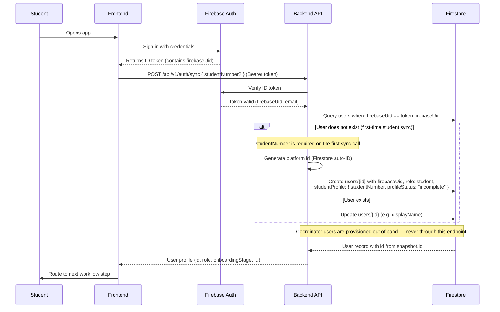
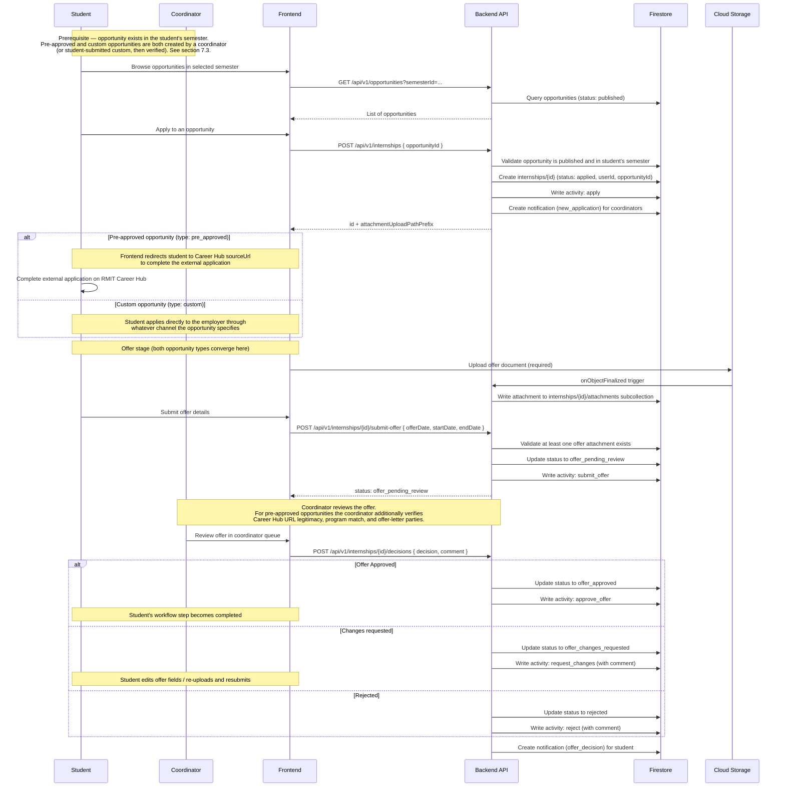
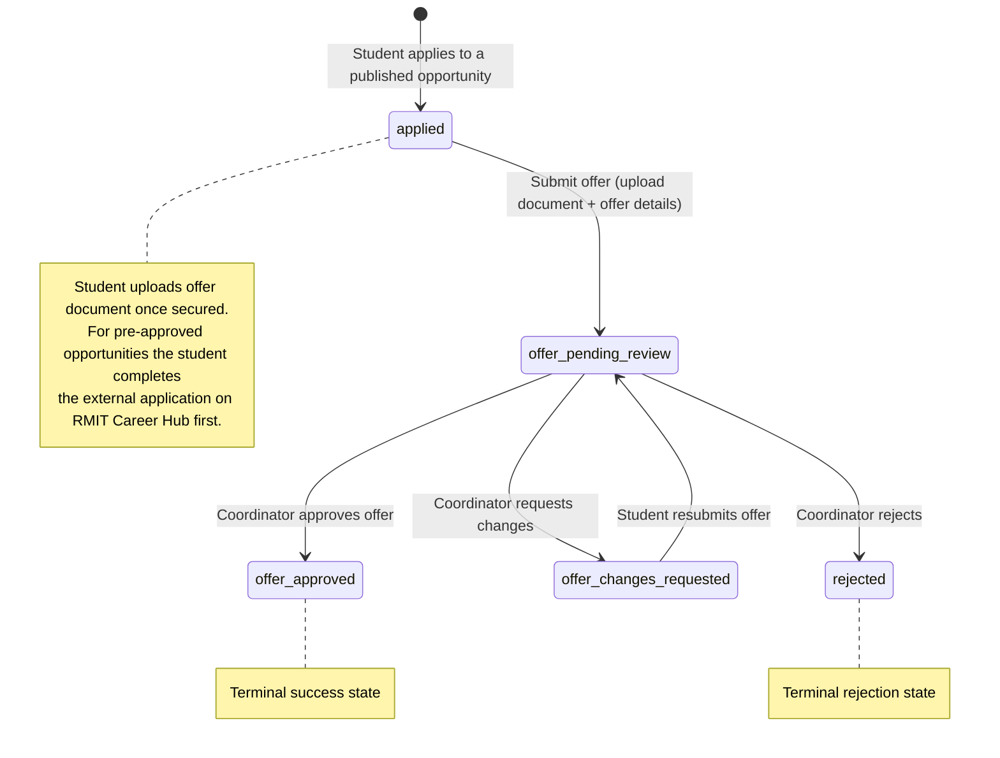
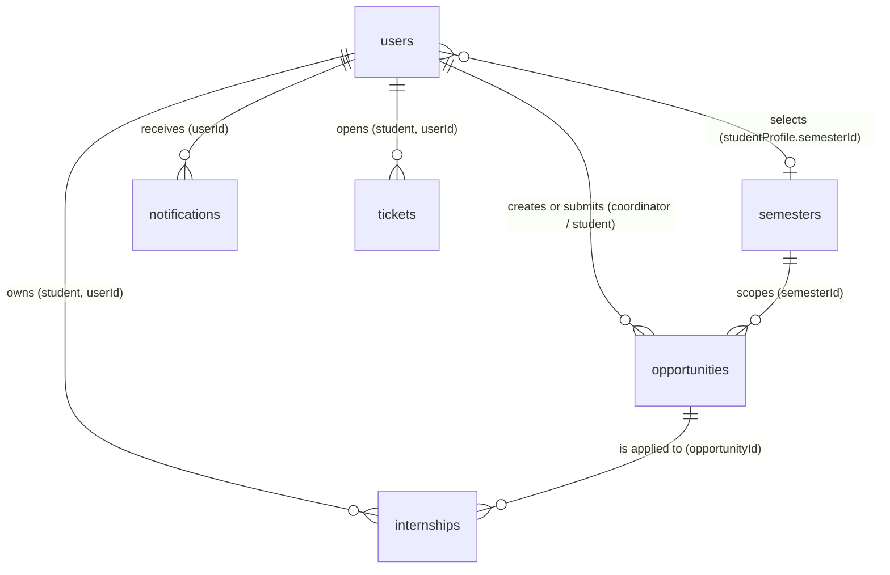

# Internship Platform Workflow and API Specification

Version: Draft 5  
Status: Working design document  
Primary stack: Firebase, Firestore, Cloud Storage, Cloud Functions v2

## 1. Overview

This document defines the platform workflow, API contract, and data model for the internship platform. The platform supports the student journey from sign-in through profile completion, semester enrolment, opportunity browsing and application, and job offer approval.

The document is intentionally product and API focused. It does not describe code-level folder structure or implementation detail. Its purpose is to provide:

- a clear API contract
- a Firestore data model
- the login and user-provisioning touchpoint with the backend
- diagrams that explain system behavior

## 2. Scope

In scope:

- student profile and confirmed academic information (manually entered by the student)
- semester enrolment as the gateway to opportunity browsing and applications
- coordinator-created opportunities (pre-approved via RMIT Career Hub links, or custom opportunities)
- student-submitted custom opportunities with coordinator verification
- student applications to opportunities, with offer upload and coordinator review
- coordinator review workflows with activity timeline
- semester management inside the app
- optional AI-assisted review suggestions (stateless, no data persisted)
- AI FAQ support for common internship questions
- support ticketing system (students submit questions/issues to coordinators)
- notifications and status tracking
- login handoff from Firebase Auth into the platform user model

Out of scope for this version:

- low-level source code design
- CI/CD and deployment pipelines
- advanced chatbot prompt engineering and knowledge-base authoring
- AI-assisted ticket deflection (suggesting answers before a student submits a ticket)
- institutional SSO federation (Entra ID / Azure AD / SAML / OIDC against RMIT's identity provider) — students authenticate directly with Firebase Auth
- per-coordinator work-item assignment and access scoping (all coordinators see all opportunities and internships in this version)
- personalised opportunity matching and semantic job search

## 3. Architecture Overview

The platform uses Firebase for identity and backend services, Firestore for operational records, Cloud Storage for uploaded files, and Cloud Functions v2 for APIs and business rules.

### Architecture Summary

1. Students and coordinators use separate frontend views over the same platform workflow.
2. The backend stores platform records in Firestore and documents in Cloud Storage.
3. Coordinators create and manage semester-scoped opportunities. Students enrol in a semester, browse its opportunities, and apply.
4. Students who find an opportunity externally can submit it as a custom opportunity for coordinator verification. Once verified, the opportunity is published and visible to all students in that semester.
5. Applications progress through offer upload and coordinator review. Coordinators approve or reject applications through backend APIs.
6. An AI FAQ service answers common internship questions using approved knowledge sources.
7. Students can submit support tickets to coordinators for questions or issues not answered by the AI FAQ.
8. Notifications are generated when important workflow states change and are delivered both in-app and by email.
9. Authentication is only the entry point into the platform workflow.

### AI Features

The app includes two AI-assisted features:

1. `AI pre-approval suggestions`
   A stateless API that returns review suggestions (concerns, missing details, recommended decision) for an internship application. It does not persist any data to Firestore — the response is consumed by the frontend as guidance only.

2. `AI FAQ`
   Used to answer common internship questions from students based on approved policy and process information. It is an assistance feature and should not override official coordinator decisions.

## 4. Actors

| Actor              | Description                             | Main Responsibilities                                                                                                              |
| ------------------ | --------------------------------------- | ---------------------------------------------------------------------------------------------------------------------------------- |
| Student            | Internship student using the web app    | Complete profile, enrol in semester, browse and apply to opportunities, upload documents, submit tickets, track progress           |
| Course Coordinator | Staff user managing internship workflow | Create and manage opportunities, verify student-submitted opportunities, review applications, manage semesters, respond to tickets |
| Identity Service   | Authentication provider (Firebase Auth) | Authenticate users before platform access                                                                                          |
| AI FAQ Service     | AI-assisted knowledge support           | Answer common internship questions from approved source material                                                                   |

The Backend API (Cloud Functions v2) is the system under specification in this document, not an external actor — it validates requests from the above actors, applies workflow rules, persists to Firestore, and triggers notifications.

## 5. Core Workflow

The expected end-to-end workflow is:

1. Student enters the platform and lands on the next required workflow step.
2. Student completes profile details, enters the required academic information manually (program, GPA, units, study load, etc.), and saves the profile. Once all required fields are present, `profileStatus` transitions to `complete` and the student can proceed to the next step.
3. Student selects an active semester from the app. Backend validates that the student's profile is complete and the semester's enrolment window is open. On success, the student is enrolled in that semester and can browse its opportunities.
4. Student browses opportunities belonging to their selected semester. Two types of opportunities exist:
   - **Pre-approved opportunities:** created by a coordinator with a link to RMIT Career Hub. When a student clicks "Apply," they are redirected to Career Hub to complete the external application. The platform tracks that the student has applied.
   - **Custom opportunities:** created by a coordinator directly, or submitted by a student who found a role externally. Student-submitted custom opportunities require coordinator verification before they become visible to all students in the semester.
5. Self-sourced opportunity submission path: a student finds an opportunity externally (LinkedIn, Seek, Indeed, a company careers page, etc.) and submits it to the platform with the position details. A coordinator reviews and verifies the submission. If approved, the opportunity is published and visible to all students in that semester. The coordinator can see how many students have applied to each opportunity.
6. Student applies to an opportunity. For both pre-approved and custom opportunities, the student proceeds to upload a job offer document once they have secured an offer.
7. Student uploads the job offer document and submits for coordinator review. For pre-approved opportunities the coordinator additionally verifies that the Career Hub URL is legitimate, the position matches the student's program, and the offer letter names the correct student and employer.
8. Coordinator reviews the job offer and approves, rejects, or requests changes. All actions are recorded in the activity timeline.
9. Students may use the AI FAQ feature to ask common process or policy questions, or submit support tickets to coordinators for issues that require human attention.
10. Notifications are sent on major workflow events through both in-app records and email delivery.

## 6. Login and User Provisioning Flow

Authentication is only the entry point into the platform. It should not dominate the document, but the handoff into the platform user model must be defined clearly.

### Authentication Rules

- Verify the Firebase ID token in every backend request.
- Create or upsert the local app user on the first verified request.

### Flow

1. User signs in on the frontend with Firebase Auth.
2. Firebase Auth returns an ID token for the signed-in user.
3. Frontend calls `POST /api/v1/auth/sync` with the bearer token.
4. Backend verifies the token with Firebase Admin.
5. Backend looks up the existing user by `firebaseUid`.
6. If no user exists, backend generates a new platform `id` and creates a `users/{id}` document with `firebaseUid`, `role: student`, and an embedded initial `studentProfile`.
7. Backend returns the user record (identity + role + onboarding state).
8. Frontend uses the onboarding state to decide the next screen.

### Notes

- The frontend signs in with Firebase Auth first, then calls backend APIs with the Firebase ID token.
- The backend uses the verified token to identify the caller and load the platform user and workflow state.
- If the user record does not exist yet, the backend creates it during the first verified request.
- Federation with RMIT's institutional identity provider (Entra ID / SSO) is **not in scope** for this platform. Students authenticate directly with Firebase Auth using their RMIT student email.

### Role Provisioning

- **Platform user id vs Firebase Auth UID.** The `users` collection uses Firestore auto-generated document IDs as the primary key (exposed to clients as `id`). The `firebaseUid` is stored as a separate indexed field on the user document — it is used only to resolve authenticated requests to a platform user, not as a key. URLs, foreign keys, and all domain data reference the platform `id`, never the Firebase UID. Foreign keys to users are named `userId` (e.g. `internships.userId`, `notifications.userId`) to make their reference nature obvious in the data model. This decouples the platform data model from the authentication provider.
- **Students** self-register through the normal sign-in flow. Any user created through `POST /auth/sync` is assigned `role: student` — this is the only role the public signup path produces. On first sync, the backend generates a new platform `id` (Firestore auto-ID), creates `users/{id}` with `firebaseUid` set to the authenticated Firebase UID and `role: student`, and embeds an initial `studentProfile` map with the supplied `studentNumber`.
- **Coordinators** are **never** created through the public sign-in flow. Coordinator user records are provisioned manually by an administrator — typically by generating a platform `id`, creating the `users/{id}` document with `role: coordinator` and the coordinator's `firebaseUid`, all out of band. The backend treats coordinator provisioning as an administrative action, not a user-facing feature. Coordinator user documents do not have a `studentProfile` field **and coordinators never own internships** — they only review them. Any attempt by a user with `role: coordinator` to create an internship returns `403`.
- **Mixed roles:** a single user record holds exactly one `role`. If a staff member also needs student access (rare), they use a separate Firebase Auth identity and receive a separate platform `id`.
- Role changes after account creation are an administrative action and are not exposed through the API in this version.

## 7. API Contract

All endpoints below assume:

- base path: `/api/v1`
- authentication: Firebase ID token in `Authorization: Bearer <token>`
- content type: `application/json`
- timestamps: ISO 8601 strings in API payloads and Firestore timestamps in storage
- authorization: the per-endpoint `Auth:` label is enforced against `users.role`. On every request, the backend resolves the Firebase ID token's UID to a platform user by looking up `users` where `firebaseUid == token.uid`. The resulting document ID (from `snapshot.id`) is the identity used for all downstream authorization and ownership checks, referred to as `caller.id` in the rules below. `Student` means `caller.role == 'student'`. `Coordinator` means `caller.role == 'coordinator'`. `Student owner` means `caller.role == 'student'` **and** the record's `userId` foreign key matches `caller.id`. `Notification owner` means the `notifications` record's `userId` field matches `caller.id`. `Ticket owner` means the `tickets` record's `userId` field matches `caller.id`. A mismatch returns `403`.

### 7.0 File Upload Pattern

File-backed records should behave like a single user action in the UI, even though the backend handles them in stages.

Recommended pattern:

1. Frontend creates a draft record with metadata.
2. Backend returns the draft ID and expected Cloud Storage path prefix.
3. Frontend uploads one or more files directly to Cloud Storage when the record type supports attachments.
4. A Cloud Storage `onObjectFinalized` trigger in Cloud Functions v2 parses the storage path and writes attachment metadata into Firestore.
5. Frontend calls a submit endpoint only when the user is ready to send the current draft for coordinator review.
6. Backend verifies that required files and metadata are already present in Firestore, then marks the record ready for review.

Rules:

- Opportunity attachments (position description documents) are optional.
- Job offer document is required on the internship before offer submission.
- Cloud Storage upload completion should not, by itself, start review. It only synchronizes file metadata into Firestore.
- The backend should be the source of truth for saved attachment metadata. Frontend should not be trusted as the final source of attachment records.
- The Storage-triggered function should verify that each file path matches the expected user-owned upload prefix before saving attachment metadata.
- When an internship is edited and resubmitted, old attachment records and files should be replaced so the attachment subcollection stores only the latest active files.
- If upload fails, the record remains in its current state.
- If submit fails, the frontend may retry submit without recreating the draft.
- A record in review remains editable until the coordinator makes a final decision.
- Editing a record under review updates the same internship and the coordinator reviews the latest version.

### 7.1 Authentication and User Sync

#### `POST /api/v1/auth/sync`

Purpose: Verify the Firebase identity and return the platform user record. On first sync for a new student, a platform `id` is generated and a new `users/{id}` document is created with `firebaseUid` set, `role: student`, and an embedded initial `studentProfile`.

Auth: Any authenticated Firebase user

Request body:

| Field         | Type   | Required    | Notes                                                                                                                                                                                                                                                                                                                                |
| ------------- | ------ | ----------- | ------------------------------------------------------------------------------------------------------------------------------------------------------------------------------------------------------------------------------------------------------------------------------------------------------------------------------------ |
| studentNumber | string | Conditional | Required on the **first** `auth/sync` call for a new student (i.e. when no `users` document with the caller's `firebaseUid` exists yet). Ignored on subsequent calls — the canonical value lives on `users/{id}.studentProfile.studentNumber` and is updated through `PATCH /users/{id}`. Coordinators never need to send this field |
| displayName   | string | No          | Optional client-supplied display name                                                                                                                                                                                                                                                                                                |

Success response:

```json
{
  "id": "usr_aBc123XyZ",
  "firebaseUid": "aBcDeFgHiJkLmNoPqRsTuVwXyZ12",
  "email": "s1234567@student.rmit.edu.au",
  "role": "student",
  "status": "active",
  "onboardingStage": "profile_pending"
}
```

Notes:

- `id` is the platform user identifier (Firestore auto-generated, opaque). Clients should store this and use it as the `{id}` path parameter for user-addressed URLs. `me` is accepted as an alias for the caller's own `id` in student URLs.
- `firebaseUid` is returned for client reference but is **not** used in any URL paths or foreign keys — it exists only to map the auth provider's identity to the platform user record.
- On repeat calls, the backend looks up the existing user via `firebaseUid`, updates mutable fields (e.g. `displayName`), and returns the same `id`.

Failure cases:

- `401` invalid or missing Firebase token
- `403` authenticated user is not allowed into the platform
- `422` first-time student sync is missing `studentNumber` in the request body (required to create the `users/{id}.studentProfile` record on first call)

Side effects:

- **First call (no existing user):** generates a new platform `id` (Firestore auto-ID), creates `users/{id}` with `firebaseUid: token.uid`, `role: student`, `email` and `displayName` from the Firebase token, and `studentProfile: { studentNumber, profileStatus: "incomplete" }`.
- **Subsequent calls (existing user):** updates `users/{id}` with any supplied `displayName`. Other fields are preserved.

#### `GET /api/v1/me`

Purpose: Return the current platform user. Polymorphic — the response shape depends on the caller's role. A student caller receives the full student resource (identity + embedded `studentProfile` + workflow summary); a coordinator caller receives the thinner coordinator resource (identity only, since coordinators have no `studentProfile`).

Auth: Authenticated platform user

Success response (student caller):

```json
{
  "id": "usr_aBc123XyZ",
  "role": "student",
  "email": "s1234567@student.rmit.edu.au",
  "displayName": "Alex Chen",
  "status": "active",
  "onboardingStage": "profile_pending",
  "currentWorkflowStep": "profile",
  "studentProfile": {
    "studentNumber": "s1234567",
    "programCode": "BP096",
    "phone": "0400000000",
    "academicInfo": null,
    "profileStatus": "incomplete"
  }
}
```

Success response (coordinator caller):

```json
{
  "id": "usr_DeF456UvW",
  "role": "coordinator",
  "email": "coordinator@rmit.edu.au",
  "displayName": "Dr. Jane Smith",
  "status": "active",
  "onboardingStage": "profile_complete"
}
```

Notes:

- `id` is the platform-generated user identifier (Firestore auto-ID). `firebaseUid` is intentionally **not** returned here — it is an authentication implementation detail that clients should never need.
- The `studentProfile` nested map is only present for students. Coordinator responses omit it entirely.
- `currentWorkflowStep` is only present for students (it's a workflow-specific field and has no meaning for coordinators).
- `onboardingStage` is always `profile_complete` for coordinators (they have no profile to complete — the field is carried on the user document for schema consistency but has no onboarding workflow for this role).
- `studentProfile.academicInfo` is `null` until the student confirms values via `PATCH /users/{id}` at least once.
- Equivalent to calling `GET /users/me` when the caller is a student. For coordinators there is no corresponding `/coordinators/me` endpoint in v1; coordinators use `/me` directly.

Failure cases:

- `401` unauthorized
- `404` user record does not exist yet (call `POST /auth/sync` first)

Workflow step values: `profile`, `semester_selection`, `opportunity_browsing`, `offer_stage`, `completed`.

This is the **coarse** workflow vocabulary used by the frontend for routing. It is derived from the student's semester enrolment and internship records:

| Step                   | Condition                                                                                                 |
| ---------------------- | --------------------------------------------------------------------------------------------------------- |
| `profile`              | `profileStatus != complete`                                                                               |
| `semester_selection`   | Profile is complete but no semester selected (`studentProfile.semesterId` is null)                        |
| `opportunity_browsing` | Semester selected, and the student has no internships or no internships past the `applied` state          |
| `offer_stage`          | At least one internship in `offer_pending_review` or `offer_changes_requested`, and none `offer_approved` |
| `completed`            | At least one internship in `offer_approved`                                                               |

`rejected` internships are ignored by this step calculation — the step reflects the **furthest-along non-rejected** internship. If every internship a student created has been rejected, the step falls back to `opportunity_browsing` (the student can apply to another opportunity). The same student can have multiple internships in parallel, so when mixed states exist, the step reflects the furthest-along non-rejected one.

The **fine** vocabulary for display (not routing) is the derived workflow state in section 9.2 (e.g. `offer_in_review`, `offer_approved`). `GET /users/{id}/workflow` returns both vocabularies in its response.

### 7.2 Users

The `users` resource represents any platform user (student or coordinator). A student is simply a user with `role: student` and an embedded `studentProfile` nested map. A coordinator is a user with `role: coordinator` and no `studentProfile`. The path segment `{id}` is the platform-generated user identifier (Firestore auto-ID), and accepts either a concrete `id` or the alias `me`, which resolves to the caller's own id.

The sub-resources `/workflow` and `/semester-selection` are **student-specific** — they return `404` if the referenced user has `role: coordinator` (the sub-resource does not exist for coordinator users). The sub-resource `/activity` is available for all roles — it returns the caller's own activity feed across all internships and opportunities.

#### `GET /api/v1/users/{id}`

Purpose: Return a user. For students, returns the user document with its embedded `studentProfile`. For coordinators, returns identity fields only. Used by the frontend to hydrate the profile form for a student viewing their own record, and by coordinators to view a student's full details during internship review.

Auth: Student owner (`{id} == caller.id`) or Coordinator. Students may read only their own record; coordinators may read any student.

Success response:

```json
{
  "id": "usr_aBc123XyZ",
  "email": "s1234567@student.rmit.edu.au",
  "displayName": "Alex Chen",
  "role": "student",
  "status": "active",
  "onboardingStage": "profile_complete",
  "studentProfile": {
    "studentNumber": "s1234567",
    "programCode": "BP096",
    "phone": "0400000000",
    "academicInfo": {
      "programName": "Bachelor of Software Engineering (Professional)",
      "programLevel": "undergraduate",
      "programStatus": "active_in_program",
      "majors": [],
      "minors": ["Data Science"],
      "unitsAttempted": 192,
      "creditUnitsEarned": 168,
      "gpa": 3.2,
      "currentStudyLoad": "full_time",
      "confirmedAt": "2026-04-05T03:14:12Z"
    },
    "profileStatus": "complete"
  }
}
```

Notes:

- `firebaseUid` is not returned by this endpoint — it is an authentication implementation detail and clients never need it for any request.
- `studentProfile.academicInfo` is null (or the field is omitted) until the student has confirmed values via `PATCH /users/{id}` at least once.
- `GET /api/v1/users/me` is an alias that resolves `me` to the caller's own `id`.

Failure cases:

- `401` unauthorized
- `403` caller is a student and `{id} != caller.id`
- `404` no student exists with the referenced `id` (the user does not exist, or the user has `role: coordinator` and no `studentProfile`)

#### `PATCH /api/v1/users/{id}`

Purpose: Partially update a user. For students, updates fields on the embedded `studentProfile` nested map. Top-level user fields are **never** writable through this endpoint: `email`, `displayName`, `firebaseUid`, and `role` sync from Firebase Auth at sign-in; `status` and `onboardingStage` are administrative fields set by the backend or by out-of-band admin actions.

Auth: Owner only (`{id} == caller.id`). A student can update their own `studentProfile`. A coordinator can call this endpoint on their own id, but there are currently no writable fields for coordinators — any non-empty body returns `422`.

Request body (student caller):

| Field          | Type   | Required | Notes                                                                                                                                                                                 |
| -------------- | ------ | -------- | ------------------------------------------------------------------------------------------------------------------------------------------------------------------------------------- |
| studentProfile | object | Yes      | The `studentProfile` nested map to merge onto the user document. Required sub-fields: `studentNumber`, `programCode`, `academicInfo` (see section 8.2A). Optional sub-fields: `phone` |

Student request body example:

```json
{
  "studentProfile": {
    "studentNumber": "s1234567",
    "programCode": "BP096",
    "phone": "0400000000",
    "academicInfo": {
      "programName": "Bachelor of Software Engineering (Professional)",
      "programLevel": "undergraduate",
      "unitsAttempted": 192,
      "creditUnitsEarned": 168,
      "gpa": 3.2,
      "currentStudyLoad": "full_time"
    }
  }
}
```

Success response: the full updated user resource, same shape as `GET /users/{id}`.

Failure cases:

- `400` invalid field format, or request body attempts to write a non-writable field (`email`, `displayName`, `role`, `firebaseUid`, `status`, `onboardingStage`)
- `401` unauthorized
- `403` caller is not the owner (`{id} != caller.id`) — users cannot update other users' records
- `422` caller is a student and one or more required `studentProfile` sub-fields are missing (`studentNumber`, `programCode`, or `academicInfo` with its required sub-fields: `programName`, `programLevel`, `unitsAttempted`, `creditUnitsEarned`, `gpa`, `currentStudyLoad`)
- `422` caller is a coordinator and the request body contains any field (no writable fields exist for coordinators in this version)

Notes:

- For students, writes the `studentProfile` nested map on `users/{id}`. Identity fields on the user document (`email`, `displayName`, `firebaseUid`, `role`) are not touched — those sync from Firebase Auth at sign-in time through `POST /auth/sync`.
- The backend sets `studentProfile.academicInfo.confirmedAt` to the server timestamp on each successful write.
- The backend sets `studentProfile.profileStatus` to `complete` when all required `studentProfile` fields and all required `academicInfo` fields are present; otherwise it remains `incomplete`. `profileStatus: complete` is the precondition for selecting a semester.
- `PATCH /api/v1/users/me` is an alias that resolves `me` to the caller's own id.

#### `GET /api/v1/users/{id}/workflow`

Purpose: Return the student's end-to-end internship workflow state. This sub-resource only exists for users with `role: student`.

Auth: Student owner (`{id} == caller.id`) or Coordinator. Coordinators can read any student's workflow state during internship review. `GET /api/v1/users/me/workflow` is an alias for the caller.

Success response:

```json
{
  "currentWorkflowStep": "opportunity_browsing",
  "internshipStatus": "browsing_opportunities",
  "semesterEnrolmentState": "enrolled"
}
```

Failure cases:

- `401` unauthorized
- `403` caller is a student and `{id} != caller.id`
- `404` no user exists with the referenced `id`, or the user has `role: coordinator` (workflow sub-resource does not exist for coordinator users)

Response fields:

| Field                  | Type   | Notes                                                                                                                     |
| ---------------------- | ------ | ------------------------------------------------------------------------------------------------------------------------- |
| currentWorkflowStep    | string | Coarse routing vocabulary (see section 7.1 / `GET /me`)                                                                   |
| internshipStatus       | string | Fine derived workflow state — one of the values in section 9.2                                                            |
| semesterEnrolmentState | string | Derived display state for the semester enrolment step. Not persisted. Values: `not_enrolled`, `enrolled`, `window_closed` |

Note: `semesterEnrolmentState` is a **derived** display state used by the frontend for UI rendering. The backend computes it at response time by checking whether the student has a `semesterId` set on their `studentProfile` and whether the referenced semester's enrolment window is still open.

#### `GET /api/v1/users/{id}/activity`

Purpose: Return activity entries authored by this user across all internships and opportunities. Uses a Firestore collection group query on the `activity` subcollection filtered by `authorUserId`. This gives coordinators a "my actions" feed (every review, comment, approval, rejection, and verification they've performed) and students a "my activity" feed (every comment and submission they've made) — without requiring a denormalized root collection.

Auth: Owner only (`{id} == caller.id`). A user can only view their own activity feed. `GET /api/v1/users/me/activity` is an alias for the caller.

Query params:

| Field     | Type   | Required | Notes                                                                                 |
| --------- | ------ | -------- | ------------------------------------------------------------------------------------- |
| limit     | number | No       | Page size, default `50`, max `200`                                                    |
| pageToken | string | No       | Opaque cursor from the previous response's `nextPageToken`. Omit on the first request |

Success response:

```json
{
  "items": [
    {
      "id": "act_xYz789aBc",
      "internshipId": "int_001",
      "type": "approve_offer",
      "authorUserId": "usr_coord01",
      "authorRole": "coordinator",
      "text": "Offer looks good, approved.",
      "createdAt": "2026-04-05T10:30:00Z"
    },
    {
      "id": "act_dEf456gHi",
      "internshipId": "int_002",
      "type": "comment",
      "authorUserId": "usr_coord01",
      "authorRole": "coordinator",
      "text": "Please clarify the supervision structure.",
      "createdAt": "2026-04-05T09:15:00Z"
    }
  ],
  "nextPageToken": null
}
```

Notes:

- `internshipId` is derived from the activity document's parent path (`internships/{internshipId}/activity/{activityId}`) — it is not a stored field on the activity document itself.
- Results are ordered by `createdAt` descending (most recent first).
- This endpoint uses a Firestore **collection group query** on the `activity` subcollection, which requires a composite index on `authorUserId` + `createdAt` (see section 8.8).
- The response does not include internship metadata (student name, job title, status). If the frontend needs that context, it hydrates it by fetching the parent internship document separately.

Failure cases:

- `401` unauthorized
- `403` caller is not the referenced user (`{id} != caller.id`)
- `404` no user exists with the referenced `id`

### 7.3 Opportunities

An opportunity represents an internship position that students can apply to. Opportunities are scoped to a semester and come in two types: **pre-approved** (coordinator-created with a Career Hub link) and **custom** (coordinator-created directly, or student-submitted and verified by a coordinator). Once an opportunity is published, all students enrolled in that semester can see and apply to it.

#### `POST /api/v1/opportunities`

Purpose: Create an opportunity. Both coordinators and students can create opportunities, but the behavior differs by role.

Auth: Coordinator or Student

Role-based behavior:

- **Coordinator**: creates an opportunity with `status: draft` (or `status: published` if the coordinator sets it directly). The coordinator specifies the `semesterId`, `type`, and position details.
- **Student**: submits a custom opportunity they found externally. The opportunity is created with `status: pending_verification` and `type: custom`. The `semesterId` is taken from the student's currently selected semester. The student cannot create `pre_approved` opportunities.

Request body:

| Field           | Type   | Required    | Notes                                                                                                                                                                                                                                                                                     |
| --------------- | ------ | ----------- | ----------------------------------------------------------------------------------------------------------------------------------------------------------------------------------------------------------------------------------------------------------------------------------------- |
| semesterId      | string | Conditional | **Required** for coordinators. For students, automatically set from `studentProfile.semesterId`                                                                                                                                                                                           |
| type            | string | Conditional | `pre_approved` or `custom`. **Required** for coordinators. For students, always `custom` (ignored if sent)                                                                                                                                                                                |
| employerName    | string | Yes         | Name of employer                                                                                                                                                                                                                                                                          |
| jobTitle        | string | Yes         | Internship role title                                                                                                                                                                                                                                                                     |
| descriptionText | string | Yes         | Main position description content                                                                                                                                                                                                                                                         |
| workMode        | string | No          | `onsite`, `hybrid`, or `remote`                                                                                                                                                                                                                                                           |
| location        | string | No          | Work location                                                                                                                                                                                                                                                                             |
| sourceUrl       | string | Conditional | URL pointing to the job listing. **Required** when `type: pre_approved` — must match the RMIT Career Hub domain allowlist (`https://careerhub.rmit.edu.au/...`). **Optional** for `custom` — students may paste a LinkedIn, Seek, Indeed, or company careers URL as informational context |
| status          | string | No          | Coordinator only. `draft` (default) or `published`. Students cannot set this — their submissions always start at `pending_verification`                                                                                                                                                   |

Success response:

```json
{
  "id": "opp_042",
  "semesterId": "sem_abc123xyz",
  "type": "pre_approved",
  "employerName": "Example Pty Ltd",
  "jobTitle": "Software Intern",
  "sourceUrl": "https://careerhub.rmit.edu.au/jobs/12345",
  "status": "published",
  "createdByUserId": "usr_DeF456UvW",
  "attachmentUploadPathPrefix": "opportunities/opp_042/attachments/"
}
```

Failure cases:

- `400` invalid field format (e.g. unknown `type` value)
- `401` unauthorized
- `403` student caller attempted to set `type: pre_approved`
- `409` student caller does not have a selected semester (`studentProfile.semesterId` is null)
- `409` referenced `semesterId` does not exist or has `status != active`
- `422` missing required fields (`employerName`, `jobTitle`, `descriptionText`)
- `422` `type: pre_approved` but `sourceUrl` is missing or does not match the Career Hub domain allowlist

Side effects:

- creates `opportunities/{id}` with the supplied fields
- if coordinator caller: sets `createdByUserId: caller.id`
- if student caller: sets `submittedByUserId: caller.id`, `status: pending_verification`

Notes:

- **Domain allowlist validation is a weak trust signal** for pre-approved opportunities. It confirms the URL points to Career Hub but does not verify the listing exists or matches the submitted fields. The coordinator verifies the listing content during offer-stage review of individual applications.
- **Program match is not verified at opportunity creation.** Career Hub lists internships across all RMIT disciplines. Program-match verification is deferred to coordinator offer-stage review (see section 7.7).

#### `GET /api/v1/opportunities`

Purpose: Return opportunities the caller is allowed to see. Students see only `published` opportunities for their enrolled semester. Coordinators see all opportunities across all semesters.

Auth: Authenticated platform user (Student or Coordinator)

Authorization:

- **Student**: backend automatically filters to `opportunities.semesterId == caller.studentProfile.semesterId` AND `opportunities.status == published`. The student cannot widen the query.
- **Coordinator**: no automatic filters — sees all opportunities. Can filter by `semesterId`, `status`, `type`.

Query params:

| Field      | Type   | Required | Notes                                                                                                                     |
| ---------- | ------ | -------- | ------------------------------------------------------------------------------------------------------------------------- |
| semesterId | string | No       | Filter by semester. Students can only pass their own enrolled semester or omit (auto-filtered). Coordinators can pass any |
| status     | string | No       | Filter by status. Coordinator only — students always see `published` only                                                 |
| type       | string | No       | Filter by `pre_approved` or `custom`                                                                                      |
| limit      | number | No       | Page size, default `50`, max `200`                                                                                        |
| pageToken  | string | No       | Opaque cursor from the previous response's `nextPageToken`                                                                |
| order      | string | No       | `createdAt_desc` (default)                                                                                                |

Success response:

```json
{
  "items": [
    {
      "id": "opp_042",
      "semesterId": "sem_abc123xyz",
      "type": "pre_approved",
      "employerName": "Example Pty Ltd",
      "jobTitle": "Software Intern",
      "sourceUrl": "https://careerhub.rmit.edu.au/jobs/12345",
      "status": "published",
      "applicationCount": 5,
      "createdAt": "2026-04-04T09:00:00Z"
    }
  ],
  "nextPageToken": null
}
```

Notes:

- `applicationCount` is included for coordinators to see how many students have applied to each opportunity. For students, this field may be omitted or included depending on product needs.
- `nextPageToken` is `null` when no more results exist.

Failure cases:

- `400` invalid query param value
- `400` student caller passed a `semesterId` that does not match their enrolled semester
- `401` unauthorized
- `409` student caller does not have a selected semester

#### `GET /api/v1/opportunities/{id}`

Purpose: Return a single opportunity with full details.

Auth: Student (if published and in their semester) or Coordinator

Success response:

```json
{
  "id": "opp_042",
  "semesterId": "sem_abc123xyz",
  "type": "pre_approved",
  "employerName": "Example Pty Ltd",
  "jobTitle": "Software Intern",
  "descriptionText": "...",
  "workMode": "hybrid",
  "location": "Melbourne, VIC",
  "sourceUrl": "https://careerhub.rmit.edu.au/jobs/12345",
  "status": "published",
  "applicationCount": 5,
  "createdByUserId": "usr_DeF456UvW",
  "submittedByUserId": null,
  "verifiedByUserId": null,
  "verifiedAt": null,
  "createdAt": "2026-04-04T09:00:00Z",
  "updatedAt": "2026-04-04T09:00:00Z"
}
```

Failure cases:

- `401` unauthorized
- `403` student caller and the opportunity is not `published` or not in their enrolled semester
- `404` opportunity does not exist

#### `PATCH /api/v1/opportunities/{id}`

Purpose: Update an opportunity's metadata or status.

Auth: Coordinator

Editable fields: `employerName`, `jobTitle`, `descriptionText`, `workMode`, `location`, `sourceUrl`, `status`. Immutable fields: `id`, `semesterId`, `type`, `createdByUserId`, `submittedByUserId`.

Status transitions allowed via PATCH:

- `draft` → `published` (coordinator publishes)
- `published` → `archived` (coordinator archives)
- `draft` → `archived`

Note: `pending_verification` → `published` or `rejected` is handled through the dedicated `POST /opportunities/{id}/verify` endpoint, not through PATCH.

Failure cases:

- `400` body contains immutable fields or invalid status transition
- `401` unauthorized
- `403` caller does not have `role: coordinator`
- `404` opportunity does not exist
- `422` body is empty

Side effects:

- updates the specified fields on `opportunities/{id}`
- updates `updatedAt` to server timestamp

#### `POST /api/v1/opportunities/{id}/verify`

Purpose: Coordinator verifies a student-submitted custom opportunity. Only applicable to opportunities with `status: pending_verification`.

Auth: Coordinator

Request body:

| Field    | Type   | Required    | Notes                                                           |
| -------- | ------ | ----------- | --------------------------------------------------------------- |
| decision | string | Yes         | `approved` or `rejected`                                        |
| comment  | string | Conditional | **Required** when `decision: rejected`. Optional for `approved` |

Success response:

```json
{
  "id": "opp_042",
  "status": "published"
}
```

Failure cases:

- `400` `decision` is not `approved` or `rejected`
- `401` unauthorized
- `403` caller does not have `role: coordinator`
- `404` opportunity does not exist
- `409` opportunity is not in `pending_verification` state
- `422` `decision: rejected` without a `comment`

Side effects:

- if `approved`: updates status to `published`, sets `verifiedByUserId: caller.id`, `verifiedAt: server timestamp`
- if `rejected`: updates status to `rejected`, sets `verifiedByUserId: caller.id`, `verifiedAt: server timestamp`
- creates a notification for the student who submitted the opportunity

### 7.4 Internships

An internship represents a student's application to a specific opportunity. It tracks the student's progress through the offer upload and review workflow. Each internship links to an opportunity via `opportunityId`.

#### `POST /api/v1/internships`

Purpose: Create an internship (apply to an opportunity). The student specifies the opportunity they want to apply to; the backend creates the internship record linking the student to that opportunity.

Auth: Student. The backend sets `userId` from the authenticated caller.

Rule: a student may apply to multiple opportunities. Each application is independent and tracked by its own internship record and workflow state.

Request body:

| Field         | Type   | Required | Notes                       |
| ------------- | ------ | -------- | --------------------------- |
| opportunityId | string | Yes      | The opportunity to apply to |

Success response:

```json
{
  "id": "int_042",
  "userId": "usr_aBc123XyZ",
  "opportunityId": "opp_042",
  "status": "applied",
  "attachmentUploadPathPrefix": "users/usr_aBc123XyZ/internships/int_042/attachments/"
}
```

Failure cases:

- `401` unauthorized
- `403` caller does not have `role: student`
- `404` opportunity does not exist
- `409` student does not have a selected semester (`studentProfile.semesterId` is null)
- `409` opportunity is not `published`
- `409` opportunity's `semesterId` does not match the student's enrolled semester
- `409` student has already applied to this opportunity (duplicate application)

Side effects:

- creates `internships/{id}` with `userId: caller.id`, `opportunityId`, `status: applied`, `version: 1`
- creates an activity entry: `{ type: "apply" }`
- creates a `new_application` notification for coordinators (see section 7.8 notification types)

Notes:

- For **pre-approved** opportunities (`type: pre_approved`), the frontend should redirect the student to the Career Hub `sourceUrl` after the internship is created. The platform tracks the application status; the actual external application happens on Career Hub.
- Position description fields (`employerName`, `jobTitle`, etc.) are **not** on the internship — they live on the linked opportunity. The internship only holds offer-stage fields and workflow state.

#### `POST /api/v1/internships/{id}/submit-offer`

Purpose: Submit the job offer for coordinator review after uploading the offer document.

Auth: Student owner

Request body:

| Field     | Type   | Required | Notes                 |
| --------- | ------ | -------- | --------------------- |
| offerDate | string | Yes      | ISO 8601 date         |
| startDate | string | Yes      | Internship start date |
| endDate   | string | No       | Internship end date   |

Success response:

```json
{
  "id": "int_001",
  "status": "offer_pending_review"
}
```

Failure cases:

- `401` unauthorized
- `403` caller is not the student owner
- `404` internship does not exist
- `409` internship is not in `applied` or `offer_changes_requested` state
- `422` at least one offer attachment is required in the `attachments` subcollection
- `422` missing or invalid offer details (`offerDate`, `startDate`)

Side effects:

- updates status to `offer_pending_review`, populates offer fields
- sets `lastSubmittedAt` to the server timestamp
- creates an activity entry: `{ type: "submit_offer" }`

#### `PATCH /api/v1/internships/{id}`

Purpose: Update an internship's offer-stage fields.

Auth: Student owner

Rule: Coordinators cannot edit student submissions through this endpoint — they influence the internship only by issuing decisions (`POST /internships/{id}/decisions`) or leaving comments (`POST /internships/{id}/comments`).

Editable states: `applied`, `offer_pending_review`, `offer_changes_requested`. A `rejected` or `offer_approved` internship cannot be edited.

Editable fields: `offerDate`, `startDate`, `endDate`.

State-change rules on edit:

- Editing in `applied` or `offer_changes_requested` keeps the current state — the student updates the draft before submitting.
- Editing in `offer_pending_review` keeps the current state — the coordinator reviews the latest version.

Failure cases:

- `401` unauthorized
- `403` caller is not the student owner
- `404` internship does not exist
- `409` internship is in a non-editable state (`rejected` or `offer_approved`)

Side effects:

- creates an activity entry: `{ type: "edit" }` with a `version` reference
- increments `version`

#### `GET /api/v1/internships`

Purpose: Return internships the caller is allowed to see. Students see only their own internships; coordinators see all internships across the platform. Ordered by `createdAt` descending (newest first).

Auth: Authenticated platform user (Student or Coordinator)

Authorization:

- **Student**: backend automatically filters to `internships.userId == caller.id`. The student cannot widen the query.
- **Coordinator**: no ownership filter applied — the coordinator sees all internships. In this version there is no per-coordinator scoping (see section 11).

Query params:

| Field         | Type   | Required | Notes                                                                                                                                                                  |
| ------------- | ------ | -------- | ---------------------------------------------------------------------------------------------------------------------------------------------------------------------- |
| status        | string | No       | Filter by a single status or comma-separated list (e.g. `offer_pending_review`)                                                                                        |
| opportunityId | string | No       | Filter to internships for a specific opportunity. Useful for coordinators to see who applied to a given opportunity                                                    |
| userId        | string | No       | Filter to internships owned by a specific user. Coordinators may pass any `userId`. Students may only pass their own or omit — passing another student's returns `400` |
| limit         | number | No       | Page size, default `50`, max `200`                                                                                                                                     |
| pageToken     | string | No       | Opaque cursor from the previous response's `nextPageToken`                                                                                                             |
| order         | string | No       | `createdAt_desc` (default), `lastSubmittedAt_desc`, or `lastSubmittedAt_asc` (useful for coordinators draining the review queue FIFO)                                  |

Student example (list own internships):

```
GET /api/v1/internships
```

Coordinator example (offer review queue):

```
GET /api/v1/internships?status=offer_pending_review&order=lastSubmittedAt_asc
```

Coordinator example (who applied to a specific opportunity):

```
GET /api/v1/internships?opportunityId=opp_042
```

Success response:

```json
{
  "items": [
    {
      "id": "int_001",
      "userId": "usr_aBc123XyZ",
      "opportunityId": "opp_042",
      "studentProgramCode": "BP096",
      "opportunityEmployerName": "Example Pty Ltd",
      "opportunityJobTitle": "Software Intern",
      "opportunityType": "pre_approved",
      "status": "offer_pending_review",
      "lastSubmittedAt": "2026-04-05T03:14:12Z",
      "createdAt": "2026-04-04T09:00:00Z"
    }
  ],
  "nextPageToken": null
}
```

Notes:

- `studentProgramCode` is denormalized from `users/{id}.studentProfile.programCode` at query time so coordinators can spot program mismatches at a glance.
- `opportunityEmployerName`, `opportunityJobTitle`, and `opportunityType` are denormalized from the linked opportunity at query time for display convenience.
- `nextPageToken` is `null` when no more results exist.
- Filtering by a `userId` or `opportunityId` that does not exist returns an empty `items` array, not `404`.

Failure cases:

- `400` invalid query param value (e.g. unknown `status` value, malformed `order`)
- `400` caller is a student and passed a `userId` query param that does not match their own `userId`
- `401` unauthorized

#### `GET /api/v1/internships/{id}`

Purpose: Return a single internship with its offer-stage details. The linked opportunity's position description fields are denormalized into the response for convenience.

Auth: Student owner or coordinator

Authorization rules:

- A student may only read internships they own (`internships.userId == caller.id`), otherwise `403`.
- In this version all coordinators can read every internship — there is no per-coordinator scoping (see section 11).

Success response:

```json
{
  "id": "int_001",
  "userId": "usr_aBc123XyZ",
  "opportunityId": "opp_042",
  "studentProgramCode": "BP096",
  "opportunityEmployerName": "Example Pty Ltd",
  "opportunityJobTitle": "Software Intern",
  "opportunityType": "pre_approved",
  "opportunitySourceUrl": "https://careerhub.rmit.edu.au/jobs/12345",
  "status": "offer_pending_review",
  "version": 1,
  "coordinatorDecision": null,
  "coordinatorComment": null,
  "reviewedByUserId": null,
  "reviewedAt": null,
  "offerDate": null,
  "startDate": null,
  "endDate": null,
  "lastSubmittedAt": "2026-04-05T03:14:12Z",
  "createdAt": "2026-04-04T09:00:00Z",
  "updatedAt": "2026-04-05T03:14:12Z"
}
```

Notes:

- `opportunity*` fields are denormalized from the linked opportunity at query time for convenience. The canonical source is the `opportunities/{opportunityId}` document.
- The `activity` and `attachments` subcollections are not inlined. Clients fetch those separately.

Failure cases:

- `401` unauthorized
- `403` caller is a student and not the owner
- `404` internship does not exist

#### `POST /api/v1/internships/{id}/comments`

Purpose: Add a comment to the internship activity timeline. Role-neutral path because both students and coordinators can comment.

Auth: Student owner or coordinator

Rule: comments can be added in any internship state, including after a final decision (`offer_approved` or `rejected`), so the conversation between student and coordinator remains open.

Request body:

| Field | Type   | Required | Notes           |
| ----- | ------ | -------- | --------------- |
| text  | string | Yes      | Comment content |

Success response: the newly-created activity entry (see section 8.4A).

```json
{
  "id": "act_xYz789aBc",
  "type": "comment",
  "authorUserId": "usr_aBc123XyZ",
  "authorRole": "student",
  "text": "Can you clarify the supervision structure?",
  "createdAt": "2026-04-05T03:14:12Z"
}
```

Failure cases:

- `401` unauthorized
- `403` caller is a student and not the owner
- `404` internship does not exist
- `422` `text` missing or empty

Side effects:

- creates an activity entry: `{ type: "comment", text: "...", authorUserId: caller.id, authorRole: caller.role, createdAt: server timestamp }` in `internships/{id}/activity`

### 7.5 Semester Management

#### `GET /api/v1/semesters`

Purpose: Return semesters configured in the app and available for enrolment workflows.

Auth: Authenticated platform user

Query params:

| Field        | Type   | Required | Notes                                                                                 |
| ------------ | ------ | -------- | ------------------------------------------------------------------------------------- |
| status       | string | No       | Filter by `draft`, `active`, or `archived`. If omitted, returns all                   |
| semesterCode | string | No       | Filter by academic semester code (e.g. `2026-S1`)                                     |
| courseCode   | string | No       | Filter by RMIT WIL course code (e.g. `INTE2710`)                                      |
| limit        | number | No       | Page size, default `50`, max `200`                                                    |
| pageToken    | string | No       | Opaque cursor from the previous response's `nextPageToken`. Omit on the first request |

Success response:

```json
{
  "items": [
    {
      "id": "sem_abc123xyz",
      "semesterCode": "2026-S1",
      "displayName": "Semester 1 2026",
      "status": "active",
      "courseCode": "INTE2710",
      "enrolmentOpenAt": "2026-01-15T00:00:00Z",
      "enrolmentCloseAt": "2026-03-13T23:59:59Z"
    }
  ],
  "nextPageToken": null
}
```

Failure cases:

- `401` unauthorized

RMIT WIL course context:

- WIL courses in the School of Computing Technologies are shared across the Professional streams (BP096 Software Engineering, BP347 Computer Science Professional, BP349 IT Professional). The primary courses are:
  - `INTE2710` Internship 2a — first 240-hour industry placement block (24 credit points)
  - `INTE2711` Internship 2b — second 240-hour industry placement block (24 credit points)
  - `INTE2708` Internship Reflection 1 — reflection unit that runs alongside the placements (12 credit points)
    All three are City campus only, Hybrid Blended Learning delivery, School of Computing Technologies.
- Non-Professional programs (BP094 Computer Science, BP162 Information Technology) route industry experience through capstone project courses (`COSC2408` / `COSC2409`), not through these WIL courses.
- A `semesters` record represents **one offering of one WIL course in one academic semester**. The same course runs in Semester 1 and Semester 2, so each of those is its own `semesters` document.
- Natural key: the tuple `(semesterCode, courseCode)` uniquely identifies a semester offering. Document IDs are Firestore auto-generated; uniqueness is enforced by the backend at create time (see `POST /semesters`).

#### `POST /api/v1/semesters`

Purpose: Create a semester record (one offering of one WIL course in one academic semester).

Auth: Coordinator

Rule: Semester records are created and managed only by course coordinators.

Request body:

| Field            | Type   | Required | Notes                                                        |
| ---------------- | ------ | -------- | ------------------------------------------------------------ |
| semesterCode     | string | Yes      | Example: `2026-S1` (platform-chosen format, see section 8.5) |
| displayName      | string | Yes      | Example: `Semester 1 2026`                                   |
| status           | string | Yes      | `draft`, `active`, or `archived`                             |
| courseCode       | string | Yes      | RMIT WIL course code (e.g. `INTE2710`)                       |
| enrolmentOpenAt  | string | No       | ISO 8601 timestamp                                           |
| enrolmentCloseAt | string | No       | ISO 8601 timestamp                                           |

Document ID: Firestore auto-generated. The client does not send an ID.

Uniqueness: the backend queries `semesters where semesterCode == X and courseCode == Y` before creating. If a matching document already exists, the request is rejected with `409`. This enforces "one offering of one WIL course per academic semester" without requiring a custom document ID.

Success response:

```json
{
  "id": "sem_abc123xyz",
  "semesterCode": "2026-S1",
  "displayName": "Semester 1 2026",
  "status": "draft",
  "courseCode": "INTE2710"
}
```

Failure cases:

- `400` invalid field format (e.g. malformed `semesterCode`, unknown `status` value)
- `401` unauthorized
- `403` caller does not have `role: coordinator`
- `409` a `semesters` document with the same `(semesterCode, courseCode)` tuple already exists
- `422` missing required fields in the request body

Side effects:

- creates `semesters/{autoId}` with the supplied fields, `createdAt` and `updatedAt` set to server timestamp

#### `PATCH /api/v1/semesters/{id}`

Purpose: Update semester metadata or availability. Only the fields present in the request body are changed; omitted fields are left untouched.

Auth: Coordinator

Request body (all fields optional, at least one required):

| Field            | Type   | Notes                                  |
| ---------------- | ------ | -------------------------------------- |
| displayName      | string | Updated user-facing label              |
| status           | string | `draft`, `active`, or `archived`       |
| enrolmentOpenAt  | string | ISO 8601 timestamp, or `null` to clear |
| enrolmentCloseAt | string | ISO 8601 timestamp, or `null` to clear |

Immutable fields: `id`, `semesterCode`, `courseCode` cannot be changed through this endpoint. If the coordinator needs a different course or academic semester, they must create a new `semesters/{id}` document.

Success response:

```json
{
  "id": "sem_abc123xyz",
  "status": "active"
}
```

Failure cases:

- `400` body contains immutable fields (`id`, `semesterCode`, `courseCode`)
- `401` unauthorized
- `403` caller does not have `role: coordinator`
- `404` semester does not exist
- `422` body is empty (no fields to update)

Side effects:

- updates the specified fields on `semesters/{id}`
- updates `updatedAt` to server timestamp

### 7.6 Semester Selection

#### `PUT /api/v1/users/{id}/semester-selection`

Purpose: Enrol the student in a semester so they can browse opportunities and apply. This is an early workflow step — it happens after profile completion and before opportunity browsing. Idempotent — can be called multiple times. Each successful call overwrites the previous selection on the user's `studentProfile`. `PUT /api/v1/users/me/semester-selection` is an alias for the caller. This sub-resource only exists for users with `role: student`.

Auth: Student owner (`{id} == caller.id` and `caller.role == student`). Coordinators cannot write semester selections — the sub-resource does not exist for coordinator users.

Rule: Semester selection does not use a review workflow. The backend validates:

1. `users/{id}.studentProfile.profileStatus == complete`
2. the referenced `semesters/{id}` document exists and has `status: active`
3. if the semester record has `enrolmentOpenAt` and/or `enrolmentCloseAt` set, the current server time is within that window (inclusive of open, exclusive of close)

If all three pass, the backend updates `users/{id}.studentProfile` directly.

Request body:

| Field      | Type   | Required | Notes                                 |
| ---------- | ------ | -------- | ------------------------------------- |
| semesterId | string | Yes      | Selected active semester from the app |

Success response:

```json
{
  "semesterId": "sem_abc123xyz"
}
```

Failure cases:

- `401` unauthorized
- `403` caller is a student and `{id} != caller.id`
- `404` no user exists with the referenced `id`, or the user has `role: coordinator` (semester-selection sub-resource does not exist for coordinator users), or the referenced `semesterId` does not exist
- `409` student profile is not complete (`profileStatus != complete`)
- `409` referenced semester has `status != active`
- `409` current time is outside the semester's enrolment window (`enrolmentOpenAt` / `enrolmentCloseAt`)
- `422` `semesterId` missing or malformed

Side effects:

- updates `users/{id}.studentProfile.semesterId` with the selected semester, overwriting any previous value
- `studentProfile.semesterSelectedAt` is set on the **first** successful selection only; subsequent updates do not change it (preserves the original enrolment time)

### 7.7 Coordinator Review

Coordinators have two review surfaces:

1. **Opportunity verification queue** — custom opportunities submitted by students that need verification before they become visible to all students in the semester:

```
GET /api/v1/opportunities?status=pending_verification
```

2. **Offer review queue** — internship applications with submitted offers awaiting review:

```
GET /api/v1/internships?status=offer_pending_review&order=lastSubmittedAt_asc
```

There is no dedicated coordinator collection URL — role-based filtering happens in the authorization layer, not in the URL path.

#### `POST /api/v1/internships/{id}/decisions`

Purpose: Submit a coordinator decision for an internship's offer — approve, reject, or request changes. Only applicable to the offer review stage.

Why `POST` and not `PUT`: this is a non-idempotent state-machine transition, not a resource replacement. Submitting the same decision twice must fail with `409` because the internship has already moved out of its reviewable state.

Auth: Coordinator

Request body:

| Field    | Type   | Required    | Notes                                                                                              |
| -------- | ------ | ----------- | -------------------------------------------------------------------------------------------------- |
| decision | string | Yes         | `approved`, `rejected`, `changes_requested`                                                        |
| comment  | string | Conditional | Visible feedback to the student. **Required** when `decision` is `changes_requested` or `rejected` |

Success response:

```json
{
  "id": "int_001",
  "status": "offer_approved"
}
```

Failure cases:

- `400` `decision` is not one of `approved`, `rejected`, `changes_requested`
- `401` unauthorized
- `403` caller does not have `role: coordinator`
- `404` internship does not exist
- `409` internship is not in a reviewable state (expected `offer_pending_review`)
- `422` `decision: changes_requested` or `decision: rejected` submitted without a `comment`

Side effects (by decision):

| Current status         | Decision            | New status                | Activity type     |
| ---------------------- | ------------------- | ------------------------- | ----------------- |
| `offer_pending_review` | `approved`          | `offer_approved`          | `approve_offer`   |
| `offer_pending_review` | `changes_requested` | `offer_changes_requested` | `request_changes` |
| `offer_pending_review` | `rejected`          | `rejected`                | `reject`          |

Additional side effects on every successful decision:

- updates `coordinatorDecision`, `coordinatorComment`, `reviewedByUserId`, `reviewedAt` on the internship
- creates a notification record for the student (in-app + email)

Offer-stage review responsibilities:

- For **custom** opportunities, the coordinator reviews the offer letter content (hours, dates, supervision, compensation). The opportunity itself was already verified before students could apply.
- For **pre-approved** opportunities, **the coordinator is additionally responsible for verifying program match at offer stage**. The coordinator should click the `sourceUrl` on the linked opportunity to confirm the Career Hub listing exists and is appropriate for the student's `programCode`. A program mismatch (e.g. an electrical engineering role submitted by a software student) is a valid reason to reject the offer even though the Career Hub URL is legitimately pre-approved for some other discipline.

### 7.8 Notifications

#### `GET /api/v1/notifications`

Purpose: Return notifications for the current user, newest first.

Auth: Authenticated platform user

Query params:

| Field      | Type    | Required | Notes                                                                                 |
| ---------- | ------- | -------- | ------------------------------------------------------------------------------------- |
| unreadOnly | boolean | No       | If `true`, returns only notifications where `readAt` is null. Default `false`         |
| limit      | number  | No       | Page size, default `50`, max `200`                                                    |
| pageToken  | string  | No       | Opaque cursor from the previous response's `nextPageToken`. Omit on the first request |

Success response:

```json
{
  "items": [
    {
      "id": "nt_001",
      "type": "offer_decision",
      "title": "Offer approved",
      "body": "Your internship offer has been approved.",
      "relatedInternshipId": "int_001",
      "relatedOpportunityId": "opp_042",
      "relatedTicketId": null,
      "readAt": null,
      "createdAt": "2026-04-05T03:14:12Z"
    }
  ],
  "nextPageToken": null,
  "unreadCount": 3
}
```

Notes:

- `nextPageToken` is `null` when no more results exist. Pass it as the `pageToken` query param on the next request to fetch the next page.
- `unreadCount` is the total number of unread notifications for the caller across all pages, not just the current page.

Notification types:

| Type                   | Recipient              | Trigger                                                        |
| ---------------------- | ---------------------- | -------------------------------------------------------------- |
| `offer_decision`       | Student                | Coordinator approves, rejects, or requests changes on an offer |
| `opportunity_verified` | Student                | Coordinator verifies a student-submitted custom opportunity    |
| `opportunity_rejected` | Student                | Coordinator rejects a student-submitted custom opportunity     |
| `new_application`      | Coordinator            | A student applies to an opportunity                            |
| `ticket_reply`         | Student or Coordinator | A reply is added to a ticket                                   |

Failure cases:

- `401` unauthorized

#### `PATCH /api/v1/notifications/{id}`

Purpose: Update a notification. The only mutable field in this version is `readAt` (marking the notification as read).

Auth: Notification owner

Request body:

| Field  | Type   | Required | Notes                                                                                                                                                                                                          |
| ------ | ------ | -------- | -------------------------------------------------------------------------------------------------------------------------------------------------------------------------------------------------------------- |
| readAt | string | Yes      | Set to the ISO 8601 timestamp of when the user read the notification. The backend ignores the client-supplied value and substitutes the server timestamp. Sending any truthy value marks the notification read |

Success response:

```json
{
  "id": "nt_001",
  "readAt": "2026-04-05T03:20:00Z"
}
```

Failure cases:

- `400` request body contains any field other than `readAt` (no other fields are mutable)
- `401` unauthorized
- `403` caller is not the notification owner (`notifications.userId != caller.id`)
- `404` notification does not exist

Side effects:

- sets `readAt` to server timestamp if not already set; idempotent (subsequent PATCH calls with a `readAt` value are no-ops — the backend preserves the first `readAt` timestamp)
- the success response always returns the **preserved first** `readAt` value, not the timestamp of the current request. A client that hits this endpoint twice sees the same `readAt` in both responses.

Notification rule: every important workflow notification must be stored in Firestore and also delivered by email when the user has a valid email address.

### 7.9 AI Features

Both AI endpoints are stateless — no request, response, or intermediate data is persisted to Firestore.

#### `POST /api/v1/internships/{id}/ai-review`

Purpose: Return AI-generated review suggestions for an internship application. Reads the internship's offer details and the linked opportunity's position description to generate suggestions. Role-neutral path because both students and coordinators can request suggestions against an internship they can see.

Auth: Student owner or coordinator (same access rules as `GET /api/v1/internships/{id}`)

Request body: none

Success response:

```json
{
  "decision": "review",
  "confidence": 0.82,
  "issues": ["Missing supervision detail", "Unclear work hours"],
  "summary": "The internship needs clarification on supervision arrangements."
}
```

Failure cases:

- `401` unauthorized
- `403` caller is a student and not the owner
- `404` internship does not exist
- `503` AI service temporarily unavailable (upstream model/provider failure)

#### `GET /api/v1/faq`

Purpose: Return an AI-assisted answer to a common internship question using approved knowledge sources. Read-only — no state is mutated on the backend.

Auth: Authenticated platform user

Query params:

| Field | Type   | Required | Notes                            |
| ----- | ------ | -------- | -------------------------------- |
| q     | string | Yes      | The user's question, URL-encoded |

Example:

```
GET /api/v1/faq?q=Can+I+still+apply+if+I+haven%27t+finished+all+my+prerequisites%3F
```

Success response:

```json
{
  "answer": "You can still apply for approved internships while completing your remaining requirements.",
  "sources": [
    {
      "title": "Internship Policy",
      "section": "Eligibility"
    }
  ],
  "disclaimer": "This answer is guidance only and does not replace coordinator decisions."
}
```

Failure cases:

- `401` unauthorized
- `422` `q` missing or empty
- `503` AI service temporarily unavailable (upstream model/provider failure)

Notes:

- This endpoint is `GET` rather than `POST` because it has no side effects — it reads the knowledge base and returns an answer. Repeated identical queries may be served from cache (HTTP cache headers, CDN, or backend memoization).
- FAQ knowledge is managed through document uploads and vector search over approved source material. There is no manual CRUD collection for FAQ content in Firestore.

### 7.10 Tickets

Support tickets allow students to submit questions or issues to coordinators outside the internship activity timeline. Tickets have their own lifecycle and conversation thread.

#### `POST /api/v1/tickets`

Purpose: Create a support ticket.

Auth: Student

Request body:

| Field    | Type   | Required | Notes                                                                |
| -------- | ------ | -------- | -------------------------------------------------------------------- |
| subject  | string | Yes      | Ticket subject                                                       |
| body     | string | Yes      | Initial message                                                      |
| category | string | No       | Optional categorization (e.g. `eligibility`, `technical`, `general`) |

Success response:

```json
{
  "id": "tkt_001",
  "userId": "usr_aBc123XyZ",
  "subject": "Question about study load requirement",
  "status": "open",
  "createdAt": "2026-04-05T03:14:12Z"
}
```

Failure cases:

- `401` unauthorized
- `403` caller does not have `role: student`
- `422` `subject` or `body` missing or empty

Side effects:

- creates `tickets/{id}` with `userId: caller.id`, `status: open`
- creates a notification for coordinators (see section 7.8 notification types)

#### `GET /api/v1/tickets`

Purpose: Return tickets the caller is allowed to see. Students see only their own tickets; coordinators see all tickets.

Auth: Authenticated platform user (Student or Coordinator)

Authorization:

- **Student**: backend automatically filters to `tickets.userId == caller.id`.
- **Coordinator**: no ownership filter — sees all tickets.

Query params:

| Field     | Type   | Required | Notes                                                    |
| --------- | ------ | -------- | -------------------------------------------------------- |
| status    | string | No       | Filter by `open`, `in_progress`, `resolved`, or `closed` |
| limit     | number | No       | Page size, default `50`, max `200`                       |
| pageToken | string | No       | Opaque cursor                                            |
| order     | string | No       | `createdAt_desc` (default)                               |

Success response:

```json
{
  "items": [
    {
      "id": "tkt_001",
      "userId": "usr_aBc123XyZ",
      "subject": "Question about study load requirement",
      "category": "eligibility",
      "status": "open",
      "createdAt": "2026-04-05T03:14:12Z",
      "updatedAt": "2026-04-05T03:14:12Z"
    }
  ],
  "nextPageToken": null
}
```

Failure cases:

- `401` unauthorized

#### `GET /api/v1/tickets/{id}`

Purpose: Return a single ticket with its full body and metadata.

Auth: Ticket owner or coordinator

Success response:

```json
{
  "id": "tkt_001",
  "userId": "usr_aBc123XyZ",
  "subject": "Question about study load requirement",
  "body": "I'm currently part-time but planning to switch to full-time next semester. Can I still apply?",
  "category": "eligibility",
  "status": "open",
  "createdAt": "2026-04-05T03:14:12Z",
  "updatedAt": "2026-04-05T03:14:12Z"
}
```

Failure cases:

- `401` unauthorized
- `403` caller is a student and not the ticket owner
- `404` ticket does not exist

#### `POST /api/v1/tickets/{id}/replies`

Purpose: Add a reply to a ticket's conversation thread.

Auth: Ticket owner or coordinator

Request body:

| Field | Type   | Required | Notes         |
| ----- | ------ | -------- | ------------- |
| text  | string | Yes      | Reply content |

Success response:

```json
{
  "id": "rep_001",
  "authorUserId": "usr_DeF456UvW",
  "authorRole": "coordinator",
  "text": "Yes, you can apply now. Your study load will be verified at enrolment time.",
  "createdAt": "2026-04-05T04:00:00Z"
}
```

Failure cases:

- `401` unauthorized
- `403` caller is a student and not the ticket owner
- `404` ticket does not exist
- `422` `text` missing or empty

Side effects:

- creates a reply document in `tickets/{id}/replies`
- updates `tickets/{id}.updatedAt`
- creates a notification for the other party (if student replies, notify coordinators; if coordinator replies, notify student)

#### `PATCH /api/v1/tickets/{id}`

Purpose: Update a ticket's status.

Auth: Ticket owner or coordinator

Request body:

| Field  | Type   | Required | Notes                                       |
| ------ | ------ | -------- | ------------------------------------------- |
| status | string | Yes      | `open`, `in_progress`, `resolved`, `closed` |

Valid status transitions:

| From          | To            | Who                               |
| ------------- | ------------- | --------------------------------- |
| `open`        | `in_progress` | Coordinator                       |
| `open`        | `closed`      | Student or coordinator            |
| `in_progress` | `resolved`    | Coordinator                       |
| `in_progress` | `closed`      | Student or coordinator            |
| `resolved`    | `closed`      | Student or coordinator            |
| `resolved`    | `open`        | Student (reopen if not satisfied) |
| `closed`      | `open`        | Student (reopen)                  |

Success response:

```json
{
  "id": "tkt_001",
  "status": "resolved"
}
```

Failure cases:

- `400` invalid status transition
- `401` unauthorized
- `403` caller is a student and not the ticket owner
- `404` ticket does not exist

## 8. Firestore Data Model

The Firestore model keeps identity, profile data, opportunities, internship applications, and auxiliary services separate.

### 8.0 Firestore Design Principles

- **Document IDs live in the path, not as fields.** Every document's identity is its Firestore document path. Do not duplicate the same value as a field inside the document body. When serializing a document to an API response DTO, the backend copies `snapshot.id` into an `id` field on the output — but the stored document itself does not contain `id`. This avoids drift between the path and the field, and is the pattern Firebase recommends.
- **Use Firestore auto-generated document IDs** for all collections. Auto-IDs use Firestore's scatter algorithm to spread writes across the keyspace, avoiding hotspotting. Do not use monotonically increasing, sequential, or semantic keys as document IDs. Uniqueness of natural keys (e.g. `(semesterCode, courseCode)` on `semesters`) is enforced at the application layer via a pre-insert query before creating a new document.
- **Foreign keys are stored as fields** with names like `userId`, `semesterId`, `opportunityId`, `internshipId`. These point to other documents in other collections. `userId` in particular appears on any document that needs to reference a platform user (owner of an internship, author of an activity, recipient of a notification).
- **Auth provider identifiers are storage-only.** The `firebaseUid` field on `users/{id}` holds the Firebase Auth UID for lookup during request authentication. It is never used as a document ID, a URL parameter, or a foreign key. It exists solely to bridge the auth provider to the platform user record.
- Use root-level collections for main workflow entities that need independent querying across the platform.
- Keep parent documents focused on the latest summary state. Move unbounded lists and detailed history into subcollections.
- Store small fixed maps directly in documents (e.g. `users/{id}.studentProfile`). Move growing attachments and activity history into subcollections to keep document size stable.
- Use explicit timestamps for sorting and filtering, but add index exemptions for fields you do not query.
- Disable descending and array indexes by default at the collection level unless a real query needs them.

Readable IDs such as `int_001`, `opp_042`, `usr_aBc123XyZ`, and `sem_abc123xyz` are used in examples in this document for clarity. Production implementations use Firestore auto-generated IDs for all collections.

### 8.1 Collection Overview

| Collection      | Document ID       | Purpose                                                                                          |
| --------------- | ----------------- | ------------------------------------------------------------------------------------------------ |
| `users`         | auto-generated ID | Platform user identity, role, onboarding state, and (for students) the embedded `studentProfile` |
| `opportunities` | auto-generated ID | Semester-scoped internship positions created by coordinators or submitted by students            |
| `internships`   | auto-generated ID | Student applications to opportunities, with offer review workflow                                |
| `semesters`     | auto-generated ID | Semester records managed in the app                                                              |
| `notifications` | auto-generated ID | User notification records and delivery tracking                                                  |
| `tickets`       | auto-generated ID | Support tickets from students to coordinators                                                    |

### 8.1A Recommended Subcollections

| Parent Document      | Subcollection | Purpose                                              |
| -------------------- | ------------- | ---------------------------------------------------- |
| `opportunities/{id}` | `attachments` | Position description file attachments                |
| `internships/{id}`   | `attachments` | Offer document file attachments                      |
| `internships/{id}`   | `activity`    | Unified timeline of actions, comments, and decisions |
| `tickets/{id}`       | `replies`     | Ticket conversation thread                           |

### 8.2 `users`

Purpose: Main application user record. Represents both students and coordinators. A student has `role: student` and an embedded `studentProfile` nested map. A coordinator has `role: coordinator` and no `studentProfile`.

Document ID: Firestore auto-generated. The ID is the path (e.g. `users/aBc123XyZ`) and is **not** duplicated as a field inside the document body. Responses expose it as `id` at serialization time by copying `snapshot.id` into the DTO.

| Field           | Type      | Required | Example                        | Notes                                                                                                                                                                                                                                                                                                                                       |
| --------------- | --------- | -------- | ------------------------------ | ------------------------------------------------------------------------------------------------------------------------------------------------------------------------------------------------------------------------------------------------------------------------------------------------------------------------------------------- |
| firebaseUid     | string    | Yes      | `aBcDeF...`                    | Firebase Auth UID. Unique across the collection, indexed for auth-middleware lookup. Used only to bridge the auth provider to the platform user record — never exposed in API responses (except on `POST /auth/sync`) and never used as a foreign key                                                                                       |
| email           | string    | Yes      | `s1234567@student.rmit.edu.au` | Primary email, synced from Firebase Auth                                                                                                                                                                                                                                                                                                    |
| displayName     | string    | No       | `Alex Chen`                    | User-facing display name, synced from Firebase Auth                                                                                                                                                                                                                                                                                         |
| role            | string    | Yes      | `student`                      | `student` or `coordinator`                                                                                                                                                                                                                                                                                                                  |
| status          | string    | Yes      | `active`                       | Account lifecycle: `active`, `inactive`, `blocked`. Independent of `onboardingStage`                                                                                                                                                                                                                                                        |
| onboardingStage | string    | Yes      | `profile_pending`              | Workflow readiness: `profile_pending` or `profile_complete`. For students, transitions from `profile_pending` to `profile_complete` when all required `studentProfile` fields are set. For coordinators, always `profile_complete` at creation (coordinators have no profile to complete). Not meaningful for `inactive` or `blocked` users |
| studentProfile  | map       | No       | object                         | Embedded student profile data. Present only for users with `role: student`. See section 8.2A                                                                                                                                                                                                                                                |
| createdAt       | timestamp | Yes      | server timestamp               | Record creation time                                                                                                                                                                                                                                                                                                                        |
| updatedAt       | timestamp | Yes      | server timestamp               | Last update time                                                                                                                                                                                                                                                                                                                            |

### 8.2A `studentProfile` Nested Map

Purpose: Student-specific profile data embedded on `users/{id}` when the user has `role: student`. Written by `PATCH /users/{id}` and `PUT /users/{id}/semester-selection`.

| Field              | Type      | Required | Example          | Notes                                                                                                                                                                                                                                                        |
| ------------------ | --------- | -------- | ---------------- | ------------------------------------------------------------------------------------------------------------------------------------------------------------------------------------------------------------------------------------------------------------ |
| studentNumber      | string    | Yes      | `s1234567`       | Institutional identifier                                                                                                                                                                                                                                     |
| programCode        | string    | Yes      | `BP096`          | RMIT program code                                                                                                                                                                                                                                            |
| phone              | string    | No       | `0400000000`     | Contact value                                                                                                                                                                                                                                                |
| academicInfo       | map       | No       | object           | Confirmed academic information. See section 8.2B. At the storage layer this sub-field is optional (a newly-created student has no `academicInfo` yet); however, it is required for `profileStatus: complete` and enforced as required on `PATCH /users/{id}` |
| semesterId         | string    | No       | `sem_abc123xyz`  | Currently enrolled semester. Set by `PUT /users/{id}/semester-selection`. Gates opportunity browsing and application — a student without a `semesterId` cannot see or apply to opportunities                                                                 |
| semesterSelectedAt | timestamp | No       | server timestamp | First successful semester enrolment time. Set on the **first** successful selection only; subsequent changes do not overwrite it                                                                                                                             |
| profileStatus      | string    | Yes      | `complete`       | `incomplete` or `complete`. Set by the backend on every `PATCH /users/{id}` write — transitions to `complete` when all required `studentProfile` fields and `academicInfo` sub-fields are present, otherwise stays `incomplete`. Not writable by the client  |

### 8.2B Academic Information Object

Purpose: Store the student's confirmed academic information at `users/{id}.studentProfile.academicInfo`. Values are entered manually by the student in the profile form and persisted on `PATCH /users/{id}`.

Design notes:

- `gpa` is on RMIT's /4.0 scale. Grade point values for permanent grades: `HD` (High Distinction)=4, `DI` (Distinction)=3, `CR` (Credit)=2, `PA` (Pass)=1, `SP` (Supplementary Pass)=1, `NN` (Fail)=0, `NH` (Failed hurdle)=0. `PX` (Pass Grade Only) is excluded from GPA calculation but earns credit. Interim codes that may appear on a live transcript — `DEF` (Deferred Assessment), `SUP` (Supplementary Assessment Granted), `EOT` (Extension of Time), `RNF` (Result Not Finalised), `NEX` (No Assessment Scheduled) — are not yet final and should not be used as eligibility evidence.
- `unitsAttempted` and `creditUnitsEarned` (expressed in RMIT credit points) diverge when a course is in progress or failed. In-progress courses and `NN` (Fail) count toward `unitsAttempted` but not `creditUnitsEarned`. `PX` (Pass Grade Only — the course offers pass/fail with no higher grade) still earns credit and is included in both.
- `currentStudyLoad` values: `full_time`, `part_time`, or `unknown`. RMIT's standard annual full-time load is 96 credit points (1 EFTSL).
- A profile is considered `complete` only when all six required fields below are present. This is the condition that unlocks semester selection (see the `409` response on `PUT /users/{id}/semester-selection`).

| Field             | Type            | Required | Example                                           | Notes                                                                                  |
| ----------------- | --------------- | -------- | ------------------------------------------------- | -------------------------------------------------------------------------------------- |
| programName       | string          | Yes      | `Bachelor of Software Engineering (Professional)` | Program name                                                                           |
| programLevel      | string          | Yes      | `undergraduate`                                   | `undergraduate` or `postgraduate`                                                      |
| programStatus     | string          | No       | `active_in_program`                               | Program enrolment status. Values: `active_in_program`, `completed`, `discontinued`     |
| majors            | array of string | No       | `[]`                                              | Declared majors (may be empty if the program has no major streams, e.g. BP096)         |
| minors            | array of string | No       | `["Data Science"]`                                | Declared minors                                                                        |
| unitsAttempted    | number          | Yes      | `192`                                             | Total units attempted                                                                  |
| creditUnitsEarned | number          | Yes      | `168`                                             | Total units of credit earned                                                           |
| gpa               | number          | Yes      | `3.2`                                             | Program GPA on RMIT's /4.0 scale                                                       |
| currentStudyLoad  | string          | Yes      | `full_time`                                       | `full_time`, `part_time`, or `unknown`                                                 |
| notes             | string          | No       | `Expected to complete prerequisite in Semester 2` | Free-text context from the student                                                     |
| confirmedAt       | timestamp       | No       | server timestamp                                  | When the student last confirmed the values via `PATCH /users/{id}`. Set by the backend |

### 8.3 `opportunities`

Purpose: Store semester-scoped internship positions that students can browse and apply to. Created by coordinators or submitted by students (with coordinator verification).

Document ID: Firestore auto-generated. Exposed as `id` in API DTOs from `snapshot.id`; not stored as a field in the document body.

| Field             | Type      | Required    | Example                                    | Notes                                                                                                                                                     |
| ----------------- | --------- | ----------- | ------------------------------------------ | --------------------------------------------------------------------------------------------------------------------------------------------------------- |
| semesterId        | string    | Yes         | `sem_abc123xyz`                            | Foreign key to `semesters/{id}` — scopes this opportunity to a specific semester                                                                          |
| type              | string    | Yes         | `pre_approved`                             | `pre_approved` (coordinator-created with Career Hub link) or `custom` (coordinator-created directly, or student-submitted)                                |
| employerName      | string    | Yes         | `Example Pty Ltd`                          | Employer                                                                                                                                                  |
| jobTitle          | string    | Yes         | `Software Intern`                          | Role title                                                                                                                                                |
| descriptionText   | string    | Yes         | `...`                                      | Main position description content                                                                                                                         |
| workMode          | string    | No          | `onsite`                                   | `onsite`, `hybrid`, or `remote`                                                                                                                           |
| location          | string    | No          | `Melbourne, VIC`                           | Work location (free text)                                                                                                                                 |
| sourceUrl         | string    | Conditional | `https://careerhub.rmit.edu.au/jobs/12345` | **Required** when `type: pre_approved` — must match the Career Hub domain allowlist. **Optional** for `custom` — students may paste a URL from any source |
| status            | string    | Yes         | `published`                                | `draft`, `pending_verification`, `published`, `rejected`, `archived`                                                                                      |
| createdByUserId   | string    | No          | `usr_DeF456UvW`                            | Foreign key to `users/{id}` — the coordinator who created this opportunity (for coordinator-created opportunities)                                        |
| submittedByUserId | string    | No          | `usr_aBc123XyZ`                            | Foreign key to `users/{id}` — the student who submitted this opportunity (for student-submitted custom opportunities, before verification)                |
| verifiedByUserId  | string    | No          | `usr_DeF456UvW`                            | Foreign key to `users/{id}` — the coordinator who verified the submission                                                                                 |
| verifiedAt        | timestamp | No          | server timestamp                           | When the opportunity was verified                                                                                                                         |
| createdAt         | timestamp | Yes         | server timestamp                           | Record creation time                                                                                                                                      |
| updatedAt         | timestamp | Yes         | server timestamp                           | Last update time                                                                                                                                          |

Subcollections:

- `opportunities/{id}/attachments/{attachmentId}` stores position description file attachments using the Attachment Object shape (section 8.3C).

### 8.3C Attachment Object

Purpose: Reusable file attachment shape for `attachments` subcollection documents written by the Storage-triggered backend sync. Used by both `opportunities/{id}/attachments` and `internships/{id}/attachments`.

Document ID: Firestore auto-generated. Exposed as `id` in API DTOs from `snapshot.id`; not stored as a field in the document body.

| Field       | Type      | Required | Example                                                        | Notes                  |
| ----------- | --------- | -------- | -------------------------------------------------------------- | ---------------------- |
| filePath    | string    | Yes      | `users/usr_aBc123XyZ/internships/int_001/attachments/file.pdf` | Cloud Storage path     |
| fileName    | string    | No       | `offer.pdf`                                                    | Original file name     |
| contentType | string    | No       | `application/pdf`                                              | MIME type              |
| uploadedAt  | timestamp | Yes      | server timestamp                                               | Upload completion time |

### 8.4 `internships`

Purpose: Store student applications to opportunities. Each internship links to an opportunity via `opportunityId` and tracks the student's offer upload and review workflow.

Document ID: Firestore auto-generated. Exposed as `id` in API DTOs from `snapshot.id`; not stored as a field in the document body.

Relationship rule: a user (student) may have multiple internships (applications to different opportunities). The `userId` field on each internship holds the `users/{id}` document ID of the owning student.

| Field               | Type      | Required | Example          | Notes                                                                                                               |
| ------------------- | --------- | -------- | ---------------- | ------------------------------------------------------------------------------------------------------------------- |
| userId              | string    | Yes      | `usr_aBc123XyZ`  | Foreign key to `users/{id}` — the student who owns this application                                                 |
| opportunityId       | string    | Yes      | `opp_042`        | Foreign key to `opportunities/{id}` — the opportunity this application is for                                       |
| offerDate           | timestamp | No       | date timestamp   | Offer date (populated at offer stage)                                                                               |
| startDate           | timestamp | No       | date timestamp   | Internship start (populated at offer stage)                                                                         |
| endDate             | timestamp | No       | date timestamp   | Internship end (populated at offer stage)                                                                           |
| status              | string    | Yes      | `applied`        | Current workflow status: `applied`, `offer_pending_review`, `offer_changes_requested`, `offer_approved`, `rejected` |
| version             | number    | Yes      | `1`              | Incremented when edited and resubmitted                                                                             |
| coordinatorDecision | string    | No       | `approved`       | Latest coordinator decision on the offer. Null until the coordinator reviews                                        |
| coordinatorComment  | string    | No       | `Looks good`     | Latest coordinator feedback                                                                                         |
| reviewedByUserId    | string    | No       | `usr_DeF456UvW`  | Foreign key to `users/{id}` — the coordinator who made the latest decision                                          |
| reviewedAt          | timestamp | No       | server timestamp | Latest decision time                                                                                                |
| createdAt           | timestamp | Yes      | server timestamp | Application creation time                                                                                           |
| updatedAt           | timestamp | Yes      | server timestamp | Last update time                                                                                                    |
| lastSubmittedAt     | timestamp | No       | server timestamp | Most recent offer submit time                                                                                       |

Subcollections:

- `internships/{id}/attachments/{attachmentId}` stores offer document file attachments using the Attachment Object shape (section 8.3C). At least one attachment is required before offer submission.
- `internships/{id}/activity/{activityId}` stores the unified timeline using the Activity Object shape (section 8.4A). All actions, comments, and decisions are recorded here in chronological order.

### 8.4A Activity Object

Purpose: Unified timeline entry for the `activity` subcollection on internships.

Document ID: Firestore auto-generated. Exposed as `id` in API DTOs from `snapshot.id`; not stored as a field in the document body.

| Field        | Type      | Required    | Example                          | Notes                                                                                                                                              |
| ------------ | --------- | ----------- | -------------------------------- | -------------------------------------------------------------------------------------------------------------------------------------------------- |
| type         | string    | Yes         | `comment`                        | Activity type (see table below)                                                                                                                    |
| authorUserId | string    | Yes         | `usr_aBc123XyZ`                  | Foreign key to `users/{id}` — the user who performed the action                                                                                    |
| authorRole   | string    | Yes         | `student`                        | `student` or `coordinator`                                                                                                                         |
| text         | string    | Conditional | `Please add supervision details` | **Required** for activity types that convey human feedback: `comment`, `request_changes`, `reject`. Null or omitted for auto-generated event types |
| createdAt    | timestamp | Yes         | server timestamp                 | When the action occurred                                                                                                                           |

Activity types:

| Type              | Who                    | `text`       | Description                                                 |
| ----------------- | ---------------------- | ------------ | ----------------------------------------------------------- |
| `apply`           | Student                | Optional     | Student applied to the opportunity                          |
| `submit_offer`    | Student                | Optional     | Job offer submitted for review                              |
| `comment`         | Student or coordinator | **Required** | Discussion comment — `text` holds the comment content       |
| `approve_offer`   | Coordinator            | Optional     | Job offer approved                                          |
| `request_changes` | Coordinator            | **Required** | Changes requested — `text` holds the coordinator's feedback |
| `reject`          | Coordinator            | **Required** | Offer rejected — `text` holds the rejection reason          |
| `edit`            | Student                | Optional     | Internship offer details edited                             |

### 8.5 `semesters`

Purpose: Store semester records and enrolment availability managed inside the app.

Document ID: Firestore auto-generated. Exposed as `id` in API DTOs from `snapshot.id`; not stored as a field in the document body. Uniqueness of the `(semesterCode, courseCode)` tuple is enforced by the backend at create time via a pre-insert query — Firestore does not provide built-in compound unique constraints.

| Field            | Type      | Required | Example           | Notes                                                                                                                                                                                                                                                                               |
| ---------------- | --------- | -------- | ----------------- | ----------------------------------------------------------------------------------------------------------------------------------------------------------------------------------------------------------------------------------------------------------------------------------- |
| semesterCode     | string    | Yes      | `2026-S1`         | Academic semester code. RMIT does not publish a standard short code externally — this is a platform-chosen format. Supports standard semesters (`2026-S1`, `2026-S2`) and non-standard teaching periods (`2026-SU` for Summer, `2026-SP` for Spring, `2026-FLEX` for flexible term) |
| displayName      | string    | Yes      | `Semester 1 2026` | User-facing label                                                                                                                                                                                                                                                                   |
| status           | string    | Yes      | `active`          | `draft`, `active`, `archived`                                                                                                                                                                                                                                                       |
| courseCode       | string    | Yes      | `INTE2710`        | RMIT WIL course code. Common values: `INTE2710` Internship 2a, `INTE2711` Internship 2b, `INTE2708` Internship Reflection 1                                                                                                                                                         |
| enrolmentOpenAt  | timestamp | No       | server timestamp  | Enrolment start                                                                                                                                                                                                                                                                     |
| enrolmentCloseAt | timestamp | No       | server timestamp  | Enrolment close                                                                                                                                                                                                                                                                     |
| createdAt        | timestamp | Yes      | server timestamp  | Record creation time                                                                                                                                                                                                                                                                |
| updatedAt        | timestamp | Yes      | server timestamp  | Last update time                                                                                                                                                                                                                                                                    |

### 8.6 `notifications`

Purpose: Store user-facing notifications and email delivery status.

Document ID: Firestore auto-generated. Exposed as `id` in API DTOs from `snapshot.id`; not stored as a field in the document body.

| Field                | Type      | Required | Example                                    | Notes                                                    |
| -------------------- | --------- | -------- | ------------------------------------------ | -------------------------------------------------------- |
| userId               | string    | Yes      | `usr_aBc123XyZ`                            | Foreign key to `users/{id}` — the notification recipient |
| type                 | string    | Yes      | `offer_decision`                           | Notification type (see section 7.8 for the full list)    |
| title                | string    | Yes      | `Offer approved`                           | Short title                                              |
| body                 | string    | Yes      | `Your internship offer has been approved.` | Message body                                             |
| relatedInternshipId  | string    | No       | `int_001`                                  | Optional link to internship                              |
| relatedOpportunityId | string    | No       | `opp_042`                                  | Optional link to opportunity                             |
| relatedTicketId      | string    | No       | `tkt_001`                                  | Optional link to ticket                                  |
| emailDeliveryStatus  | string    | No       | `sent`                                     | `pending`, `sent`, `failed`, `skipped`                   |
| emailDeliveredAt     | timestamp | No       | server timestamp                           | Email delivery time                                      |
| readAt               | timestamp | No       | server timestamp                           | Read time                                                |
| createdAt            | timestamp | Yes      | server timestamp                           | Create time                                              |
| updatedAt            | timestamp | Yes      | server timestamp                           | Last update time                                         |

### 8.7 `tickets`

Purpose: Store support tickets submitted by students for coordinator assistance.

Document ID: Firestore auto-generated. Exposed as `id` in API DTOs from `snapshot.id`; not stored as a field in the document body.

| Field     | Type      | Required | Example                                 | Notes                                                            |
| --------- | --------- | -------- | --------------------------------------- | ---------------------------------------------------------------- |
| userId    | string    | Yes      | `usr_aBc123XyZ`                         | Foreign key to `users/{id}` — the student who created the ticket |
| subject   | string    | Yes      | `Question about study load requirement` | Ticket subject                                                   |
| body      | string    | Yes      | `I'm currently part-time...`            | Initial message                                                  |
| category  | string    | No       | `eligibility`                           | Optional categorization                                          |
| status    | string    | Yes      | `open`                                  | `open`, `in_progress`, `resolved`, `closed`                      |
| createdAt | timestamp | Yes      | server timestamp                        | Record creation time                                             |
| updatedAt | timestamp | Yes      | server timestamp                        | Last update time                                                 |

Subcollections:

- `tickets/{id}/replies/{replyId}` stores the conversation thread.

### 8.7A Reply Object

| Field        | Type      | Required | Example                   | Notes                       |
| ------------ | --------- | -------- | ------------------------- | --------------------------- |
| authorUserId | string    | Yes      | `usr_DeF456UvW`           | Foreign key to `users/{id}` |
| authorRole   | string    | Yes      | `coordinator`             | `student` or `coordinator`  |
| text         | string    | Yes      | `Yes, you can apply now.` | Reply content               |
| createdAt    | timestamp | Yes      | server timestamp          | Reply time                  |

### 8.8 Indexing Guidance

Firestore auto-creates most single-field indexes. The fields listed below are the ones that real queries in this spec depend on — Firestore will create them on first query, or the backend can predeclare them.

Recommended indexed fields:

- `users.firebaseUid` — single-field index used by auth middleware on every request. Uniqueness is enforced at the application layer (the backend checks for existing documents before creating a new user); Firestore has no native unique-constraint mechanism
- `users.studentProfile.profileStatus`
- `users.studentProfile.semesterId`
- `opportunities.semesterId`
- `opportunities.status`
- `opportunities.type`
- `internships.userId`
- `internships.opportunityId`
- `internships.status`
- `internships.lastSubmittedAt`
- `notifications.userId`
- `notifications.createdAt`
- `tickets.userId`
- `tickets.status`
- `semesters.status`

Recommended composite indexes:

- `opportunities.semesterId` + `opportunities.status` (student browsing published opportunities for their semester)
- `internships.userId` + `internships.status` (student's internships by state)
- `internships.opportunityId` + `internships.status` (coordinator viewing applications per opportunity)
- `internships.status` + `internships.lastSubmittedAt` (coordinator offer review queue: `GET /internships?status=offer_pending_review&order=lastSubmittedAt_asc`)
- `notifications.userId` + `notifications.createdAt` (user's notifications ordered by time)
- `tickets.userId` + `tickets.createdAt` (student's tickets ordered by time)
- `tickets.status` + `tickets.createdAt` (coordinator ticket queue)

Recommended collection group indexes:

- **Collection group `activity`**: `authorUserId ASC` + `createdAt DESC` — enables `GET /users/{id}/activity`, which queries across all `internships/{id}/activity` subcollections to return a user's activity feed. Without this index, the collection group query will fail at runtime

Note: `semesters` is small (tens of documents) and queries like "all active offerings of course X in period Y" can rely on collection scan + single-field filters. A composite on `semesters.courseCode` + `semesters.semesterCode` is only worth adding if query latency becomes a concern at scale.

Recommended single-field index exemptions when they are not queried directly:

- `opportunities.descriptionText`
- `opportunities.sourceUrl`
- `internships.coordinatorComment`
- `users.studentProfile.academicInfo`
- `notifications.body`
- `tickets.body`

Collection-level guidance:

- Disable descending and array indexing by default unless a real query requires them.
- Review timestamp indexes carefully on very high-write collections. Keep only the timestamp indexes that support real queries.

## 9. Workflow Status Model

To keep the workflow predictable, account readiness, workflow progress, opportunity states, and internship states should be modeled separately.

### 9.1 User Readiness States

| State              | Meaning                                                                  |
| ------------------ | ------------------------------------------------------------------------ |
| `profile_pending`  | User exists but profile is incomplete                                    |
| `profile_complete` | Profile is complete and `academicInfo` has been confirmed by the student |

The `users.onboardingStage` field should use only these readiness states. It should not represent the full workflow.

### 9.2 Derived Workflow Progress

Workflow progress should be derived from the student's semester enrolment and internship records rather than stored as one global user status. This is the **fine** vocabulary for display — distinct from the coarse `currentWorkflowStep` vocabulary defined in section 7.1 (`profile`, `semester_selection`, `opportunity_browsing`, `offer_stage`, `completed`) which is used for frontend routing. `GET /users/{id}/workflow` returns both: the coarse step for routing and the fine state as `internshipStatus` for display.

| Derived state             | Meaning                                                                                                               |
| ------------------------- | --------------------------------------------------------------------------------------------------------------------- |
| `no_semester`             | Profile complete but no semester selected — the student must enrol in a semester to proceed                           |
| `browsing_opportunities`  | Semester selected, student is browsing and applying to opportunities                                                  |
| `offer_in_review`         | An internship's offer is in `offer_pending_review` — with the coordinator                                             |
| `offer_changes_requested` | An internship's offer is in `offer_changes_requested` — back with the student for edits                               |
| `offer_approved`          | At least one internship has `offer_approved`                                                                          |
| `all_rejected`            | All of the student's internships are in `rejected` and none are active — the student may apply to another opportunity |

Note: a student with multiple internships in parallel resolves to the **furthest-along non-rejected** state. `rejected` internships do not block the student from applying to new opportunities.

### 9.3 Opportunity Status States

| State                  | Meaning                                                                |
| ---------------------- | ---------------------------------------------------------------------- |
| `draft`                | Coordinator-created opportunity, not yet visible to students           |
| `pending_verification` | Student-submitted custom opportunity awaiting coordinator verification |
| `published`            | Visible to all students in the semester — students can apply           |
| `rejected`             | Coordinator rejected a student-submitted custom opportunity            |
| `archived`             | No longer active, not visible to students                              |

Valid state transitions:

| From                   | To          | Trigger                                                  |
| ---------------------- | ----------- | -------------------------------------------------------- |
| `draft`                | `published` | Coordinator publishes the opportunity                    |
| `draft`                | `archived`  | Coordinator archives without publishing                  |
| `pending_verification` | `published` | Coordinator verifies and approves the student submission |
| `pending_verification` | `rejected`  | Coordinator rejects the student submission               |
| `published`            | `archived`  | Coordinator archives the opportunity                     |

### 9.4 Internship Status States

| State                     | Meaning                                |
| ------------------------- | -------------------------------------- |
| `applied`                 | Student has applied to the opportunity |
| `offer_pending_review`    | Offer submitted for coordinator review |
| `offer_changes_requested` | Coordinator requested offer changes    |
| `offer_approved`          | Offer approved (terminal for success)  |
| `rejected`                | Offer rejected by coordinator          |

Entry state: all internships start at `applied` when a student applies to an opportunity via `POST /internships`.

Valid state transitions:

| From                      | To                        | Trigger                            |
| ------------------------- | ------------------------- | ---------------------------------- |
| `applied`                 | `offer_pending_review`    | Student submits offer              |
| `offer_pending_review`    | `offer_approved`          | Coordinator approves offer         |
| `offer_pending_review`    | `offer_changes_requested` | Coordinator requests offer changes |
| `offer_pending_review`    | `rejected`                | Coordinator rejects                |
| `offer_changes_requested` | `offer_pending_review`    | Student resubmits offer            |

## 10. Diagrams

### 10.1 Login and User Provisioning Sequence



### 10.2 Internship Review Sequence



### 10.3 Internship State Diagram



### 10.4 Core Entity Relationship Diagram

Only root collections are shown. `activity` and `attachments` are subcollections of their parent documents (see section 8.1A) and are not modelled as independent entities here.



### 10.5 System Architecture


## 11. Open Questions

- **Coordinator assignment:** should approval tasks for course coordinators go into one global shared queue, or should each coordinator have their own assigned review queue? Currently all coordinators see all work items (sections 7.4 and 7.7).
